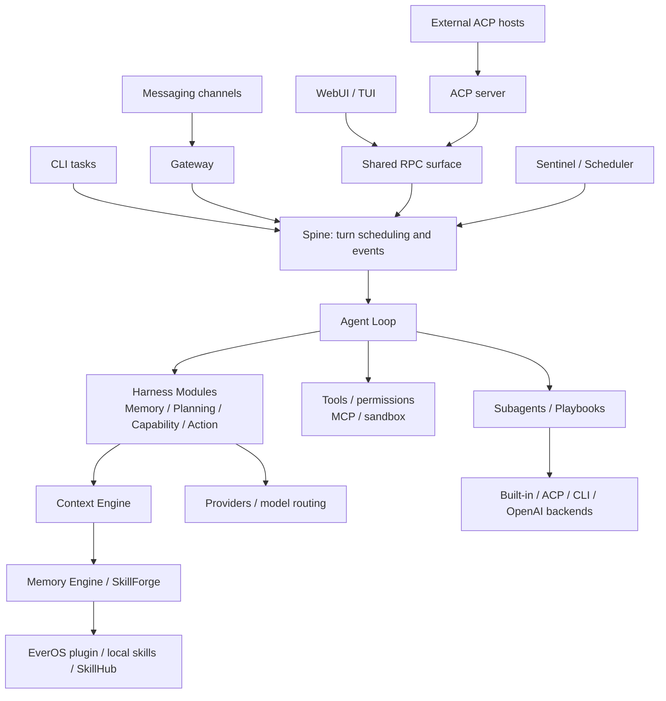

<div align="center" id="readme-top">


<p align="center">
  <a href="https://x.com/evermind"></a>
  <a href="https://huggingface.co/EverMind-AI"></a>
  <a href="https://discord.gg/gYep5nQRZJ"></a>
  <a href="https://github.com/EverMind-AI/EverOS/discussions/67"></a>
</p>

[Website](https://raven.evermind.ai) · [中文](README.zh-CN.md)

</div>

<br>

# What is Raven

Raven is **The Harness of Harnesses**—a self-evolving multi-agent orchestration ecosystem. As a **Host Agent**, it brings specialized agents together through one unified surface to delegate tasks, coordinate execution, and integrate results. Its long-term vision is to extend this orchestration across devices, environments, and domains.

Built on EverMind’s self-evolving harness engine and powered by [EverOS](https://github.com/EverMind-AI/EverOS), Raven preserves context across sessions and continuously improves agent harnesses and collaborative workflows.

**Built-in Agents: Raven-Research**, **Raven-Code**, **Raven-Design**, and **Raven-Oncall** support research, coding, visual design, and unattended workflow automation.

> Raven is pre-alpha. Interfaces and configuration may change quickly.

<p align="center">
  <a href="https://github.com/user-attachments/assets/e333694a-0f4c-4f27-8bfe-8120ff5339a0"></a>
</p>

<p align="center"><em>Raven's Performance on the Multi-Agent Orchestration Benchmark</em></p>

## ❯❯ Built-in Agents

Raven's modular architecture is designed for harness self-evolving and subagent creation. Powered by the **Raven Evolver** engine, its four built-in agents deliver **state-of-the-art (SOTA) performance in their respective domains**, combining reusable harness components with domain-specific tools, skills, and agent loops. Raven can delegate a focused task to a single agent or orchestrate multiple agents within a shared workflow.

> All four agents are built in and ready for orchestration out of the box.

### Raven-Research

**Raven-Research** enables **autonomous deep research** for complex questions, literature reviews, and technical analysis. It delivers clear, structured reports with traceable sources, helping users understand unfamiliar domains, compare alternatives, and make informed decisions.

<p align="center">
  <a href="https://github.com/user-attachments/assets/d072a514-58fd-41c7-8fcd-40782ebb4c80"></a>
</p>

<p align="center"><em>Raven-Research's performance on the DeepResearch Mixed benchmark</em></p>

### Raven-Code

**Raven-Code** enables **agentic software development**, turning requirements into working, tested code. It supports feature implementation, debugging, refactoring, data processing, and data analysis, helping users build new capabilities, resolve issues, and improve code quality while following their project's conventions.

<p align="center">
  <a href="https://github.com/user-attachments/assets/a516ebc2-f0b4-47d4-b970-7dfd492adc0e"></a>
</p>

<p align="center"><em>Raven-Code's performance on coding benchmarks</em></p>

<p align="center">
  <a href="https://github.com/user-attachments/assets/75f60aa2-3e2f-42fb-aa51-aa111bf078d0"></a>
</p>

<p align="center"><em>Raven-Code tops on DataAgentBench for data analysis (2026-08-24 Live)</em></p>

### Raven-Design

**Raven-Design** performs **visual design**, turning ideas and content into polished visual deliverables. It creates PowerPoint slide decks, brand assets, charts, diagrams, and web interfaces, refining layout, typography, and visual consistency to help users communicate clearly and bring their ideas to life.

<p align="center">
  <a href="https://github.com/user-attachments/assets/c42ff722-8aab-40ec-82e3-0655a859a9d9"></a>
</p>

<p align="center"><em>Raven-Design tops on PresentBench for slide generation</em></p>

<p align="center">
  <a href="https://github.com/user-attachments/assets/061b5818-595b-4392-b9b6-53a1effb8347"></a>
</p>

<p align="center"><em>Raven-Design's performance on visual design benchmarks</em></p>

### Raven-Oncall

**Raven-Oncall** enables **unattended workflow automation** for experimentation, optimization, and continuous monitoring. It autonomously manages workflows from start to completion, sustaining progress over hours or overnight, delivering results, and involving users only when human judgment is needed.

<p align="center">
  <a href="https://github.com/user-attachments/assets/8e2b9721-421c-485c-b1dc-1acf901bcb2c"></a>
</p>

<p align="center"><em>Raven-Oncall vs. Claude Code on AI4AI (Nanochat 50M Pretraining) benchmark</em></p>

<p align="center">
  <a href="https://github.com/user-attachments/assets/aafe30ca-6693-4d30-956e-73debf3ef2c9"></a>
</p>

<p align="center"><em>Raven-Oncall vs. Claude Code on internal AI4S benchmark</em></p>

## ❯❯ Connect Third-Party Agents

Raven can connect to and orchestrate agents via ACP, CLI, or OpenAI-compatible APIs, with presets for 13 **third-party agents** to simplify setup, task delegation, and coordination across shared workflows.

<p align="center">
  
</p>

## ❯❯ Quick Start

### 📦 Install

Linux, macOS, or WSL2:

```bash
curl -fsSL https://raven.evermind.ai/install.sh | bash
```

Native Windows PowerShell:

```powershell
irm https://raven.evermind.ai/install.ps1 | iex
```

Windows PowerShell 5.1 may reject the redirect. Use the direct installer URL instead:

```powershell
irm https://raw.githubusercontent.com/EverMind-AI/Raven/refs/heads/main/install.ps1 | iex
```

Or install from a source checkout, to develop against the code or to run what
has not been released yet:

```bash
git clone https://github.com/EverMind-AI/Raven.git
cd Raven
./install.sh
```

Run as a file, `install.sh` installs that checkout in editable mode: raven and
its bundled plugins link back to your tree, and the TUI bundle and the served
page are built from it. A piped run installs the published wheel even from
inside a clone, so that a one-line install never picks up whatever a working
tree happens to contain. Set `RAVEN_LOCAL_SRC=<dir>` to force the editable
install through a pipe.

The agent products ship with raven itself: a wheel carries the `agents/`
product tree and copies it out to your raven home on first use, and a source
checkout reads the tree in place. Setup asks about each product and registers
the ones you take up, on the model it is tuned for or on this raven's LLM.
See [`agents/README.md`](agents/README.md).

## ❯❯ Self-Hosting

Raven can run directly from a checkout or as a single Docker Compose service. The
Compose deployment serves the built page through nginx, keeps the Raven engine
and its child services in one container, and stores durable state in a named
volume.

### 📝 Prerequisites

For a Docker deployment, install Docker Engine and Docker Compose v2. For a
source deployment, install Python 3.12, `uv`, Node.js, and npm. A source
checkout also needs the repository dependencies installed before starting the
engine.

### 🐳 Start with Docker Compose

The repository Compose setup builds the page and Python environment as part of
the image, so no separate host-side build is required:

```bash
cd docker
docker compose up
```

Open <http://127.0.0.1:18793>. The Compose container runs the full `gateway`
engine so providers added from **Settings > Model providers** are available on the next
turn without restarting.

For the detailed container layout, sign-in flow, provider setup, and operational
notes, see [`docker/README.md`](docker/README.md).

### ⚙️ Configuration

Docker reads committed defaults from [`docker/.env`](docker/.env), then loads
the optional, git-ignored `docker/.env.local` over them.
Put credentials and deployment-specific overrides in `.env.local`, not in the
committed file.

Raven stores its configuration, sessions, workspace, logs, and memory under
`RAVEN_HOME`. The Compose image maps this to `/data` through the `raven-data`
volume. Keep that volume for upgrades and restarts; `docker compose down -v`
deletes it and its data.

### 🛠️ Build a Docker image

Build the image using the Makefile target:

```bash
make docker-build
```

The default tag is `raven:local`. To select a different tag or optional
dependency set:

```bash
make docker-build DOCKER_IMAGE=raven:local
docker build -t raven:local --build-arg RAVEN_EXTRAS="channels,tools,sandbox" .
```

Run the locally built image through Compose by exporting
`RAVEN_IMAGE=raven:local` (or prefixing the command with that assignment) and
running `docker compose up` from `docker/`. The Makefile shortcut is
`RAVEN_IMAGE=raven:local make docker-up`. Stop the stack with `make docker-down`.


### 🚀 Start the server from source

From the repository root:

```bash
make install-deps
make build-ui
uv run raven web
```

`raven web` opens the local page and leaves the engine running after the
terminal exits. It defaults to `http://127.0.0.1:18792`. Use
`uv run raven web --foreground` when debugging, or `uv run raven web --stop` to
stop the resident engine. The first run can start without a configured model;
add one from **Settings > Model providers** or run `uv run raven onboard`.

To run only the engine without the browser launcher, use
`uv run raven gateway`.

## ❯❯ Core Systems

| System | What it adds |
| --- | --- |
| **Agent Orchestration** | Coordinates agents, manages task dependencies and parallel execution, and turns multi-step collaboration into reusable workflows. |
| **Evolver** | Drives harness self-evolution by diagnosing failures, testing candidate improvements, and retaining changes that outperform the baseline in reproducible evaluations. |
| **EverOS Memory** | Preserves user context, agent experience, and world knowledge across sessions, recalling relevant memories and reusable skills for future tasks. |
| **SkillForge** | Retrieves relevant skills from local libraries, EverOS memory, and [SkillHub's catalog of **114,190 skills**](https://github.com/EverMind-AI/SkillCorpus#public-artifacts), giving agents specialized expertise on demand. |
| **Proactivity** | Combines event monitoring and scheduled execution to anticipate user needs, deliver timely reminders, and initiate follow-up work. |

<br>
<div align="right">

[](#readme-top)

</div>


## ❯❯ Launch WebUI

Raven's WebUI brings conversations, multi-agent collaboration, and workspace management into your browser. Chat with agents, follow task progress, inspect files and outputs, and browse memory and skills in one place.

```bash
raven web
```

The command opens the WebUI in your browser and keeps Raven running in the background. Use `raven web --stop` to stop the background service.

> **Screenshot placeholder 1:** Conversations and workspace.

> **Screenshot placeholder 2:** Agent collaboration and task graph.

> **Screenshot placeholder 3:** Memory and skill management.

## ❯❯ Command Reference

| Command | Purpose |
| --- | --- |
| `raven` or `raven tui` | Launch the terminal UI |
| `raven web` | Open the WebUI and keep Raven running in the background |
| `raven web --stop` | Stop the background WebUI service |
| `raven agent -m "..."` | Run a one-shot task |
| `raven onboard` | Configure providers, sandboxing, channels, memory, web tool keys, sub-agents, and import |
| `raven status` | Show configuration and runtime status |
| `raven doctor` | Diagnose provider and environment problems |
| `raven --version` | Show the installed Raven version |
| `raven upgrade --check` / `raven upgrade` | Check for updates or upgrade a managed installation |
| `raven agents new <name>` | Create a specialized agent from Raven's modular templates |
| `raven acp` | Serve Raven as an ACP agent over stdio |
| `raven sessions` | Create, list, fork, export, or delete sessions; resolve session keys with `resume` |
| `raven playbook` | Create, validate, manage, and run reusable agent workflows |
| `raven provider` | Configure providers and endpoints, authenticate, test connectivity, and select the active model |
| `raven channels` | List, configure, authenticate, enable, or disable messaging channels |
| `raven gateway` | Run messaging gateways |
| `raven gateway status` / `raven gateway reload` / `raven gateway stop` | Inspect, reload configuration, or gracefully stop a running gateway |
| `raven serve` | Run the headless WebSocket RPC service, serving the WebUI when available |
| `raven skill` | Browse SkillForge skills, inspect their contents, block or unblock skills, and remove installed bundles |
| `raven plugins` | List installed plugins and the active memory backend |
| `raven plugin auth <server>` | Authenticate or refresh OAuth access for an MCP server |
| `raven mcp bridge <socket-path>` | Bridge a subagent's MCP connection over stdio to a host-managed server |
| `raven import` | Preview and import data from other AI tools, inspect progress, or stop an import |
| `raven deep-research` | Configure, inspect, or reset the MiroThinker research integration |
| `raven cron` | Create, inspect, run, enable, disable, or delete scheduled jobs |
| `raven sentinel` | Configure proactivity and inspect attention, routines, decisions, and nudges |
| `raven ops connection` | Register local or remote machines, list them, and check connectivity |
| `raven sandbox` | List sandbox VMs, run commands, or open a shell; requires `sandbox.debug=true` |
| `raven tracing` | Open the local trace dashboard |
| `raven tracing compact` | Fold duplicate trace artifacts to reclaim disk space |
| `raven trajectory` | Save, replay, redact, label, and preserve execution trajectories for debugging |

Run `raven --help` or `raven <command> --help` for the complete CLI surface.

## ❯❯ Documentation

- [Documentation index](docs/README.md)
- [Developer workflow](docs/dev.md)
- [Tracing Standard API](docs/TRACING_STANDARD_API.md)
- [Sandbox usage](docs/sandbox/usage.md)
- [Memory plugin architecture](docs/memory-plugin-architecture.md)
- [Self-evolution loop mapping](docs/specs/self-evolution-loop-raven-mapping.md)
- [Proactivity implementation](docs/Proactivity-Implementation.md)

<br>
<div align="right">

[](#readme-top)

</div>

## ❯❯ Repo layout

The shared Python runtime lives in `raven/`. Agent definitions, plugin distributions, frontends, and development tools live alongside it.

Key directories:

```text
raven/                 # Shared runtime, feature engines, and CLI/RPC/ACP surfaces
agents/                # Specialized agents assembled from installed Raven and plugins
plugins-dist/          # everos-memory, design-engine, and ppt-engine distributions
ui-web/                # Browser UI, also used by the desktop window
ui-tui/                # React/Ink terminal UI
rpc-schema/            # Shared OpenRPC contract for interactive clients
schemas/               # Generated agent and plugin JSON Schemas
bridge/                # WhatsApp TypeScript bridge
evolver/               # Benchmark-driven harness self-evolution tooling
benchmarks/            # Benchmark adapters and evaluation integrations
docker/                # Container deployment and Compose configuration
tests/                 # Unit, integration, and architecture contract tests
scripts/               # Build, packaging, code generation, and repository checks
docs/                  # Setup, development, and design documentation
```

The following runtime packages and modules form the canonical commit scopes under `raven/`. Changes outside `raven/` use the relevant tree or distribution scope from [`commitlint.config.cjs`](commitlint.config.cjs); see [`AGENTS.md`](AGENTS.md) for commit rules.

| Package | What it is |
|---|---|
| `acp` | ACP server surface: exposes Raven to external agent hosts |
| `acp_client` | ACP client, capability negotiation, and adapters for third-party agent events |
| `agent` | Agent Loop, Harness Modules, tool execution, and subagent orchestration |
| `auth` | Authentication and authorization primitives |
| `browser` | Browser automation, session management, and navigation checks |
| `channels` | Messaging adapters and their shared channel contract |
| `cli` | Command-line entry points, setup, and service launchers |
| `config` | Configuration schemas, loading, migrations, admission, and controlled updates |
| `contracts` | Papers: declared interfaces and data shapes shared across runtime components |
| `context_engine` | Context assembly, token budgets, and conversation compaction |
| `core` | Assembly Root: runtime generations and the builders that wire their components |
| `eval_engine` | Evaluation hooks for task completion, iteration feedback, and tool auditing |
| `gateway` | Channel lifecycle, runtime generation swaps, event delivery, and process coordination |
| `home` | Shared `RAVEN_HOME` and configuration-path resolution (`home.py`) |
| `i18n` | Language catalogs, translations, and prompt localization |
| `importer` | Cold-start import from other AI tools |
| `knowledge` | Document ingestion, indexing, and retrieval for user knowledge bases |
| `market` | PlugHub catalog, trust checks, installation, and contribution ledgers |
| `mcp` | MCP server connections and tool integration |
| `memory_engine` | Memory recall and consolidation, local skills, and SkillForge retrieval |
| `observability` | Span semantics, attribute extraction, and usage attribution |
| `ops` | Local and remote machine registry and execution transports |
| `permissions` | Tool-call decisions: allow, ask for approval, or refuse |
| `playbook` | Reusable workflow library, validation, generation, and execution |
| `plugins` | Plugin manifests, discovery, contribution registry, and bundled plugins |
| `proactive_engine` | Sentinel event processing, cron scheduling, heartbeat, and proactive decisions |
| `providers` | LLM adapters, provider pool, and model-to-provider binding |
| `routing` | Task classification and model selection by quality and cost |
| `rpc` | Shared typed RPC methods, streaming events, and gateway control surface |
| `sandbox` | Isolated execution, VM lifecycle, and debugging tools |
| `security` | Outbound address policy and prompt-injection fences |
| `session` | Conversation storage, session resolution, titles, and transcript export |
| `skill_hub` | SkillHub search, skill retrieval, bundle installation, and install policy |
| `spine` | Turn scheduling, concurrency lanes, cancellation, and event delivery |
| `templates` | Packaged workspace files, prompt packs, and agent scaffolding templates |
| `token_wise` | Token usage, pricing, prompt caching, and efficiency strategies |
| `tracing` | Span capture, instrumentation, trace storage, and artifact management |
| `trajectory` | Execution bundles, replay, redaction, outcome labels, and regression cassettes |
| `updates` | Release discovery, upgrade planning, installation handoff, and update notices |
| `utils` | Shared utilities, including atomic file writes |

## ❯❯ Architecture

Each runtime entrance assembles Raven through the same **Assembly Root**, `raven/core/runtime.py:build_runtime`. Configuration and plugin contributions determine the components in a runtime generation; the Spine schedules turns and delivers events around the Agent Loop.



The WebUI and React/Ink TUI use the shared contract in [`rpc-schema/openrpc.json`](rpc-schema/openrpc.json). The ACP server adapts external hosts to the RPC stack, while the ACP client drives other agents. CLI tasks, messaging channels, and proactive triggers submit work through the Spine.

- **Modular execution.** The Agent Loop owns turn state, tool execution, persistence, and event ordering. Its four Harness Modules provide replaceable memory, planning, capability selection, and model-response behavior; hooks and tools add domain-specific capabilities.
- **Agent and plugin composition.** Definitions in [`agents/`](agents/README.md) combine the installed runtime with agent-specific configuration and plugins, then serve over ACP. [`plugins-dist/`](plugins-dist/) contains the EverOS memory, visual design, and PowerPoint engines as separate distributions.
- **Kernel boundaries.** `spine/`, `contracts/`, `tracing/`, and `home.py` form the standalone Kernel. Inner runtime packages do not import the CLI, RPC, or ACP surfaces; import contracts enforce these boundaries.
- **Harness self-evolution.** [`evolver/`](evolver/README.md) is a separate tool that diagnoses runs and evaluates candidate harness changes against benchmarks. It consumes Raven as a library; the runtime does not import Evolver or the repo-level agent definitions.

See the [Context Map](CONTEXT-MAP.md) for subsystem boundaries, the [Runtime Context](CONTEXT.md) for canonical terms and layer seats, and [`pyproject.toml`](pyproject.toml) for the enforced import contracts.

<br>
<div align="right">

[](#readme-top)

</div>

## ❯❯ EverMind Ecosystem

[EverMind](https://evermind.ai/) connects memory research, production-ready products, and practical
integrations into one open-source ecosystem.

<table>
<tr>
<th colspan="2">Products</th>
</tr>
<tr>
<td><strong><a href="https://github.com/EverMind-AI/EverOS">EverOS</a></strong></td>
<td>A local-first, Markdown-native long-term memory runtime for agents and users.</td>
</tr>
<tr>
<td><strong><a href="https://github.com/EverMind-AI/Raven">Raven</a></strong></td>
<td>A memory-first, self-improving agent harness with proactivity, context control, and skill evolution.</td>
</tr>
<tr>
<td><strong><a href="https://github.com/EverMind-AI/EverMe">EverMe (CLI)</a></strong></td>
<td>A CLI and agent plugin suite for cross-device, cross-agent personal memory.</td>
</tr>
<tr>
<th colspan="2">Research &amp; Evaluation</th>
</tr>
<tr>
<td><strong><a href="https://github.com/EverMind-AI/SkillCorpus">SkillCorpus</a></strong></td>
<td>Curated, retrieval-ready agent skill corpora with retrieval and evaluation tooling.</td>
</tr>
<tr>
<td><strong><a href="https://github.com/EverMind-AI/EverAlgo">EverAlgo</a></strong></td>
<td>Stateless extraction, ranking, parsing, and memory operators that power EverOS.</td>
</tr>
<tr>
<td><strong><a href="https://github.com/EverMind-AI/HyperMem">HyperMem</a></strong></td>
<td>Hypergraph-based hierarchical memory for coarse-to-fine long-term conversation retrieval.</td>
</tr>
<tr>
<td><strong><a href="https://github.com/EverMind-AI/MSA">MSA</a></strong></td>
<td>Memory Sparse Attention for scalable latent memory and 100M-token contexts.</td>
</tr>
<tr>
<td><strong><a href="https://github.com/EverMind-AI/EverMemBench">EverMemBench</a></strong></td>
<td>Evaluation of factual recall, applied reasoning, and personalized generalization in memory systems.</td>
</tr>
<tr>
<td><strong><a href="https://github.com/EverMind-AI/EvoAgentBench">EvoAgentBench</a></strong></td>
<td>Longitudinal evaluation of agent self-evolution, transfer efficiency, error avoidance, and skill use.</td>
</tr>
<tr>
<th colspan="2"><a href="https://github.com/EverMind-AI/plugins">Integrations</a></th>
</tr>
<tr>
<td><strong><a href="https://docs.openclaw.ai">OpenClaw</a></strong></td>
<td><a href="https://github.com/EverMind-AI/plugins/tree/main/openclaw">OpenClaw plugin</a> for automatic recall, capture, and session-memory lifecycle management.</td>
</tr>
<tr>
<td><strong><a href="https://github.com/NousResearch/hermes-agent">Hermes Agent</a></strong></td>
<td><a href="https://github.com/EverMind-AI/plugins/tree/main/hermes">Hermes plugin</a> for persistent memory across Hermes sessions.</td>
</tr>
<tr>
<td><strong><a href="https://github.com/deepseek-ai/DeepSeek-Harness">DeepSeek Harness</a></strong></td>
<td><a href="https://github.com/EverMind-AI/plugins/tree/main/dsh">DSH plugin</a> for memory-aware DeepSeek Harness agents.</td>
</tr>
<tr>
<td><strong><a href="https://dify.ai">Dify</a></strong></td>
<td><a href="https://github.com/EverMind-AI/plugins/tree/main/dify">Self-hosted</a> and <a href="https://github.com/EverMind-AI/plugins/tree/main/dify_cloud">cloud</a> tools for explicit memory search and storage in workflows and agents.</td>
</tr>
</table>

Together, these projects form EverMind's research-to-runtime stack: methods
and benchmarks become reusable memory infrastructure, products, and agent
integrations.

<br>
<div align="right">

[](#readme-top)

</div>

## ❯❯ Contributing

Issues and pull requests are welcome. Start with the [developer workflow](docs/dev.md), follow [AGENTS.md](AGENTS.md) for repository rules, and use [GitHub Discussions](https://github.com/EverMind-AI/Raven/discussions) for design conversations.

## ❯❯ License

[Apache License 2.0](LICENSE)
