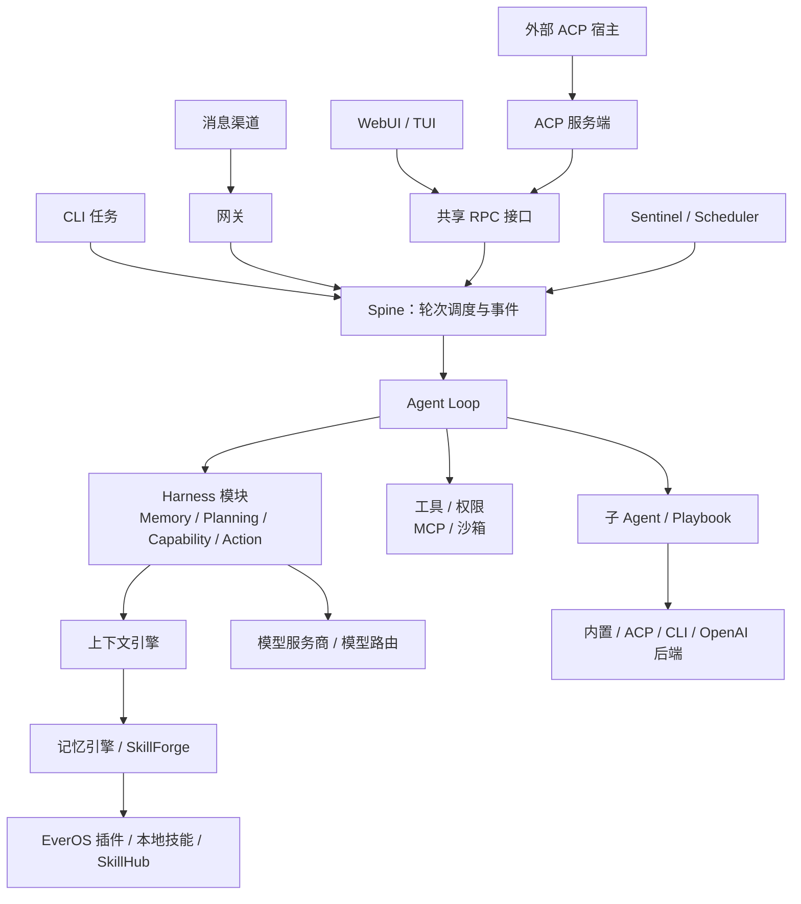

<div align="center" id="readme-top">


<p align="center">
  <a href="https://x.com/evermind"></a>
  <a href="https://huggingface.co/EverMind-AI"></a>
  <a href="https://discord.gg/gYep5nQRZJ"></a>
  <a href="https://github.com/EverMind-AI/EverOS/discussions/67"></a>
</p>

[官网](https://raven.evermind.ai) · [English](README.md)

</div>

<br>

# Raven 是什么

<p align="center">
  <a href="https://github.com/user-attachments/assets/ef64cd3b-a48f-4516-9a30-47fe47a750be"></a>
</p>

<p align="center"><em>一个入口，全领域 Agent 协同：Raven 生成并编排任务 DAG，驱动多个专业 Agent 协作完成复杂任务。</em></p>

Raven 是 **The Harness of Harnesses**——一个持续自我演进的多 Agent 编排生态。作为 **Host Agent（宿主 Agent）**，它通过统一入口连接专业 Agent，负责任务委派、执行协调和结果整合。Raven 的长期目标是将这种编排能力扩展到不同设备、环境和领域。

基于 EverMind 的自进化 harness 引擎，并由 [EverOS](https://github.com/EverMind-AI/EverOS) 提供支持，Raven 跨会话保存上下文，持续改进 Agent harness 与协作工作流。

**内置 Agent：** **Raven-Research**、**Raven-Code**、**Raven-Design** 和 **Raven-Oncall** 支持研究、编程、视觉设计和无人值守流程自动化。

> Raven 目前处于 pre-alpha 阶段，接口和配置可能快速变化。

<p align="center">
  <a href="https://github.com/user-attachments/assets/e333694a-0f4c-4f27-8bfe-8120ff5339a0"></a>
</p>

<p align="center"><em>Raven 在多 Agent 编排基准测试上的表现</em></p>

## ❯❯ 内置 Agent

Raven 的模块化架构面向 harness 自我演进和子 Agent 创建。借助 **Raven Evolver** 引擎，四个内置 Agent 在各自领域提供**先进水平（SOTA）的性能**，结合可复用的 harness 组件、领域专用工具、技能和 Agent 循环。Raven 可以将聚焦任务委派给单个 Agent，也可以在共享工作流中编排多个 Agent。

> 四个 Agent 均已内置，开箱即可进行编排。

### Raven-Research

**Raven-Research** 为复杂问题、文献综述与技术分析提供**自主深度研究**能力。它交付清晰、结构化且来源可追溯的研究报告，帮助用户理解陌生领域、比较不同方案，并作出有依据的决策。

<p align="center">
  <a href="https://github.com/user-attachments/assets/d072a514-58fd-41c7-8fcd-40782ebb4c80"></a>
</p>

<p align="center"><em>Raven-Research 在 DeepResearch Mixed 基准测试中的表现</em></p>

### Raven-Code

**Raven-Code** 支持**智能体驱动的软件开发**，将需求转化为可运行、经过测试的代码。它支持功能实现、调试、重构、数据处理与数据分析，帮助用户在遵循项目规范的前提下构建新能力、解决问题并提升代码质量。

<p align="center">
  <a href="https://github.com/user-attachments/assets/a516ebc2-f0b4-47d4-b970-7dfd492adc0e"></a>
</p>

<p align="center"><em>Raven-Code 在编程基准测试中的表现</em></p>

<p align="center">
  <a href="https://github.com/user-attachments/assets/75f60aa2-3e2f-42fb-aa51-aa111bf078d0"></a>
</p>

<p align="center"><em>Raven-Code 在数据分析任务的 DataAgentBench 上排名第一（2026-08-24 Live）</em></p>

### Raven-Design

**Raven-Design** 提供**视觉设计**能力，将想法与内容转化为精美的视觉作品。它支持 PowerPoint 幻灯片、品牌素材、图表、示意图和网页界面创作，通过持续优化布局、字体与视觉一致性，帮助用户清晰表达信息，将创意变为作品。

<p align="center">
  <a href="https://github.com/user-attachments/assets/c42ff722-8aab-40ec-82e3-0655a859a9d9"></a>
</p>

<p align="center"><em>Raven-Design 在 PresentBench 幻灯片生成测试中排名第一</em></p>

<p align="center">
  <a href="https://github.com/user-attachments/assets/061b5818-595b-4392-b9b6-53a1effb8347"></a>
</p>

<p align="center"><em>Raven-Design 在视觉设计基准测试中的表现</em></p>

### Raven-Oncall

**Raven-Oncall** 为实验、优化与持续监控提供**无人值守的流程自动化**能力。它自主推进从启动到完成的整个工作流程，支持持续数小时乃至通宵运行并交付结果，仅在需要人工判断时请用户介入。

<p align="center">
  <a href="https://github.com/user-attachments/assets/8e2b9721-421c-485c-b1dc-1acf901bcb2c"></a>
</p>

<p align="center"><em>Raven-Oncall 与 Claude Code 在 AI4AI（Nanochat 50M 预训练）基准测试上的对比</em></p>

<p align="center">
  <a href="https://github.com/user-attachments/assets/aafe30ca-6693-4d30-956e-73debf3ef2c9"></a>
</p>

<p align="center"><em>Raven-Oncall 与 Claude Code 在内部 AI4S 基准测试上的对比</em></p>

## ❯❯ 连接第三方 Agent

Raven 可以通过 ACP、CLI 或兼容 OpenAI 的 API 连接并编排 Agent，并提供 13 个**第三方 Agent**的预设，简化设置、任务委派和共享工作流中的协作。

<p align="center">
  
</p>

## ❯❯ 快速开始

### 📦 安装

Linux、macOS 或 WSL2：

```bash
curl -fsSL https://raven.evermind.ai/install.sh | bash
```

原生 Windows PowerShell：

```powershell
irm https://raven.evermind.ai/install.ps1 | iex
```

Windows PowerShell 5.1 可能拒绝重定向，请改用直连安装地址：

```powershell
irm https://raw.githubusercontent.com/EverMind-AI/Raven/refs/heads/main/install.ps1 | iex
```

也可以从源码检出安装，适合基于代码做开发，或运行尚未发布的版本：

```bash
git clone https://github.com/EverMind-AI/Raven.git
cd Raven
./install.sh
```

以文件方式运行时，`install.sh` 会以可编辑（editable）模式安装该检出目录：Raven 及其内置插件都链接回你的工作树，TUI 包和内置页面也从该目录构建。通过管道运行时，即使身处克隆仓库中也始终安装已发布的 wheel，这样一行命令的安装就不会使用工作树中的任意内容。如需在管道方式下强制使用可编辑安装，请设置 `RAVEN_LOCAL_SRC=<dir>`。

这些 Agent 随 Raven 一同发布：wheel 包包含 `agents/` 产品目录，首次使用时会将其复制到 Raven 主目录；源码安装则直接读取仓库中的目录。配置向导会逐一询问是否启用，并为所选 Agent 注册其适配的模型，或使用当前 Raven 的 LLM。详见 [`agents/README.md`](agents/README.md)。

## ❯❯ 自托管

Raven 可以直接从源码仓库运行，也可以作为单个 Docker Compose 服务运行。Compose 部署通过 nginx 提供已构建的页面，在同一个容器中运行 Raven 引擎及其子服务，并将持久化状态保存到命名卷中。

### 📝 前置条件

使用 Docker 部署时，请安装 Docker Engine 和 Docker Compose v2。使用源码部署时，请安装 Python 3.12、`uv`、Node.js 和 npm，并在启动引擎前安装仓库依赖。

### 🐳 使用 Docker Compose 启动

仓库中的 Compose 配置会在构建镜像时完成页面和 Python 环境的构建，因此无需在宿主机上单独构建：

```bash
cd docker
docker compose up
```

打开 <http://127.0.0.1:18793>。Compose 容器运行完整的 `gateway` 引擎，因此在 **设置 > 模型服务商（Settings > Model providers）** 中添加模型服务商后，无需重启即可在下一轮使用。

容器布局、登录流程、模型服务商配置和运维说明详见 [`docker/README.md`](docker/README.md)。

### ⚙️ 配置

Docker 先读取 [`docker/.env`](docker/.env) 中已提交的默认值，再加载可选的、被 Git 忽略的 `docker/.env.local` 覆盖这些默认值。请将凭据和部署相关的覆盖项写入 `.env.local`，不要写入已提交的文件。

Raven 将配置、会话、工作区、日志和记忆保存在 `RAVEN_HOME` 下。Compose 镜像通过 `raven-data` 卷将其映射到 `/data`。升级或重启时请保留该卷；`docker compose down -v` 会删除卷及其中的数据。

### 🛠️ 构建 Docker 镜像

使用 Makefile 目标构建镜像：

```bash
make docker-build
```

默认标签是 `raven:local`。如需选择其他标签或可选依赖集：

```bash
make docker-build DOCKER_IMAGE=raven:local
docker build -t raven:local --build-arg RAVEN_EXTRAS="channels,tools,sandbox" .
```

要通过 Compose 运行本地构建的镜像，请设置 `RAVEN_IMAGE=raven:local`（也可以在命令前直接设置该变量），然后在 `docker/` 目录运行 `docker compose up`。对应的 Makefile 快捷方式是 `RAVEN_IMAGE=raven:local make docker-up`。使用 `make docker-down` 停止服务。

### 🚀 从源码启动服务

在仓库根目录运行：

```bash
make install-deps
make build-ui
uv run raven web
```

`raven web` 会打开本地页面，并在终端退出后保持引擎运行。默认地址是 `http://127.0.0.1:18792`。调试时可以使用 `uv run raven web --foreground`，使用 `uv run raven web --stop` 停止常驻引擎。首次启动时可以暂时不配置模型，之后在 **设置 > 模型服务商（Settings > Model providers）** 中添加，或运行 `uv run raven onboard`。

如果只需要启动引擎而不打开浏览器页面，请使用 `uv run raven gateway`。

## ❯❯ 核心系统

| 系统 | 能力 |
| --- | --- |
| **Agent 编排** | 协调 Agent，管理任务依赖和并行执行，将多步骤协作沉淀为可复用的工作流。 |
| **Evolver** | 通过失败诊断、候选改进测试和可复现评估，保留优于基线的变更，推动 harness 自进化。 |
| **EverOS 记忆** | 跨会话保留用户上下文、Agent 经验和世界知识，为后续任务召回相关记忆与可复用技能。 |
| **SkillForge** | 从本地技能库、EverOS 记忆以及 [SkillHub 的 **114,190 项技能**](https://github.com/EverMind-AI/SkillCorpus#public-artifacts)中检索相关技能，按需为 Agent 提供专业能力。 |
| **主动行为** | 结合事件监测与定时执行，预测用户需求，及时发出提醒并发起后续工作。 |

<br>
<div align="right">

[](#readme-top)

</div>


## ❯❯ 启动 WebUI

Raven 的 WebUI 将对话、多 Agent 协作和工作区管理整合到浏览器中。你可以在同一界面与 Agent 对话、跟踪任务进度、查看文件和输出，以及浏览记忆与技能。

```bash
raven web
```

该命令会在浏览器中打开 WebUI，并让 Raven 在后台持续运行。使用 `raven web --stop` 停止后台服务。

> **截图占位 1：** 对话与工作区。

> **截图占位 2：** Agent 协作与任务图。

> **截图占位 3：** 记忆与技能管理。

## ❯❯ 命令参考

| 命令 | 用途 |
| --- | --- |
| `raven` 或 `raven tui` | 启动终端界面 |
| `raven web` | 打开 WebUI，并让 Raven 在后台运行 |
| `raven web --stop` | 停止 WebUI 后台服务 |
| `raven agent -m "..."` | 执行单次任务 |
| `raven onboard` | 配置模型服务商、沙箱、消息渠道、记忆、网络工具密钥、子 Agent 和数据导入 |
| `raven status` | 查看配置与运行状态 |
| `raven doctor` | 诊断模型服务商和运行环境问题 |
| `raven --version` | 查看已安装的 Raven 版本 |
| `raven upgrade --check` / `raven upgrade` | 检查更新，或升级由安装工具管理的 Raven |
| `raven agents new <name>` | 使用 Raven 的模块化模板创建专用 Agent |
| `raven acp` | 通过标准输入输出将 Raven 作为 ACP Agent 提供服务 |
| `raven sessions` | 创建、列出、派生、导出或删除会话；使用 `resume` 解析会话键 |
| `raven playbook` | 创建、校验、管理和运行可复用的 Agent 工作流 |
| `raven provider` | 配置模型服务商与端点、完成认证、测试连通性并选择当前模型 |
| `raven channels` | 列出、配置、认证、启用或禁用消息渠道 |
| `raven gateway` | 运行消息网关 |
| `raven gateway status` / `raven gateway reload` / `raven gateway stop` | 查看运行中的网关、重新加载配置，或平稳停止网关 |
| `raven serve` | 运行无界面的 WebSocket RPC 服务，并在页面已构建时提供 WebUI |
| `raven skill` | 浏览 SkillForge 技能、查看内容、屏蔽或解除屏蔽技能，以及移除已安装的技能包 |
| `raven plugins` | 列出已安装的插件和当前记忆后端 |
| `raven plugin auth <server>` | 为 MCP 服务完成认证或刷新 OAuth 授权 |
| `raven mcp bridge <socket-path>` | 通过标准输入输出，将子 Agent 的 MCP 连接桥接到宿主管理的服务 |
| `raven import` | 预览并导入其他 AI 工具的数据、查看进度或停止导入 |
| `raven deep-research` | 配置、查看或重置 MiroThinker 研究集成 |
| `raven cron` | 创建、查看、运行、启用、禁用或删除定时任务 |
| `raven sentinel` | 配置主动行为，查看关注事项、例行任务、决策和提醒 |
| `raven ops connection` | 注册、列出本地或远程机器，并检查连通性 |
| `raven sandbox` | 列出沙箱虚拟机、执行命令或打开 Shell；需要设置 `sandbox.debug=true` |
| `raven tracing` | 打开本地追踪面板 |
| `raven tracing compact` | 合并重复的追踪产物，回收磁盘空间 |
| `raven trajectory` | 保存、回放、脱敏、标注和保留执行轨迹，用于调试 |

运行 `raven --help` 或 `raven <command> --help` 查看完整命令说明。

## ❯❯ 文档

- [文档索引](docs/README.md)
- [开发工作流](docs/dev.md)
- [追踪标准 API](docs/TRACING_STANDARD_API.md)
- [沙箱使用指南](docs/sandbox/usage.md)
- [记忆插件架构](docs/memory-plugin-architecture.md)
- [自进化循环实现映射](docs/specs/self-evolution-loop-raven-mapping.md)
- [主动行为实现](docs/Proactivity-Implementation.md)

<br>
<div align="right">

[](#readme-top)

</div>

## ❯❯ 仓库布局

共享的 Python 运行时位于 `raven/`，Agent 定义、插件发行包、前端和开发工具与其并列存放。

主要目录：

```text
raven/                 # 共享运行时、功能引擎，以及 CLI/RPC/ACP 接口层
agents/                # 由已安装的 Raven 与插件组装而成的专用 Agent
plugins-dist/          # everos-memory、design-engine 和 ppt-engine 发行包
ui-web/                # 浏览器界面，桌面窗口也使用同一页面
ui-tui/                # React/Ink 终端界面
rpc-schema/            # 交互式客户端共用的 OpenRPC 契约
schemas/               # 生成的 Agent 与插件 JSON Schema
bridge/                # WhatsApp TypeScript 桥接服务
evolver/               # 由基准评估驱动的 harness 自进化工具
benchmarks/            # 基准适配器与评估集成
docker/                # 容器部署与 Compose 配置
tests/                 # 单元测试、集成测试和架构契约测试
scripts/               # 构建、打包、代码生成与仓库检查
docs/                  # 安装、开发与设计文档
```

下列运行时包和模块构成 `raven/` 下的标准提交 scope。修改 `raven/` 之外的内容时，使用 [`commitlint.config.cjs`](commitlint.config.cjs) 中对应的目录或发行包 scope；提交规则见 [`AGENTS.md`](AGENTS.md)。

| 包或模块 | 职责 |
|---|---|
| `acp` | ACP 服务端接口：向外部 Agent 宿主提供 Raven |
| `acp_client` | ACP 客户端、能力协商和第三方 Agent 事件适配 |
| `agent` | Agent Loop、Harness 模块、工具执行与子 Agent 编排 |
| `auth` | 认证与授权基础组件 |
| `browser` | 浏览器自动化、会话管理与导航检查 |
| `channels` | 消息适配器及其共享渠道契约 |
| `cli` | 命令行入口、配置向导与服务启动器 |
| `config` | 配置 schema、加载、迁移、准入校验与受控更新 |
| `contracts` | 契约定义（Paper）：运行时组件共享的接口与数据结构 |
| `context_engine` | 上下文组装、token 预算与会话压缩 |
| `core` | 装配根（Assembly Root）：运行时世代及其组件组装 |
| `eval_engine` | 任务完成判断、迭代反馈与工具审计的评估 hook |
| `gateway` | 渠道生命周期、运行时世代切换、事件投递与进程协调 |
| `home` | 统一解析 `RAVEN_HOME` 和配置路径（`home.py`） |
| `i18n` | 语言目录、翻译与提示词本地化 |
| `importer` | 从其他 AI 工具进行冷启动导入 |
| `knowledge` | 用户知识库的文档导入、索引与检索 |
| `market` | PlugHub 目录、信任检查、安装及贡献项账本 |
| `mcp` | MCP 服务连接与工具集成 |
| `memory_engine` | 记忆召回与整合、本地技能及 SkillForge 检索 |
| `observability` | 追踪 span 语义、属性提取与用量归属 |
| `ops` | 本地和远程机器注册表及执行传输 |
| `permissions` | 工具调用决策：允许、请求批准或拒绝 |
| `playbook` | 可复用工作流库及其校验、生成与执行 |
| `plugins` | 插件清单、发现、贡献项注册与内置插件 |
| `proactive_engine` | Sentinel 事件处理、cron 调度、心跳与主动决策 |
| `providers` | LLM 适配器、服务商池与模型到服务商的绑定 |
| `routing` | 任务分类，以及根据质量和成本选择模型 |
| `rpc` | 共享的类型化 RPC 方法、流式事件与网关控制接口 |
| `sandbox` | 隔离执行、虚拟机生命周期与调试工具 |
| `security` | 出站地址策略与提示词注入防护 |
| `session` | 会话存储、会话解析、标题与对话记录导出 |
| `skill_hub` | SkillHub 搜索、技能获取、技能包安装与安装策略 |
| `spine` | 轮次调度、并发通道、取消与事件投递 |
| `templates` | 随包发布的工作区文件、提示词包与 Agent 脚手架模板 |
| `token_wise` | Token 用量、计价、提示词缓存与效率策略 |
| `tracing` | Span 采集、埋点、追踪存储与产物管理 |
| `trajectory` | 执行轨迹包、回放、脱敏、结果标注与回归测试记录 |
| `updates` | 版本发现、升级规划、安装交接与更新提示 |
| `utils` | 共享工具函数，包括原子文件写入 |

## ❯❯ 架构

各运行时入口都通过同一个 **装配根（Assembly Root）** `raven/core/runtime.py:build_runtime` 组装 Raven。配置与插件贡献共同决定每一代运行时的组件；Spine 围绕 Agent Loop 调度轮次并传递事件。



WebUI 和 React/Ink TUI 共用 [`rpc-schema/openrpc.json`](rpc-schema/openrpc.json) 中的契约。ACP 服务端将外部宿主接入 RPC 栈，ACP 客户端则用于驱动其他 Agent。CLI 任务、消息渠道和主动触发器都通过 Spine 提交工作。

- **模块化执行。** Agent Loop 负责轮次状态、工具执行、持久化和事件顺序。四个 Harness 模块分别提供可替换的记忆、规划、能力选择和模型响应行为；hook 与工具用于增加特定领域的能力。
- **Agent 与插件组装。** [`agents/`](agents/README.md) 中的定义将已安装的运行时与 Agent 专属配置、插件组合起来，再通过 ACP 提供服务。[`plugins-dist/`](plugins-dist/) 将 EverOS 记忆、视觉设计和 PowerPoint 引擎作为独立发行包提供。
- **内核边界。** `spine/`、`contracts/`、`tracing/` 和 `home.py` 构成可独立运行的内核（Kernel）。内层运行时包不导入 CLI、RPC 或 ACP 接口层，导入契约会强制检查这些边界。
- **Harness 自进化。** [`evolver/`](evolver/README.md) 是独立工具，用于诊断运行情况，并通过基准评估候选 harness 变更。它将 Raven 作为库使用；运行时不会反向导入 Evolver 或仓库顶层的 Agent 定义。

子系统边界见[上下文映射](CONTEXT-MAP.md)，标准术语和层级归属见[运行时上下文](CONTEXT.md)，强制执行的导入契约见 [`pyproject.toml`](pyproject.toml)。

<br>
<div align="right">

[](#readme-top)

</div>

## ❯❯ EverMind 生态

[EverMind](https://evermind.ai/) 将记忆研究、可用于生产环境的产品与实际集成连接为一个开源生态。

<table>
<tr>
<th colspan="2">产品</th>
</tr>
<tr>
<td><strong><a href="https://github.com/EverMind-AI/EverOS">EverOS</a></strong></td>
<td>优先本地运行、以 Markdown 为原生格式的长期记忆运行时，面向 Agent 与用户。</td>
</tr>
<tr>
<td><strong><a href="https://github.com/EverMind-AI/Raven">Raven</a></strong></td>
<td>以记忆为核心、能够自我改进的 Agent harness，支持主动行为、上下文控制和技能演化。</td>
</tr>
<tr>
<td><strong><a href="https://github.com/EverMind-AI/EverMe">EverMe (CLI)</a></strong></td>
<td>用于跨设备、跨 Agent 个人记忆的 CLI 与 Agent 插件套件。</td>
</tr>
<tr>
<th colspan="2">研究与评估</th>
</tr>
<tr>
<td><strong><a href="https://github.com/EverMind-AI/SkillCorpus">SkillCorpus</a></strong></td>
<td>经过整理、可用于检索的 Agent 技能语料库，配套检索与评估工具。</td>
</tr>
<tr>
<td><strong><a href="https://github.com/EverMind-AI/EverAlgo">EverAlgo</a></strong></td>
<td>为 EverOS 提供无状态的提取、排序、解析和记忆算子。</td>
</tr>
<tr>
<td><strong><a href="https://github.com/EverMind-AI/HyperMem">HyperMem</a></strong></td>
<td>基于超图的分层记忆，支持从粗到细检索长期对话内容。</td>
</tr>
<tr>
<td><strong><a href="https://github.com/EverMind-AI/MSA">MSA</a></strong></td>
<td>Memory Sparse Attention，支持可扩展的潜在记忆与 100M Token 上下文。</td>
</tr>
<tr>
<td><strong><a href="https://github.com/EverMind-AI/EverMemBench">EverMemBench</a></strong></td>
<td>评估记忆系统的事实召回、应用推理和个性化泛化能力。</td>
</tr>
<tr>
<td><strong><a href="https://github.com/EverMind-AI/EvoAgentBench">EvoAgentBench</a></strong></td>
<td>对 Agent 自进化、迁移效率、错误规避和技能使用进行纵向评估。</td>
</tr>
<tr>
<th colspan="2"><a href="https://github.com/EverMind-AI/plugins">集成</a></th>
</tr>
<tr>
<td><strong><a href="https://docs.openclaw.ai">OpenClaw</a></strong></td>
<td><a href="https://github.com/EverMind-AI/plugins/tree/main/openclaw">OpenClaw 插件</a>，用于自动召回、记忆采集和会话记忆生命周期管理。</td>
</tr>
<tr>
<td><strong><a href="https://github.com/NousResearch/hermes-agent">Hermes Agent</a></strong></td>
<td><a href="https://github.com/EverMind-AI/plugins/tree/main/hermes">Hermes 插件</a>，为 Hermes 提供跨会话的持久化记忆。</td>
</tr>
<tr>
<td><strong><a href="https://github.com/deepseek-ai/DeepSeek-Harness">DeepSeek Harness</a></strong></td>
<td><a href="https://github.com/EverMind-AI/plugins/tree/main/dsh">DSH 插件</a>，为 DeepSeek Harness Agent 提供记忆能力。</td>
</tr>
<tr>
<td><strong><a href="https://dify.ai">Dify</a></strong></td>
<td>提供<a href="https://github.com/EverMind-AI/plugins/tree/main/dify">自托管</a>与<a href="https://github.com/EverMind-AI/plugins/tree/main/dify_cloud">云端</a>工具，在工作流和 Agent 中显式搜索与存储记忆。</td>
</tr>
</table>

这些项目共同构成 EverMind 从研究到运行时的技术体系，将方法与基准转化为可复用的记忆基础设施、产品和 Agent 集成。

<br>
<div align="right">

[](#readme-top)

</div>

## ❯❯ 参与贡献

欢迎提交 issue 和 pull request。请先阅读[开发工作流](docs/dev.md)，遵循 [AGENTS.md](AGENTS.md) 中的仓库规则，并在 [GitHub Discussions](https://github.com/EverMind-AI/Raven/discussions) 中讨论设计方案。

## ❯❯ 许可证

[Apache 许可证 2.0](LICENSE)
