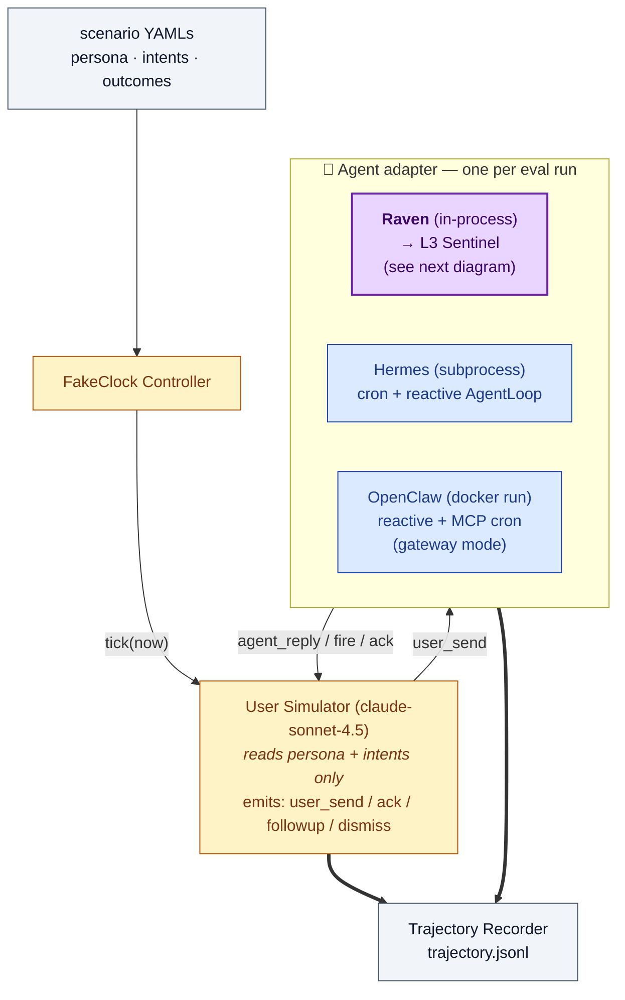
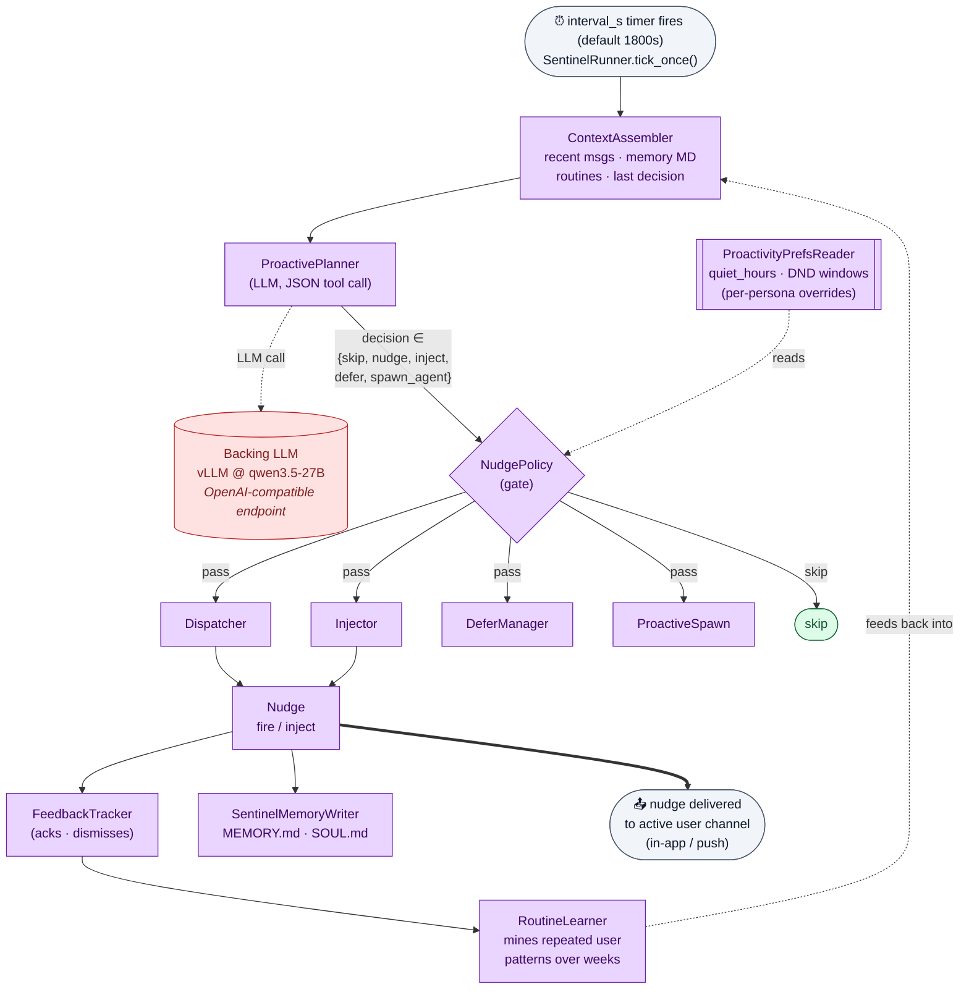

# Longrun Proactivity Benchmark

> **30-day closed-loop IM-style benchmark for measuring agent _proactivity_:
> not "did the agent answer correctly?", but "did the agent surface the
> right thing _before_ the user thought to ask?"**

`longrun` is one half of Raven's two-axis proactivity evaluation suite
(see also: [`pbench`](https://huggingface.co/datasets/thunlp/ProactiveAgent),
the single-turn decision benchmark from Lu et al., NAACL 2024).  Where
`pbench` measures *per-event decision quality* (TP/FP/TN/FN over 120
single-shot records), `longrun` measures *multi-day coverage*: across 30
simulated days, how many of the persona's pre-registered "should fire"
moments did the agent actually fire on, while staying inside DND / novelty
/ frequency constraints?

Each scenario binds **(persona profile, 30-day intent stream, per-persona
outcome rubric)** into one fake-clock evaluation, advanced through an
LLM user simulator that genuinely *reacts* to the agent's nudges. This
closes the loop that open-loop datasets (e.g., `phronesis-io/proactive-eval`)
intentionally leave open.

---

## TL;DR

- **6 personas** × **30 days** × **3 reference agents** (Raven, Hermes, OpenClaw)
- **Language**: zh-CN (Asia/Shanghai), with localized DND windows and weekly rhythms
- **Closed-loop**: simulator reads agent nudges and chooses {ack | dismiss | follow-up | ignore}
- **Three outcome dimensions**:
  - **Type A — anticipatory** (agent fires unprompted)
  - **Type B — reactive** (agent answers correctly when asked)
  - **Type C — restraint** (agent honors DND, novelty, frequency caps)
- **Scoring**: deterministic regex/time/count gating + optional LLM judge for content quality
- **Outputs**: trajectory JSONL (~1.5k events / persona-run) + per-persona scorecard

---

## Longrun evaluation pipeline

How a single (persona × agent) run is produced: the scenario YAMLs drive a
fake-clock LLM simulator, which talks to one of three agent adapters per
run; every event the simulator emits and every event the agent emits
(reply, fire, cron tick) lands in `trajectory.jsonl`.



---

## Raven L3 Sentinel — Implementation Architecture

The reference agent (`Raven`) is the only one of the three baselines
that ships a dedicated **anticipatory** planning layer. Hermes ships a
native cron scheduler; OpenClaw gets cron via a bundled MCP server in
**gateway mode** (`runners/_common/mcp_cron_server.mjs`, exposing
`set_reminder` / `list_reminders` / `cancel_reminder`). Both still serve
as architectural ablations — cron can fire user-pre-registered jobs but
cannot *anticipate*.

Inside the Raven adapter from the pipeline above, each tick flows
through this Sentinel stack:



### Why the architecture matters for the scoring axes

| Axis | What's measured | Which component drives it |
|---|---|---|
| **Type A — anticipatory** | Did the agent fire about `X` *before* the user mentioned `X`, inside the persona-specific window? | `ContextAssembler` + `ProactivePlanner` (only Sentinel-class agents can score > 0 here) |
| **Type B — reactive** | When the user asks, does the reply mention the canonical fact? | Reactive `AgentLoop` (all 3 agents) |
| **Type C — restraint** | Zero nudges in `quiet_hours`; ≤1 nudge / hour in bedtime windows; weekend rate capped | `NudgePolicy` + `ProactivityPreferencesReader` (per-persona DND overrides) |

Both `Hermes` (native cron) and `OpenClaw` (cron via the bundled MCP
gateway, since OC ≥ 2026.3.31) execute pre-registered jobs but cannot
*anticipate* — so on Type A both architecturally bottom out at zero.
They are kept as **ablation baselines**, not as competitors.

---

## Dataset Structure

Each persona is a triple of YAML files:

```
data/longrun/
├── persona-caregiver-01.yaml          ← profile (style, rhythm, goals, DND)
├── persona-caregiver-01-intents.yaml  ← 30-day timestamped user-initiated topics
├── persona-caregiver-01-outcomes.yaml ← rubric: Type A / B / C with regex gating
├── persona-dev-01.yaml
├── persona-dev-01-intents.yaml
├── persona-dev-01-outcomes.yaml
├── persona-freelancer-01.yaml
├── persona-freelancer-01-intents.yaml
├── persona-freelancer-01-outcomes.yaml
├── persona-parent-01.yaml
├── persona-parent-01-intents.yaml
├── persona-parent-01-outcomes.yaml
├── persona-student-01.yaml
├── persona-student-01-intents.yaml
├── persona-student-01-outcomes.yaml
├── persona-team-lead-01.yaml
├── persona-team-lead-01-intents.yaml
└── persona-team-lead-01-outcomes.yaml
```

### Persona profile (`persona-<id>-01.yaml`)

| Field | Purpose |
|---|---|
| `id`, `persona_name`, `role` | Identity; e.g. `parent-01`, "双职工妈妈" |
| `language`, `timezone`, `anchor_date` | Locale + fake-clock origin |
| `wake_hours`, `weekly_rhythm` | Daily schedule narrative the simulator follows |
| `communication_style`, `quirks` | Phrasing rules for user messages |
| `goals` | Concrete multi-day projects the rubric anchors to |
| `policy_overrides.do_not_disturb_windows` | Per-persona DND (above global `quiet_hours`) |
| `initial_memory_md` | Long-term state the agent starts with (Markdown) |

### Intents (`persona-<id>-01-intents.yaml`)

Timestamped queue of **user-initiated** events the simulator will surface
over the 30-day run. The simulator reads only these + the persona — it
does **not** see `outcomes.yaml` (anti-leak).

```yaml
- at: '2026-05-01T07:45:00'
  topic: 地铁上突然想起小宝疫苗本放哪了
  kind: admin_task           # planning | admin_task | reminder | learning |
                             # lifestyle_query | vent | reflection
  depth: single_turn         # or multi_turn
  expected_followups: 0
  related_memory_ids: ["小宝体检"]
  reveals_new_fact: null
```

| Persona | # intents over 30 days |
|---|---:|
| caregiver-01 | 114 |
| student-01 | 88 |
| parent-01 | 66 |
| team-lead-01 | 64 |
| dev-01 | 41 |
| freelancer-01 | 39 |

### Outcomes (`persona-<id>-01-outcomes.yaml`)

Per-persona rubric, partitioned into three orthogonal axes that sum to
~40-42 points each:

```yaml
type_a_proactive_only:        # agent-initiated; the proactivity test
  - id: sports_day_reminder
    description: 主动提醒大宝5/15运动会准备事项(5/10-5/14之间)
    window: ['2026-05-10', '2026-05-14']
    initiator: agent
    topic_match_regex: 运动会|亲子活动|5[-/]15|白球鞋
    novelty_window_hours: 48
    points: 4

type_b_reactive_achievable:   # user asks → agent must recall canonical fact
  - id: allergy_info
    trigger_regex_in_user_send: 过敏|花生|坚果
    reply_must_mention: 花生|坚果|Leo|Mia
    points: 2

type_c_restraint:             # don't over-fire; honor quiet hours
  - id: quiet_hours_respected
    constraint: nudge_count_in_window == 0
    window_daily: ['22:30', '06:00']
    points: 4
```

| Persona | Type A | Type B | Type C | Total |
|---|---:|---:|---:|---:|
| caregiver-01 | 9 | 3 | 3 | **42** |
| dev-01 | 7 | 4 | 4 | **42** |
| freelancer-01 | 8 | 4 | 4 | **42** |
| parent-01 | 8 | 4 | 4 | **42** |
| student-01 | 4 | 3 | 3 | **40** |
| team-lead-01 | 7 | 3 | 3 | **42** |

---

## Reproducing the baseline numbers

### 0. Prerequisites

You will need:

| Component | Default |
|---|---|
| Backing LLM | OpenAI-compatible endpoint serving **`qwen3.5-27B`** (LAN vLLM in our setup) |
| User simulator | OpenRouter `anthropic/claude-sonnet-4.5` (default; override with `--simulator-model`) |
| Raven agent | `pip install raven==0.1.0` |
| Hermes agent | `hermes-agent==0.10.0` source tree on disk (`$HERMES_AGENT_SRC`) |
| OpenClaw CLI | `openclaw==2026.2.1` on `$PATH` (or `docker pull openclaw:local`) |

Configure endpoints in `runners.config.local.yaml`:

```yaml
systems:
  hermes_src: ~/src/hermes-agent
  openclaw_cmd: openclaw

llm:
  vllm_base_url: https://your-vllm-endpoint.example.com/v1
  vllm_model_id: qwen3.5-27B
  vllm_api_key: <your-api-key>
  judge_base_url: https://your-judge-endpoint.example.com/v1
  judge_model: Qwen3.5-397B-A17B-GPTQ-Int4
```

### 1. Raven (full Sentinel pipeline)

```bash
# Smoke: 1 persona × 1 day (~5 min)
uv run python benchmarks/proactivity_eval/runners/run.py \
    --agent raven --benchmark longrun \
    --case parent-01 --day-limit 1

# Full: all 6 personas × 30 days (expect hours)
uv run python benchmarks/proactivity_eval/runners/run.py \
    --agent raven --benchmark longrun --all

# Resume from checkpoint if interrupted
uv run python benchmarks/proactivity_eval/runners/run.py \
    --agent raven --benchmark longrun --case parent-01 \
    --resume
```

### 2. Hermes Agent (cron + reactive baseline)

Hermes is invoked as a fresh subprocess per turn into an isolated
`$HERMES_HOME`. The harness monkey-patches `hermes_time.now` so the
agent's `cron_create` and scheduled job firing align with the
fake-clock — this is what makes its 115 cron-fires on parent-01
comparable to Raven's.

```bash
# Smoke
uv run python benchmarks/proactivity_eval/runners/run.py \
    --agent hermes --benchmark longrun \
    --case parent-01 --day-limit 1

# Full
uv run python benchmarks/proactivity_eval/runners/run.py \
    --agent hermes --benchmark longrun --all

# Override Hermes source location (defaults to systems.hermes_src)
HERMES_AGENT_SRC=~/path/to/hermes-agent uv run python \
    benchmarks/proactivity_eval/runners/run.py \
    --agent hermes --benchmark longrun --case dev-01
```

### 3. OpenClaw (reactive + MCP-gateway cron baseline)

OpenClaw has no anticipatory layer, so it still scores 0 on Type A. But
since OC ≥ 2026.3.31 supports MCP, the harness bundles a Node-based
MCP cron server (`runners/_common/mcp_cron_server.mjs`) and pre-wires it
into the per-persona `OPENCLAW_HOME`. The OC agent's LLM can then call
`set_reminder` exactly the way Hermes calls `cron_create`, and the
harness fires matured reminders back into OC as synthetic user turns.

Requires the MCP-enabled image (`openclaw:local-mcp`); the legacy
`openclaw:local` (2026.2.x) has no MCP support and will silently produce
zero cron fires.

The MCP `set_reminder` registers **one-shot** reminders (not recurring),
so the agent must re-arm a daily reminder every day. In practice OC's LLM
re-arms the caregiver meds for the first ~15 days, then stops re-registering
and cron fires dry up — even though the conversation runs the full 30 days
(the harness keeps firing whatever is still registered). By contrast Hermes
registers the meds as recurring jobs, which keep firing on 05-27..05-30 with
no conversation at all. So OpenClaw's 61 is an *under-delivery* floor of its
one-shot model failing to sustain recurring reminders — not restraint.

```bash
# Re-tag the upstream MCP-capable image as openclaw:local-mcp once:
docker tag ghcr.io/openclaw/openclaw:latest openclaw:local-mcp

# Smoke
uv run python benchmarks/proactivity_eval/runners/run.py \
    --agent openclaw --benchmark longrun \
    --case parent-01 --day-limit 1 \
    --thinking medium

# Full
uv run python benchmarks/proactivity_eval/runners/run.py \
    --agent openclaw --benchmark longrun --all

# Override the MCP-capable image (ablation: drop MCP cron entirely)
OPENCLAW_LONGRUN_IMAGE=openclaw:local uv run python \
    benchmarks/proactivity_eval/runners/run.py \
    --agent openclaw --benchmark longrun --case parent-01 --day-limit 1
```

### 4. Scoring & cross-agent comparison

```bash
# One-shot: score every trajectory, emit per-persona comparison, and
# render the README-style cross-persona × cross-agent capability table.
uv run python benchmarks/proactivity_eval/runners/longrun_scorecard.py \
    --all --compare --aggregate

# Re-render aggregate only (no rescoring — fast, uses existing *-scorecard.json)
uv run python benchmarks/proactivity_eval/runners/longrun_scorecard.py --aggregate
```

Outputs land next to the trajectory:

```
output/longrun/
├── longrun-parent-01-raven-trajectory.jsonl
├── longrun-parent-01-raven-scorecard.json
├── longrun-parent-01-hermes-trajectory.jsonl
├── longrun-parent-01-hermes-scorecard.json
├── longrun-parent-01-openclaw-trajectory.jsonl
├── longrun-parent-01-openclaw-scorecard.json
├── comparison-parent-01.md      ← per-persona 3-way comparison (--compare)
└── aggregate-scorecard.md       ← README-style capability table (--aggregate)
```

---

## Trajectory format

One JSONL line per event. `kind` is the discriminator:

| `kind` | Meaning |
|---|---|
| `user_send` | Simulator emits a user-initiated message (driven by `intents.yaml`) |
| `agent_reply` | Agent's reactive reply to the most recent `user_send` |
| `sim_action` | Simulator's reaction to an agent fire: `ack` / `dismiss` / `followup` / `end_intent` |
| `sentinel_tick` | A Sentinel/cron tick — `action ∈ {skip, nudge, nudge_inject, nudge_defer, spawn_agent}`, `delivered ∈ {true, false, null}` |
| `cron_fire` | A registered cron / reminder job fired — emitted by both Hermes (native cron) and OpenClaw (MCP-gateway cron). Shape mirrors `sentinel_tick`: `delivered=true`, `route="cron"`, plus `cron_id` / `cron_name` / `nudge_message`. |

Each event carries `fake_now` (in-simulation time), `ts_wall` (wall-clock),
and `day` (0..29). Roughly **~1,500 events per persona-run** for the
Raven reference (~1,160 sentinel_ticks, ~130 agent_replies, ~70
user_sends, ~130 sim_actions); ~27 deliveries per run (≈2.3% fire rate).

---

## Scoring

`longrun_scorecard.py` walks the trajectory and matches against the
rubric:

- **Type A** — for each `outcome.window`, scan `sentinel_tick` / `cron_fire`
  events where `delivered == true`. Pass requires:
  - `fake_now` ∈ `window`
  - `topic_match_regex` matches the fired content (regex first, optional
    LLM-judge fallback for semantic match)
  - no other delivered nudge on the same `id` within `novelty_window_hours`
- **Type B** — for each rubric item, find any `user_send` whose content
  matches `trigger_regex_in_user_send`, then check the following
  `agent_reply` for `reply_must_mention`.
- **Type C** — count agent-initiated events by daily window / weekend
  ratio / per-hour cap; emit pass/fail per constraint.
- **Memory accuracy** (optional) — one LLM judge call against final
  `MEMORY.md` to verify long-term facts were preserved.

Per-persona total: `sum(per_outcome_points × pass_fraction) / total_points`.

### Reference results (qwen3.5-27B backend, 6 personas × 30 days)

| Dimension | Raven | Hermes (v0.10) | OpenClaw |
|---|---|---|---|
| **A. Anticipatory proactivity** (Type A hits / lift) | **19/43 (44%)**, lift = 60 | 0/43, lift = 0 | 0/43, lift = 0 |
| **B. Reactive Q&A** (Type B hits) | 15/21 (71%) | **18/21 (86%)** | 11/21 (52%) |
| **D. Restraint** (Type C hits) | 10/21 (48%) | **16/21 (76%)** | **16/21 (76%)** |
| **C. Scheduled execution** (delivered **cron** fires across personas)¹ | **109** (+155 sentinel anticipatory) | 115 (all cron) | 61 (MCP-gateway) |

¹ Scheduled execution counts **cron fires only** (delivered scheduled
reminders). Raven's sentinel anticipatory fires are shown as an aside
(+N) and belong to row A, not here — counting them would double-count L3
activity. **This row is dominated by a single persona (caregiver's daily
medication reminders)**: only caregiver (3 recurring meds/day) and
freelancer (3 one-shots) issue explicit `set_reminder` intents; the other
4 personas issue none. Ground-truth cron for the whole longrun ≈ 81–93
(explicit requests) up to ~110 (incl. agent-derived contextual todos such
as parent's kid/family items). Raven's 109 sits in that band (caregiver
87 ≈ correct, parent 18 context-derived); OpenClaw's 61 is *under*-firing
(missed reminders), not restraint. **Do not read this row as a capability
ranking** — the real differentiator is row A. OpenClaw runs via the
MCP-gateway cron path (`openclaw:local-mcp`, OC ≥ 2026.3.31); the legacy
`openclaw:local` (2026.2.x) image had no MCP and bottomed out at zero.
All three re-scored with the current `longrun_scorecard.py` for a
consistent metric.

These numbers are *measurements of architecture, not just of model
quality* — same backing model across all three agents. Raven's
Type-A score is structurally unreachable for the other two: cron (native
or MCP-gateway) can only fire what the LLM explicitly registered ahead
of time, never *anticipate* what the user has yet to mention.

---

## Construction notes

- **Personas** were authored from internal user-research personas, then
  scrubbed of identifying details. All names and dates are synthetic.
- **Intents** were generated by Sonnet 4.6 against the persona profile
  with explicit instructions to weave around the goals (so that
  "anticipatory" opportunities exist but are not trivially leaked).
- **Outcomes** were hand-curated by the Raven team, with two
  reviewers required per persona. Each Type A outcome must be *derivable*
  from the persona profile + intents — `topic_match_regex` is held out
  of the persona text to prevent the simulator from leaking it back.
- **Simulator** is `anthropic/claude-sonnet-4.5` via OpenRouter — chosen
  over cheaper alternatives (e.g. DeepSeek chat) because cheaper models
  tend to be too polite to *dismiss* an agent nudge, which is exactly the
  signal Type-C restraint scoring depends on. Cost ≈ $3 / $15 per 1M
  in/out (≈ $3–$5 per persona-run). Override via `--simulator-model`. See
  [LONGRUN-OSS-DESIGN.md](../../LONGRUN-OSS-DESIGN.md) §5 for the planned
  canonical-simulator pipeline.
- **Fake clock**: time advances in `interval_s` ticks (default 30 min)
  between user messages. Both real-time syscalls (`datetime.now()`,
  Hermes's `hermes_time.now`) are monkey-patched per turn.

---

## Limitations & known issues

- **Single locale.** All 6 personas are zh-CN / Asia/Shanghai. Multi-language
  expansion (EN / ES / JA) is planned (see design doc §11.3).
- **Simulator drift.** Over 30 simulated days a cheap simulator can drift
  from persona voice; we currently catch this only through manual spot
  checks. Stability monitoring is on the roadmap.
- **Outcome regex granularity.** Type-A gating uses regex first; an
  LLM judge picks up the semantic fallbacks, but borderline phrasing
  ("the kid's sports event") can still miss the gate without the judge.
- **No held-out test split.** All 6 personas are public. A hidden split
  is planned for the eventual NeurIPS-D&B-style release.
- **Single backing model in reference numbers.** The reference table
  reports qwen3.5-27B for all three agents. Cross-model studies (GPT-4o
  agent vs Claude agent vs local Qwen) are not yet in this release.

---

## Citation

If you use this dataset in research, please cite both the upstream
`pbench` (`thunlp/ProactiveAgent`, NAACL 2024) and this benchmark:

```bibtex
@misc{raven_longrun_2026,
  title  = {Longrun Proactivity Benchmark: 30-day Closed-Loop Persona
            Evaluation for Anticipatory Agents},
  author = {Raven Team},
  year   = {2026},
  url    = {https://huggingface.co/datasets/evermind-ai/longrun-proactivity-bench}
}

@inproceedings{lu2024proactiveagent,
  title     = {ProactiveAgent: Benchmarking Proactive Conversation in
               Realistic Scenarios},
  author    = {Lu, Yaxi and others},
  booktitle = {NAACL},
  year      = {2024}
}
```

---

## License

MIT. Persona profiles, intents, and outcome rubrics are released for
research use; commercial redistribution of agent trajectories is
permitted under the same license.

---

## Related

- **`pbench`** (single-turn decision benchmark) — [thunlp/ProactiveAgent](https://huggingface.co/datasets/thunlp/ProactiveAgent)
- **`phronesis-io/proactive-eval`** — 4-hour open-loop IM filtering (complementary, not redundant)
- **`larsderidder/projection-memory-benchmark`** — content-quality scoring for fired messages
- **Design doc**: [`LONGRUN-OSS-DESIGN.md`](../../LONGRUN-OSS-DESIGN.md) — full OSS plan,
  cost analysis, planned canonical simulator, persona-expansion roadmap
- **Dataset audit**: [`DATASET-AUDIT.md`](../../DATASET-AUDIT.md) — why no other
  public dataset fills this gap (52 candidates reviewed)
