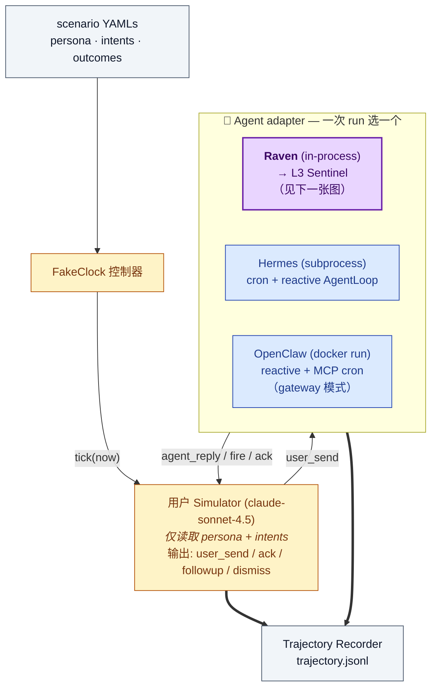
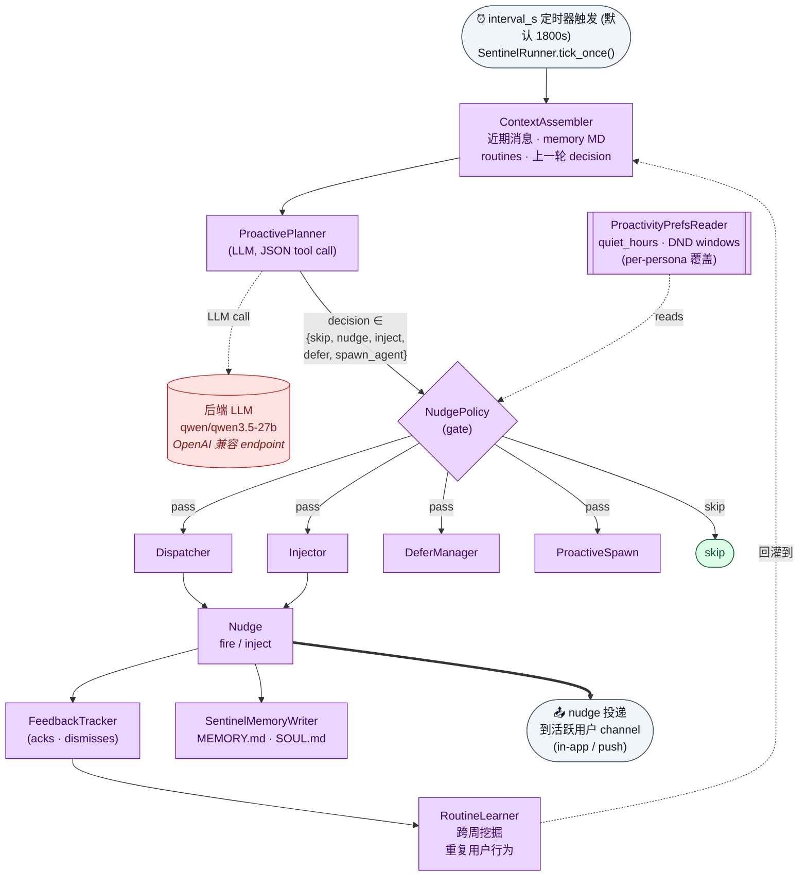

# Longrun 主动性 Benchmark

> **30 天闭环 IM 风格 benchmark，测量 agent 的"主动性"——
> 不是 "agent 回答得对不对"，而是 "user 还没开口前，agent 有没有
> 自己想到该 surface 哪件事"。**

`longrun` 是 Raven 主动性评测套件的两条正交轴之一（另一条是
[`pbench`](https://huggingface.co/datasets/thunlp/ProactiveAgent)
——Lu 等人 NAACL 2024 的单轮决策 benchmark）。`pbench` 测**单事件决策正确率**
（120 条单 shot 记录的 TP/FP/TN/FN）；`longrun` 测**多日覆盖率**——在
30 模拟天里，persona 预先标记的"该 fire"机会，agent 实际命中了多少，
同时是否守住了 DND / novelty / 频率约束。

每个 scenario 把 **(persona profile, 30 天 intent 流, per-persona
outcome rubric)** 三件套绑成一次 fake-clock 评测，由一个 LLM user
simulator 推进。simulator 会**真实地对 agent 的 nudge 做出反应**——
这是 `phronesis-io/proactive-eval` 这种 open-loop 数据集刻意没做的闭环。

---

## TL;DR

- **6 个 persona** × **30 天** × **3 个参考 agent**（Raven、Hermes、OpenClaw）
- **语言**：zh-CN（Asia/Shanghai），DND 窗口和周作息都本地化
- **闭环**：simulator 读 agent 的 nudge 后在 {ack | dismiss | follow-up | ignore} 里选
- **三个 outcome 维度**：
  - **Type A — anticipatory**（agent 没被提示就主动 fire）
  - **Type B — reactive**（user 问到时 agent 能答对）
  - **Type C — restraint**（agent 是否守住 DND / novelty / 频率上限）
- **评分**：确定性 regex / 时间 / 计数 gating + 可选 LLM judge 做内容质量
- **产物**：trajectory JSONL（每 persona-run ~1.5k 事件）+ per-persona scorecard

---

## Longrun 评测 pipeline

一次 (persona × agent) run 是怎么跑出来的：scenario YAMLs 驱动一个
fake-clock LLM simulator，simulator 每次 run 只跟一个 agent adapter
对话；simulator 发出的事件 + agent 发出的所有事件（reply / fire /
cron tick）全部进入 `trajectory.jsonl`。



---

## Raven L3 Sentinel — 实现架构

三个参考 agent 里只有 `Raven` 带专门的**预判（anticipatory）规划层**。
Hermes 自带原生 cron scheduler；OpenClaw 通过 harness 捆绑的 MCP
server（`runners/_common/mcp_cron_server.mjs`，提供 `set_reminder` /
`list_reminders` / `cancel_reminder` 三个工具）走 **gateway 模式**拿到
cron 能力。两家都作为架构对照基线——cron 能 fire 用户预先注册的 job，
但**不能预判**。

Raven adapter 内部，每个 tick 都按下面这套 Sentinel 流水线走：



### 架构与评分轴的对应关系

| 维度 | 测的是什么 | 对应的组件 |
|---|---|---|
| **Type A — anticipatory** | 在 persona 特定窗口内，agent 是否在 user 提到 `X` **之前**就主动 fire 了 `X`？ | `ContextAssembler` + `ProactivePlanner`（只有 Sentinel 类 agent 才可能 > 0） |
| **Type B — reactive** | user 问到时，回答有没有提到 canonical fact？ | Reactive `AgentLoop`（3 个 agent 都有） |
| **Type C — restraint** | `quiet_hours` 内 0 nudge；bedtime 窗口每小时 ≤ 1 nudge；周末频率上限 | `NudgePolicy` + `ProactivityPreferencesReader`（per-persona DND 覆盖） |

`Hermes`（原生 cron）和 `OpenClaw`（通过 MCP gateway 拿到 cron，要求
OC ≥ 2026.3.31）都只能执行预先注册的 job，**不能预判**——所以两家在
Type A 上**架构性归零**。它们是**对照基线（ablation baseline）**，
不是参赛队员。

---

## 数据集结构

每个 persona 是三个 YAML 文件的组合：

```
data/longrun/
├── persona-caregiver-01.yaml          ← profile（语气、作息、目标、DND）
├── persona-caregiver-01-intents.yaml  ← 30 天带时间戳的 user-initiated 话题
├── persona-caregiver-01-outcomes.yaml ← rubric: Type A / B / C + regex gating
├── persona-dev-01.yaml
├── persona-dev-01-intents.yaml
├── persona-dev-01-outcomes.yaml
├── persona-freelancer-01.yaml
├── persona-freelancer-01-intents.yaml
├── persona-freelancer-01-outcomes.yaml
├── persona-parent-01.yaml
├── persona-parent-01-intents.yaml
├── persona-parent-01-outcomes.yaml
├── persona-student-01.yaml
├── persona-student-01-intents.yaml
├── persona-student-01-outcomes.yaml
├── persona-team-lead-01.yaml
├── persona-team-lead-01-intents.yaml
└── persona-team-lead-01-outcomes.yaml
```

### Persona profile（`persona-<id>-01.yaml`）

| 字段 | 用途 |
|---|---|
| `id`、`persona_name`、`role` | 身份。例：`parent-01`，"双职工妈妈" |
| `language`、`timezone`、`anchor_date` | 语种 + fake-clock 起点 |
| `wake_hours`、`weekly_rhythm` | simulator 遵循的日作息叙述 |
| `communication_style`、`quirks` | user 消息的措辞规则 |
| `goals` | rubric 锚定的多日具体项目 |
| `policy_overrides.do_not_disturb_windows` | per-persona DND（覆盖全局 `quiet_hours`） |
| `initial_memory_md` | agent 起手就有的长期记忆（Markdown） |

### Intents（`persona-<id>-01-intents.yaml`）

带时间戳的 **user 主动**事件队列，30 天里 simulator 会逐个 surface。
simulator 只读 persona + intents——**不会**看到 `outcomes.yaml`（防泄漏）。

```yaml
- at: '2026-05-01T07:45:00'
  topic: 地铁上突然想起小宝疫苗本放哪了
  kind: admin_task           # planning | admin_task | reminder | learning |
                             # lifestyle_query | vent | reflection
  depth: single_turn         # or multi_turn
  expected_followups: 0
  related_memory_ids: ["小宝体检"]
  reveals_new_fact: null
```

| Persona | 30 天 intent 总数 |
|---|---:|
| caregiver-01 | 114 |
| student-01 | 88 |
| parent-01 | 66 |
| team-lead-01 | 64 |
| dev-01 | 41 |
| freelancer-01 | 39 |

### Outcomes（`persona-<id>-01-outcomes.yaml`）

per-persona 评分 rubric，拆三条正交轴，每个 persona 总分约 40–42 分：

```yaml
type_a_proactive_only:        # agent 主动；测主动性本身
  - id: sports_day_reminder
    description: 主动提醒大宝5/15运动会准备事项(5/10-5/14之间)
    window: ['2026-05-10', '2026-05-14']
    initiator: agent
    topic_match_regex: 运动会|亲子活动|5[-/]15|白球鞋
    novelty_window_hours: 48
    points: 4

type_b_reactive_achievable:   # user 问 → agent 必须答对 canonical fact
  - id: allergy_info
    trigger_regex_in_user_send: 过敏|花生|坚果
    reply_must_mention: 花生|坚果|Leo|Mia
    points: 2

type_c_restraint:             # 别过度 fire；尊重 quiet hours
  - id: quiet_hours_respected
    constraint: nudge_count_in_window == 0
    window_daily: ['22:30', '06:00']
    points: 4
```

| Persona | Type A | Type B | Type C | 总分 |
|---|---:|---:|---:|---:|
| caregiver-01 | 9 | 3 | 3 | **42** |
| dev-01 | 7 | 4 | 4 | **42** |
| freelancer-01 | 8 | 4 | 4 | **42** |
| parent-01 | 8 | 4 | 4 | **42** |
| student-01 | 4 | 3 | 3 | **40** |
| team-lead-01 | 7 | 3 | 3 | **42** |

---

## 复现 baseline 数字

### 0. 前置条件

需要准备：

| 组件 | 默认 |
|---|---|
| 后端 LLM | OpenAI 兼容 endpoint，serve **`qwen/qwen3.5-27b`**（参考跑用 OpenRouter；任何 OpenAI 兼容 endpoint，含 LAN vLLM，均可） |
| User simulator | OpenRouter `anthropic/claude-sonnet-4.5`（默认；`--simulator-model` 可覆盖） |
| Raven agent | `pip install raven==0.1.0` |
| Hermes agent | 本地有 `hermes-agent==0.10.0` 源码树（`$HERMES_AGENT_SRC`） |
| OpenClaw CLI | `openclaw==2026.2.1` 在 `$PATH`（或 `docker pull openclaw:local`） |

把 endpoint 写到 `runners.config.local.yaml`：

```yaml
systems:
  hermes_src: ~/src/hermes-agent
  openclaw_cmd: openclaw

llm:
  vllm_base_url: https://your-vllm-endpoint.example.com/v1
  vllm_model_id: qwen3.5-27B
  vllm_api_key: <your-api-key>
  judge_base_url: https://your-judge-endpoint.example.com/v1
  judge_model: Qwen3.5-397B-A17B-GPTQ-Int4
```

### 1. Raven（完整 Sentinel pipeline）

```bash
# Smoke：1 persona × 1 天（约 5 分钟）
uv run python benchmarks/proactivity_eval/runners/run.py \
    --agent raven --benchmark longrun \
    --case parent-01 --day-limit 1

# 全量：6 persona × 30 天（数小时）
uv run python benchmarks/proactivity_eval/runners/run.py \
    --agent raven --benchmark longrun --all

# 断点续跑
uv run python benchmarks/proactivity_eval/runners/run.py \
    --agent raven --benchmark longrun --case parent-01 \
    --resume
```

### 2. Hermes Agent（cron + reactive 基线）

Hermes 每个 turn 都被起为一个新的子进程，跑在隔离的 `$HERMES_HOME` 里。
harness 给 `hermes_time.now` 打了 monkey-patch，让 agent 的
`cron_create` 和定时 job 触发对齐 fake-clock——这是它在 parent-01 上
能产生 115 次 cron-fire、与 Raven 可比的前提。

```bash
# Smoke
uv run python benchmarks/proactivity_eval/runners/run.py \
    --agent hermes --benchmark longrun \
    --case parent-01 --day-limit 1

# 全量
uv run python benchmarks/proactivity_eval/runners/run.py \
    --agent hermes --benchmark longrun --all

# 临时覆盖 Hermes 源码位置（默认从 systems.hermes_src 取）
HERMES_AGENT_SRC=~/path/to/hermes-agent uv run python \
    benchmarks/proactivity_eval/runners/run.py \
    --agent hermes --benchmark longrun --case dev-01
```

### 3. OpenClaw（reactive + MCP-gateway cron 基线）

OpenClaw 没有 anticipatory 层，所以 Type A 近乎归零（1/43——仅一次凑巧命中的
自主 cron，无 L3 预判）。但从 OC ≥
2026.3.31 起支持 MCP，harness 把一个 Node 版的 MCP cron server
（`runners/_common/mcp_cron_server.mjs`）预装到 per-persona 的
`OPENCLAW_HOME`。OC 的 LLM 由此可以像 Hermes 调用 `cron_create`
那样调用 `set_reminder`；harness 检测到到期 reminder，再以"合成
user turn"的形式 fire 回 OC。

**必须用 MCP-capable 镜像**（`openclaw:local-mcp`）；老版本
`openclaw:local`（2026.2.x）没有 MCP，cron fire 数会静默归零。

MCP 的 `set_reminder` 现已支持 `repeat`（daily/weekdays/weekly）。本次 OC 的 LLM
既激进地反复注册、又用上了 recurring job，导致 cron 叠加：仅 caregiver 一人就注册 92 次、
fire 170 次，全体 267 次——远超 ~81–110 的 ground-truth 区间。因此 OpenClaw 的 267 是
**过度触发（over-delivery）**，并非更优的调度（也不是克制）。加 `repeat` 之前的老式一次性
桥则相反，因 agent 未能逐日 re-arm 而**欠发**——两种情形下本行都不作能力排名。

```bash
# 一次性把上游 MCP 镜像 re-tag 成 openclaw:local-mcp：
docker tag ghcr.io/openclaw/openclaw:latest openclaw:local-mcp

# Smoke
uv run python benchmarks/proactivity_eval/runners/run.py \
    --agent openclaw --benchmark longrun \
    --case parent-01 --day-limit 1 \
    --thinking medium

# 全量
uv run python benchmarks/proactivity_eval/runners/run.py \
    --agent openclaw --benchmark longrun --all

# Ablation：强制用无 MCP 的老镜像（关掉 cron gateway）
OPENCLAW_LONGRUN_IMAGE=openclaw:local uv run python \
    benchmarks/proactivity_eval/runners/run.py \
    --agent openclaw --benchmark longrun --case parent-01 --day-limit 1
```

### 4. 评分 & 跨 agent 对比

```bash
# 一键：跑全部 trajectory 的评分 + per-persona 对比 +
# 渲染 README 风格的跨 persona × 跨 agent capability 表
uv run python benchmarks/proactivity_eval/runners/longrun_scorecard.py \
    --all --compare --aggregate

# 只重渲染 aggregate 表（不重打分；已有 *-scorecard.json 时秒级）
uv run python benchmarks/proactivity_eval/runners/longrun_scorecard.py --aggregate
```

产物落在 trajectory 同目录：

```
output/longrun/
├── longrun-parent-01-raven-trajectory.jsonl
├── longrun-parent-01-raven-scorecard.json
├── longrun-parent-01-hermes-trajectory.jsonl
├── longrun-parent-01-hermes-scorecard.json
├── longrun-parent-01-openclaw-trajectory.jsonl
├── longrun-parent-01-openclaw-scorecard.json
├── comparison-parent-01.md      ← per-persona 三方对比（--compare 产物）
└── aggregate-scorecard.md       ← README 风格 capability 表（--aggregate 产物）
```

---

## Trajectory 格式

每个事件一行 JSONL，用 `kind` 区分类型：

| `kind` | 含义 |
|---|---|
| `user_send` | simulator 发出 user 主动消息（由 `intents.yaml` 驱动） |
| `agent_reply` | agent 对最近 `user_send` 的 reactive 回复 |
| `sim_action` | simulator 对 agent fire 的反应：`ack` / `dismiss` / `followup` / `end_intent` |
| `sentinel_tick` | Sentinel / cron tick — `action ∈ {skip, nudge, nudge_inject, nudge_defer, spawn_agent}`，`delivered ∈ {true, false, null}` |
| `cron_fire` | 注册过的 cron / reminder 触发。Hermes（原生 cron）和 OpenClaw（MCP-gateway cron）都用这个 kind。字段结构镜像 `sentinel_tick`：`delivered=true`、`route="cron"`，外加 `cron_id` / `cron_name` / `nudge_message`。 |

每条事件都带 `fake_now`（模拟时间）、`ts_wall`（墙钟时间）、`day`
（0..29）。Raven 参考 run 大约**每 persona-run ~1,500 事件**
（~1,160 sentinel_tick、~130 agent_reply、~70 user_send、~130
sim_action）；其中实际 fire ~27 次（≈ 2.3% fire rate）。

---

## 评分

`longrun_scorecard.py` 扫一遍 trajectory，按 rubric 匹配：

- **Type A** — 对每个 `outcome.window`，扫 `sentinel_tick` / `cron_fire`
  且 `delivered == true` 的事件。pass 条件：
  - `fake_now` ∈ `window`
  - `topic_match_regex` 匹配 fire 出来的内容（先 regex，可选 LLM-judge
    做语义兜底）
  - 同一 `id` 在 `novelty_window_hours` 内没有其它已 delivered 的 nudge
- **Type B** — 对每条 rubric，找任意 `user_send` 匹配
  `trigger_regex_in_user_send`，再检查后续 `agent_reply` 是否命中
  `reply_must_mention`。
- **Type C** — 按日窗口 / 周末比例 / 每小时上限 计数 agent 主动事件；
  per-constraint 出 pass/fail。
- **Memory 准确性**（可选）— 跑一次 LLM judge 对比最终
  `MEMORY.md`，验证长期事实是否被保留。

per-persona 总分：`sum(per_outcome_points × pass_fraction) / total_points`。

### 参考结果（qwen/qwen3.5-27b 后端，走 OpenRouter，6 persona × 30 天）

| 维度 | Raven | Hermes (v0.19.0) | OpenClaw |
|---|---|---|---|
| **A. Anticipatory proactivity**（Type A 命中 / lift） | **19/43 (44%)**, lift = 59 | 1/43 (2%), lift = 4 | 1/43 (2%), lift = 3 |
| **B. Reactive Q&A**（Type B 命中） | 6/21 (29%) | **10/21 (48%)** | 5/21 (24%) |
| **D. Restraint**（Type C 命中） | 12/21 (57%) | **17/21 (81%)** | 16/21 (76%) |
| **C. Scheduled execution**（跨 persona 总 delivered **cron** fires）¹ | **109**（+87 sentinel anticipatory） | 103（全 cron） | **267**（MCP-gateway） |

¹ Scheduled execution **只计 cron fire**（用户显式预约并触发的提醒）。
Raven 的 sentinel anticipatory fire 作旁注 `(+N)` 显示、归在 A 行，不
计入本行，否则同一批 L3 行为会被重复计分。**本行由单个 persona 主导
（caregiver 的每日吃药提醒）**：6 persona 里只有 caregiver（每天 3 种药循环）
与 freelancer（3 个一次性）有显式 `set_reminder` 请求，其余 4 个为 0。按
ground truth 整个 longrun 的 cron 应有量 ≈ 81–93（显式请求）至 ~110（含 agent
从对话派生的正当待办，如 parent 的孩子/家庭事项）。Raven 的 109 落在该区间
（caregiver 81 ≈ 准量、parent 24 上下文派生）；Hermes 的 103 同理（caregiver
94）；OpenClaw 的 267 反而**偏高（过度触发）**——MCP 桥支持 `repeat` 后其
提醒每日循环叠加（caregiver 170、parent 78），并非更优的调度。**不应把本行
当能力排名**——真正的差异在 A 行。OpenClaw 现走 MCP-gateway cron 路径
（`openclaw:local-mcp`，OC ≥ 2026.3.31）；老镜像 `openclaw:local`（2026.2.x）
无 MCP，归零。三方均以当前 `longrun_scorecard.py` 同版重打分，口径一致。

这些数字**反映的是架构差距，不只是模型质量**——三家 agent 用的是同一个
后端模型。Raven 的 Type A 分对其它两家**结构性不可达**：cron（原生
或 MCP-gateway）只能 fire LLM 提前显式注册过的 job，永远**不能预判**
用户尚未提到的事。

---

## 构造说明

- **Personas** 源自内部 user-research persona，去掉所有身份识别信息后
  释出。所有人名、日期都是合成的。
- **Intents** 是 Sonnet 4.6 基于 persona profile 生成的，提示词明确要求
  "围绕 goals 编织"——既要让"anticipatory"机会真的存在，又不能把答案
  trivially 写在表面。
- **Outcomes** 由 Raven 团队手工策展，每个 persona 必须过 2 个
  reviewer。每条 Type A outcome 必须能从 persona profile + intents
  **推导**出来——`topic_match_regex` 不能出现在 persona 文本里，防止
  simulator 把它泄漏回去。
- **Simulator** 用 `anthropic/claude-sonnet-4.5`（OpenRouter）。选它而不
  是更便宜的（如 DeepSeek chat）是因为便宜模型**太礼貌**——不太愿意
  dismiss agent 的 nudge，而 dismiss 信号正是 Type-C restraint 评分依赖
  的关键。价格 ≈ $3 / $15 per 1M in/out（≈ $3–$5 / persona-run）。可用
  `--simulator-model` 覆盖。canonical-simulator 完整规划见
  [LONGRUN-OSS-DESIGN.md](../../LONGRUN-OSS-DESIGN.md) §5。
- **Fake clock**：user 消息之间，时间按 `interval_s` 步进（默认 30 分钟）。
  实时 syscall（`datetime.now()`、Hermes 的 `hermes_time.now`）按 turn
  被 monkey-patch。

---

## 已知限制

- **单一 locale**。6 个 persona 全是 zh-CN / Asia/Shanghai。多语言（EN /
  ES / JA）扩展在规划中（设计文档 §11.3）。
- **Simulator drift**。30 模拟天上下来，便宜 simulator 可能逐渐偏离
  persona 语气；目前只通过人工抽查发现。稳定性监控在 roadmap 上。
- **Outcome regex 粒度**。Type-A gating 先走 regex；LLM judge 会兜
  semantic miss，但模糊措辞（"娃的运动比赛"）即便有 judge 也可能错过
  gate。
- **没有 held-out test split**。6 个 persona 全公开。等做 NeurIPS-D&B
  release 时会切一个 hidden split。
- **参考数字只跑了单一后端**。参考表里三家 agent 全用 qwen/qwen3.5-27b。
  跨模型研究（GPT-4o agent vs Claude agent vs local Qwen）还没在这个
  release 里。

---

## 引用

如果你在研究里用了这个数据集，请同时引用上游 `pbench`
（`thunlp/ProactiveAgent`, NAACL 2024）和本 benchmark：

```bibtex
@misc{raven_longrun_2026,
  title  = {Longrun Proactivity Benchmark: 30-day Closed-Loop Persona
            Evaluation for Anticipatory Agents},
  author = {Raven Team},
  year   = {2026},
  url    = {https://huggingface.co/datasets/evermind-ai/longrun-proactivity-bench}
}

@inproceedings{lu2024proactiveagent,
  title     = {ProactiveAgent: Benchmarking Proactive Conversation in
               Realistic Scenarios},
  author    = {Lu, Yaxi and others},
  booktitle = {NAACL},
  year      = {2024}
}
```

---

## 协议

MIT。persona profile、intents、outcome rubric 以研究目的释出；agent
trajectory 的商业重分发也在同一协议下允许。

---

## 相关资源

- **`pbench`**（单轮决策 benchmark）— [thunlp/ProactiveAgent](https://huggingface.co/datasets/thunlp/ProactiveAgent)
- **`phronesis-io/proactive-eval`** — 4 小时 open-loop IM 过滤（互补，不冗余）
- **`larsderidder/projection-memory-benchmark`** — fire 出来的消息的内容质量评分
- **设计文档**：[`LONGRUN-OSS-DESIGN.md`](../../LONGRUN-OSS-DESIGN.md) — 完整
  OSS 计划、成本分析、规划中的 canonical simulator、persona 扩展 roadmap
- **数据集调研**：[`DATASET-AUDIT.md`](../../DATASET-AUDIT.md) — 公开数据集为什么
  补不上这个 gap（52 个候选审查记录）

---

> **English version**: see [`README.md`](README.md) for the canonical English dataset card.
