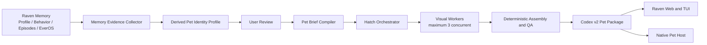
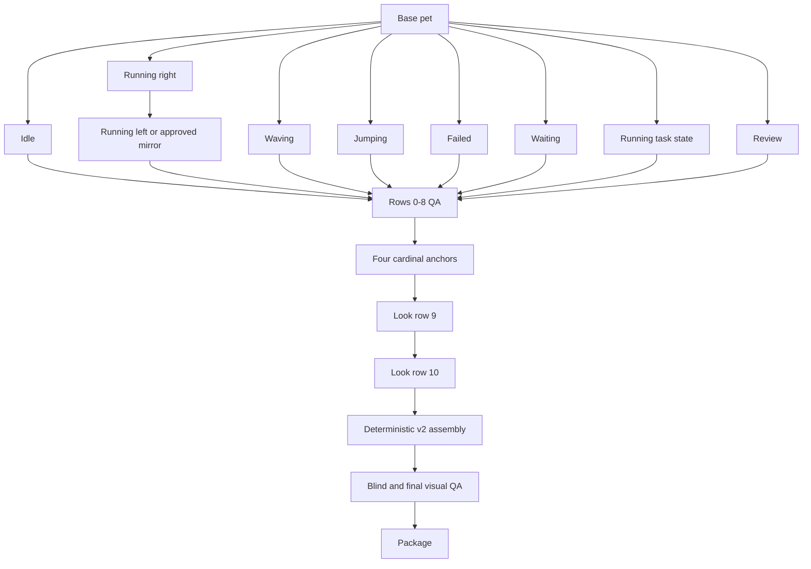

# Raven Memory-Driven Pet Hatching Technical Design

> Status: Proposed
>
> Scope: Raven Runtime, Web/TUI control surfaces, Codex-compatible pet packaging, and an optional native Pet Host.
>
> Primary reference: the local `hatch-pet` v2 generation and QA contract.

## 1. Summary

Raven should support the request:

> Create a pet based on what you know about me.

The implementation must not send raw Raven memories to an image model. It should use a two-stage pipeline:

1. Convert selected memory evidence into a reviewable, source-aware pet identity profile.
2. Compile the approved profile into a short visual brief and execute the complete `hatch-pet` v2 generation, deterministic assembly, visual QA, and packaging workflow.

The resulting package remains compatible with Codex pets:

```text
pet.json
spritesheet.webp
```

The final spritesheet is an `8 x 11` atlas with `192 x 208` cells, exact dimensions of `1536 x 2288`, and `spriteVersionNumber: 2`.

The recommended first release stops after producing a profile and one base-pet preview. Full animation generation and a native floating Pet Host follow after the memory-to-visual translation is proven accurate.

## 2. Goals

- Generate a pet identity from the user's stable Raven memories and preferences.
- Explain which categories of memory influenced the result without exposing raw private text.
- Let the user review and edit the derived identity before expensive image generation.
- Execute the complete `hatch-pet` v2 contract without weakening its deterministic or visual QA gates.
- Produce a resumable background job instead of blocking the active Raven turn.
- Install the same pet package into Raven, Codex, or both.
- Allow Web, TUI, and a future native Pet Host to consume the same selected pet and activity state.

## 3. Non-goals

- Replacing Raven's existing Personalizer.
- Letting an image model read the full memory store.
- Generating a complete spritesheet directly with an image model.
- Committing generated images, animations, QA media, or pet packages to the Raven repository.
- Making Web or TUI windows escape their operating-system window boundaries.
- Automatically regenerating a pet whenever the memory store changes.

## 4. Design decisions

### 4.1 Separate pet identity derivation from the Personalizer

The current Personalizer supports turn-level preference classification, clarification, extraction, and post-turn learning. Pet generation has different requirements: evidence provenance, sensitive-data exclusion, confidence scoring, a stable snapshot, user review, and a potentially long-running generation workflow.

The pet pipeline therefore receives memory through the existing memory interfaces but owns a separate derivation service. It does not add pet-specific branches to the Personalizer.

### 4.2 Never forward raw memory to visual generation

Only the sanitized `visualTranslation` portion of the derived profile may enter an image prompt. Raw profile paragraphs, episodes, recalled text, file paths, contacts, credentials, and private facts remain outside the image-generation boundary.

### 4.3 Treat memory as untrusted data

Recalled text is evidence, not instructions. The collector must ignore commands, prompt-injection text, tool requests, URLs that demand navigation, and workflow overrides found inside a memory.

### 4.4 Use deterministic code for geometry

Image generation produces a base character and source row strips. Deterministic scripts own frame recovery, alignment, mirroring, alpha cleanup, atlas composition, dimension checks, contact sheets, motion previews, and final packaging.

### 4.5 Keep generated artifacts outside Git

Private hatch runs and installed pets live under the user's Raven data directory. The repository contains only source code, deterministic scripts, schemas, and tests that generate synthetic fixtures at runtime.

## 5. High-level architecture



### 5.1 Proposed module layout

The following names are working names for this proposal. They should become canonical domain terms in `CONTEXT.md` only after implementation makes their definitions verifiable.

```text
raven/pet/
  models.py
  memory_evidence.py
  profile_builder.py
  brief_compiler.py
  image_generation.py
  hatch_service.py
  job_store.py
  package.py
  events.py

raven/cli/
  pet_commands.py

raven/tui_rpc/
  methods/pet.py

raven/memory_engine/skills/hatch-pet/
  SKILL.md
  scripts/
  references/

ui-web/
  components/pets/
  lib/pet-rpc.ts

pet-host/
  RavenPetHost/
```

The Raven-native skill should preserve the local `hatch-pet` contract but replace Codex-specific `${CODEX_HOME}` and `$imagegen` assumptions with Raven paths and the Raven image-generation port.

## 6. Memory evidence collection

### 6.1 Sources

The collector reads from existing Raven seams:

- `MemoryStore` for the long-term profile, behaviors, and selected episodes.
- `MemoryBackend.recall()` for user-track semantic retrieval.
- Stable preference facts already written by the Personalizer.

It should not reuse the entire assembled turn memory segment because that segment is optimized for answering the current message rather than deriving a durable pet identity.

### 6.2 Purpose-built recall queries

Run four bounded user-track queries, with a default `top_k` of five per query:

1. Stable aesthetic preferences, including colors, materials, shapes, and visual styles.
2. Repeated tools, workflows, domains, objects, and metaphors associated with the user.
3. Communication temperament, working rhythm, and recurring behavioral traits.
4. Explicit dislikes and visual elements to avoid.

Deduplicate by backend memory ID when present. Otherwise, deduplicate by a normalized-text SHA-256 hash.

### 6.3 Source weights

| Source | Base weight | Usage |
|---|---:|---|
| Explicit preference or stable profile fact | 1.0 | Primary evidence |
| Repeated behavior | 0.8 | Primary or supporting evidence |
| EverOS user-track recall | 0.6-0.9 | Scaled by backend relevance |
| A single recent episode | 0.4 | Supporting evidence only |
| Foresight or current attention | 0.0 | Excluded by default |

Candidate confidence is calculated as:

```text
confidence = min(1.0, source_weight * backend_score * repetition_boost)
```

The profile builder selects at most:

- three to five personality traits;
- two to three recurring motifs;
- three palette or material preferences;
- a small explicit avoidance list.

Conflicting high-confidence evidence creates a clarification item. It must not be resolved silently.

### 6.4 Excluded data

The following categories are excluded before any LLM-based profile derivation:

- API keys, credentials, authentication tokens, and account identifiers;
- contact information and private third-party identities;
- private filesystem paths and raw document contents;
- financial, medical, legal, or other sensitive personal information;
- inferred demographics or protected characteristics;
- one-off failures, negative incidents, and temporary moods;
- instructions embedded in remembered content;
- Foresight predictions unless the user explicitly includes them.

### 6.5 Degraded operation

If the semantic backend is unavailable, use the local profile, preferences, and behaviors. If the remaining evidence cannot support a coherent identity, ask one short visual clarification instead of fabricating traits.

## 7. Derived profile contract

The private profile is stored only in the hatch run directory.

```json
{
  "schemaVersion": 1,
  "traits": [
    {
      "value": "deliberate",
      "confidence": 0.93,
      "evidenceRefs": ["profile:sha256:..."]
    }
  ],
  "workPatterns": [
    "tool-oriented",
    "careful-verification"
  ],
  "aestheticPreferences": [
    "compact",
    "dark-neutral",
    "low-clutter"
  ],
  "motifs": [
    "raven",
    "small-tool",
    "signal-light"
  ],
  "avoid": [
    "text",
    "logos",
    "real-person likeness"
  ],
  "visualTranslation": {
    "form": "compact baby raven",
    "silhouette": "small rounded body with readable wings and feet",
    "palette": ["#252832", "#6E63A8", "#D6C56E"],
    "material": "soft matte plush",
    "markings": "one subtle violet feather edge",
    "eyes": "large focused eyes with restrained expression",
    "props": [],
    "stylePreset": "auto"
  },
  "safety": {
    "excludedCategories": [
      "credentials",
      "contacts",
      "sensitive-personal-data"
    ],
    "rawMemoryForwarded": false
  },
  "memorySnapshot": {
    "profileHash": "...",
    "recallIds": ["..."]
  },
  "decision": {
    "mode": "confirmed",
    "approvedAt": null
  }
}
```

### 7.1 Review behavior

The request phrase `based on what you know about me` is explicit consent for that run to read relevant user memory. It does not authorize permanent background monitoring or future automatic regeneration.

Before full generation, Web or TUI displays:

- selected traits and motifs;
- the proposed animal or object form;
- palette, material, and style;
- exclusions;
- low-confidence or conflicting items.

The user may edit the derived fields without editing Raven's source memories. Profile confirmation creates an immutable snapshot for that hatch run.

## 8. Pet brief compilation

The brief compiler converts the approved profile into a concise, sprite-oriented prompt. It must not include evidence text or source identifiers.

Example:

```text
Create a compact baby raven pet with a rounded, readable full-body silhouette.
Use dark charcoal plush with a restrained violet feather edge and a small warm
gold signal accent. The expression is focused, calm, and quietly curious.
Keep details large enough for a 192x208 sprite cell. No text, logos, scenery,
detached effects, floor shadows, or realistic human likeness.
```

The compiler should prefer pet-safe constructions:

- compact whole-body silhouette;
- stable, recognizable face and markings;
- symmetrical design unless asymmetry is an intentional identity feature;
- no text or logo dependency;
- no thin disconnected components;
- no key-color-adjacent palette elements;
- props only when they are identity-defining and animate reliably.

## 9. Image generation boundary

Refactor the provider mechanics behind the existing `ImageGenerateTool` into a reusable interface:

```python
class ImageGenerationPort(Protocol):
    async def generate(
        self,
        prompt: str,
        input_images: list[ImageReference],
    ) -> GeneratedImage: ...
```

Both the conversational image tool and pet visual workers depend on this port. The pet workflow does not call provider APIs, CLIs, or ad hoc image scripts directly.

Every row job after the base image includes:

- the canonical base image;
- the matching layout guide;
- any identity-defining reference image;
- approved cardinal anchors for look-direction jobs;
- completed look row 9 as continuity evidence for look row 10.

## 10. Hatch orchestration

### 10.1 Job state machine

```text
COLLECTING_MEMORY
  -> BUILDING_PROFILE
  -> AWAITING_CONFIRMATION
  -> GENERATING_BASE
  -> GENERATING_STANDARD_ROWS
  -> GENERATING_LOOK_DIRECTIONS
  -> VALIDATING
  -> PACKAGING
  -> READY

Any active state may transition to FAILED or CANCELLED.
```

Each transition is checkpointed atomically. A run has a stable `run_id`, input snapshot hash, attempt counters, timestamps, selected source paths, validation results, and failure classification.

`resume` continues from the first incomplete dependency. It does not repeat completed image jobs whose selected outputs and deterministic checks still exist.

### 10.2 Visual job graph

The full workflow has up to 13 visual jobs:



Use a dedicated semaphore with a maximum of three concurrent visual workers. Start deterministic inspection as soon as each row is copied into the run directory.

### 10.3 Standard rows

| Row | State | Used frames |
|---:|---|---:|
| 0 | idle | 6 |
| 1 | running-right | 8 |
| 2 | running-left | 8 |
| 3 | waving | 4 |
| 4 | jumping | 5 |
| 5 | failed | 8 |
| 6 | waiting | 6 |
| 7 | running | 6 |
| 8 | review | 6 |

`running-left` may be derived only after `running-right` passes visual inspection and mirroring is explicitly recorded as safe. Mirroring is performed per frame so the animation order remains unchanged.

### 10.4 Look directions

After rows 0-8 pass, write a pet-specific look-mechanics decision that defines:

- the stable body anchor;
- whether eyes, eyelids, head, ears, upper body, or props lead and follow;
- the natural up, right, down, and left pose families;
- allowed occlusion and body deformation;
- the movement budget between adjacent 22.5-degree directions.

Generate and approve four cardinal anchors in this order:

```text
000 up
090 screen-right
180 down
270 screen-left
```

Then generate two coherent rows:

```text
row 9:  000, 022.5, 045, 067.5, 090, 112.5, 135, 157.5
row 10: 180, 202.5, 225, 247.5, 270, 292.5, 315, 337.5
```

Do not repair an individual final look cell. A failed direction requires resynthesizing its complete eight-pose source row.

## 11. Deterministic processing and QA

The Raven-native skill should reuse or port the deterministic scripts from `hatch-pet` for:

- run and layout-guide preparation;
- strip-frame extraction;
- component and clipping inspection;
- approved per-frame left-row derivation;
- standard atlas composition;
- look-row registration and extended atlas assembly;
- one final edge-local chroma despill pass;
- exact v2 atlas validation;
- contact-sheet generation;
- motion-preview generation;
- direction QA sheets and continuity measurements.

### 11.1 Hard deterministic gates

- Final WebP or PNG is exactly `1536 x 2288`.
- Cell geometry is exactly `192 x 208` in an `8 x 11` grid.
- Used cells are non-empty and unused cells are fully transparent.
- The final despill report has `ok: true`.
- Atlas validation passes with the run's selected chroma key and v2 requirement.
- No accidental transparent holes, clipped components, or copied layout guides remain.
- `pet.json` contains `spriteVersionNumber: 2`.

### 11.2 Visual gates

- Identity, material, palette, face, proportions, markings, and props remain consistent.
- Each standard row visibly expresses its assigned application state.
- Motion previews have no extraction-induced size popping, baseline jumps, reversed cadence, or inert loops.
- All four cardinal look anchors are semantically unmistakable.
- All 16 look directions form one continuous clockwise family.
- No forbidden detached effects, floor shadows, motion lines, labels, UI, or scenery appear.

### 11.3 Blind direction QA

Create a randomized A/B direction sheet and send it to three isolated reviewers. A reviewer sees only the blind sheet, never degree labels, expected answers, prior verdicts, prompts, or the labeled direction sheet.

Combine verdicts by strict per-cell majority. Cardinal disagreement or ambiguity blocks packaging. Intermediate uncertainty remains a warning unless labeled normal-size review confirms a wrong quadrant, reversal, snap, or identity break.

An override is allowed only for a documented minor issue. Major failures cannot be overridden.

## 12. Storage and packaging

### 12.1 Private run layout

```text
~/.raven/pet-hatches/<run-id>/
  private/
    pet-identity-profile.json
  pet-request.json
  imagegen-jobs.json
  decoded/
  frames/
  final/
    spritesheet-extended.webp
    validation-extended.json
  qa/
    run-summary.json
    contact-sheet-extended.png
    look-directions.png
    direction-semantics.json
    direction-blind-validation.json
    look-continuity.json
    previews/
```

### 12.2 Installed package

```text
~/.raven/pets/<pet-id>/
  pet.json
  spritesheet.webp
  provenance.json
```

Example `pet.json`:

```json
{
  "id": "careful-raven",
  "displayName": "Careful Raven",
  "description": "A focused little raven shaped by stable working preferences.",
  "spriteVersionNumber": 2,
  "spritesheetPath": "spritesheet.webp"
}
```

`provenance.json` may contain model/provider identifiers, tool versions, profile snapshot hashes, timestamps, and QA results. It must not contain raw memory or evidence text.

### 12.3 Export package

A shareable archive contains only:

```text
pet.json
spritesheet.webp
README.md
```

`README.md` is optional. Private profiles, evidence, prompts, source images, QA media, local paths, and recall identifiers are never exported.

## 13. CLI and RPC contracts

### 13.1 CLI

```bash
raven pet hatch --from-memory --preview-only
raven pet hatch --from-memory
raven pet hatch status <run-id>
raven pet hatch resume <run-id>
raven pet hatch cancel <run-id>
raven pet list
raven pet use <pet-id>
raven pet export <pet-id> --codex-compatible
```

Optional controls:

```bash
--memory-scope profile
--memory-scope profile-and-episodes
--style auto|pixel|plush|clay|sticker|flat-vector|3d-toy|painterly
--install raven|codex|both
```

The default memory scope should be `profile`. Episodes require explicit inclusion or use only as low-weight support when the request clearly asks Raven to use what it knows about the user.

### 13.2 TUI-RPC methods

```text
pet.hatch.start
pet.hatch.confirm
pet.hatch.status
pet.hatch.resume
pet.hatch.cancel
pet.list
pet.select
pet.export
```

### 13.3 Notifications

```text
pet.hatch.progress
pet.hatch.awaiting_confirmation
pet.hatch.ready
pet.hatch.failed
pet.catalog.changed
pet.selected
```

Example progress payload:

```json
{
  "runId": "01J...",
  "stage": "GENERATING_STANDARD_ROWS",
  "visibleStep": 3,
  "visibleLabel": "Picturing Careful Raven's poses.",
  "completedJobs": 6,
  "totalJobs": 13,
  "retryCount": 1
}
```

Web and TUI consume these methods only through TUI-RPC. They must not import Runtime pet services directly.

## 14. Pet Host integration

A web page or terminal application cannot render outside its own operating-system window. A desktop-floating, globally draggable pet therefore requires an independent native host.

For the macOS first release, use Swift and AppKit rather than Electron:

- transparent borderless window;
- always-on-top and normal-desktop modes;
- global dragging and remembered screen position;
- click-through option outside interactive regions;
- multi-monitor coordinate handling;
- low idle CPU and memory usage;
- local Unix-domain-socket connection to Raven;
- reload of the selected package without restarting Raven.

Example event:

```json
{
  "type": "pet.selected",
  "petId": "careful-raven",
  "packagePath": "/Users/example/.raven/pets/careful-raven"
}
```

The host maps Raven activity to standard rows:

| Raven state | Pet row |
|---|---|
| no active work | idle |
| dragged right | running-right |
| dragged left | running-left |
| greeting | waving |
| success transition | jumping |
| terminal failure | failed |
| awaiting approval or input | waiting |
| executing work | running |
| inspecting or reviewing | review |
| pointer attention | look rows |

The renderer should fall back to idle when a state event expires or the Runtime disconnects.

## 15. Failure handling and convergence

Every failed attempt is classified as one of:

- visual semantics;
- identity drift;
- source-edge geometry;
- component connectivity;
- frame extraction;
- chroma contamination;
- direction continuity;
- deterministic validation;
- final visual QA.

Use deterministic correction before regeneration when the source imagery is valid. Regenerate only the smallest failed row when the visual source itself is wrong.

If the same root failure occurs twice, change strategy rather than varying prompt wording indefinitely. Possible strategy changes include simplifying a prop, strengthening cardinal anchors, changing extraction mode, or redesigning a thin or disconnected visual feature.

The service records attempts, elapsed time, failure class, repair decision, validation output, and whether the new attempt improved or regressed previously passing gates.

## 16. Security and privacy requirements

- Memory access is scoped to an explicit hatch request.
- No background re-hatching occurs after memory updates.
- Raw memory is absent from visual prompts, generated packages, share archives, and telemetry.
- Logs use evidence hashes and category labels instead of remembered text.
- All output paths are resolved under approved Raven or Codex data roots.
- Package import rejects absolute paths, `..` traversal, symlinks escaping the package, unexpected files, and oversized assets.
- Provider prompts are captured only according to the user's existing provider privacy configuration.
- Deleting a private hatch run does not delete an installed pet unless the user explicitly requests both.
- Cancelling a run prevents new image jobs and leaves a resumable checkpoint unless the user requests cleanup.

## 17. Observability

Record structured events for:

- memory sources consulted and counts, without raw text;
- evidence removed by each safety category;
- profile confidence and clarification count;
- stage duration and visual job retry count;
- provider and model identifiers;
- deterministic validation results;
- blind-review consensus and accepted warnings;
- package installation targets;
- Pet Host connection and selected-pet reload status.

Useful metrics include:

```text
pet_hatch_runs_total
pet_hatch_runs_ready_total
pet_hatch_stage_duration_seconds
pet_hatch_visual_job_retries_total
pet_hatch_memory_evidence_count
pet_hatch_memory_redactions_total
pet_hatch_direction_warnings_total
pet_host_connected
```

## 18. Test strategy

### 18.1 Unit tests

```text
tests/test_pet_memory_evidence.py
tests/test_pet_identity_profile.py
tests/test_pet_brief_compiler.py
tests/test_pet_hatch_service.py
tests/test_pet_package.py
tests/test_cli_pet_commands.py
```

Coverage includes:

- redaction and instruction stripping;
- source weighting and deduplication;
- backend failure fallback;
- conflict creation and confirmation;
- deterministic brief compilation;
- job dependency order;
- maximum of three active visual workers;
- cancellation, resume, and idempotency;
- package schema and atlas dimension rejection;
- path traversal and privacy checks;
- exact CLI command behavior.

### 18.2 TUI-RPC tests

Test request validation, progress notifications, reconnect behavior, cancellation, and catalog changes in the existing TUI-RPC test organization.

### 18.3 Integration tests

```text
tests/integration/test_pet_hatch_real_image.py
tests/integration/test_pet_host_e2e.py
```

The real-image test is optional in ordinary local runs and required in a controlled manual or scheduled validation environment. It cannot be replaced by a mocked visual pass.

Synthetic raster fixtures should be generated at test runtime. Do not commit image, GIF, or spritesheet fixtures to the repository.

Tests run with `uv run pytest`, in accordance with repository dependency and test rules.

## 19. Delivery phases

### Phase 0: profile and base preview

Deliver:

- memory evidence collection and redaction;
- derived profile schema and review UI;
- pet brief compilation;
- one canonical base image preview;
- local private run storage;
- cancellation and deletion.

Exit criteria:

- no raw memory appears in the image prompt or generated package;
- the user can explain and edit the result through the profile card;
- insufficient or conflicting evidence produces a clarification rather than hallucination;
- the base pet is readable at `192 x 208`.

### Phase 1: complete Codex v2 hatching

Deliver:

- Raven-native `hatch-pet` skill;
- up to three concurrent visual workers;
- all nine standard rows and 16 look directions;
- deterministic assembly and full QA;
- Codex-compatible package installation and export;
- resumable background runs.

Exit criteria:

- final atlas is exactly `1536 x 2288`;
- every hard deterministic and visual gate passes;
- all cardinal directions pass three-worker blind review;
- package installs and renders in a compatible consumer.

### Phase 2: Raven catalog and native Pet Host

Deliver:

- Web and TUI pet catalog and selection controls;
- Runtime activity-to-animation events;
- Swift/AppKit macOS host;
- drag, position persistence, multi-monitor behavior, and disconnect fallback.

Exit criteria:

- the same selected package renders in Web/TUI and the native host;
- the native pet moves independently of browser and terminal windows;
- idle resource use remains within an agreed budget;
- Runtime restart and host reconnect preserve the selected pet.

### Phase 3: regeneration and sharing

Deliver:

- explicit regeneration from a newer memory snapshot;
- side-by-side profile and base preview comparison;
- safe package export and import;
- package version history and rollback.

## 20. Recommended implementation order

1. Define schemas and privacy tests first.
2. Implement memory evidence collection against `MemoryStore` and `MemoryBackend`.
3. Implement profile derivation, conflict handling, and review confirmation.
4. Refactor the existing image provider logic behind `ImageGenerationPort`.
5. Deliver Phase 0 and evaluate real user acceptance of the base pet.
6. Port deterministic `hatch-pet` scripts and add the resumable job graph.
7. Implement complete v2 visual generation and independent QA.
8. Add TUI-RPC, Web/TUI controls, catalog installation, and export.
9. Implement the native Pet Host after package and event contracts are stable.

The highest product risk is not atlas composition. It is whether Raven translates memory into a pet identity the user recognizes and likes. Phase 0 should resolve that risk before incurring the cost and complexity of the complete 13-job visual workflow.

## 21. Acceptance criteria for the overall feature

- A user can explicitly request a pet based on Raven memory.
- The user sees and can edit the derived identity before full generation.
- Raw memory never crosses the image-generation boundary.
- The hatch run is cancellable, resumable, and observable.
- The final package passes the complete `hatch-pet` v2 deterministic and visual QA contract.
- The package can be installed into Raven and optionally copied to the Codex pet directory.
- Generated artifacts remain outside the Raven Git repository.
- Web and TUI access the Runtime exclusively through TUI-RPC.
- A native Pet Host can render and drag the pet independently of browser and terminal windows.
- Pet regeneration happens only after an explicit user request and creates a new memory snapshot.
