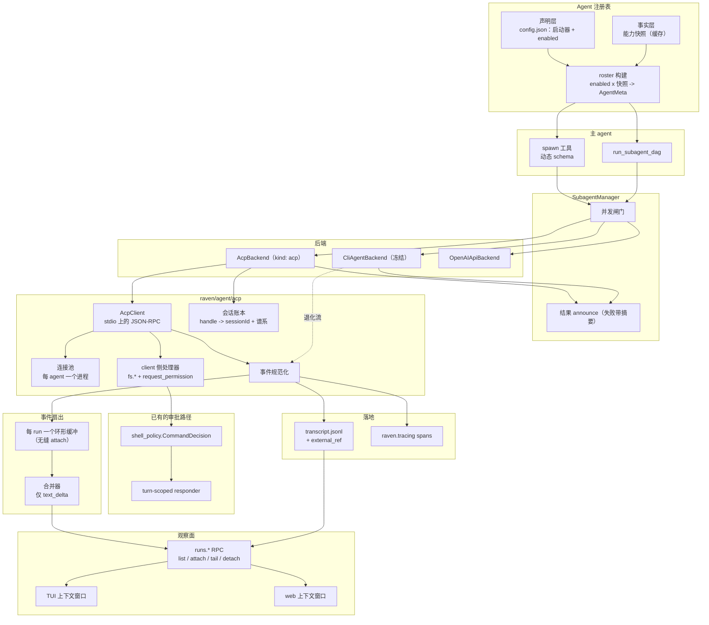
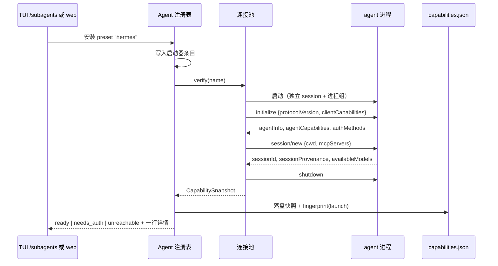
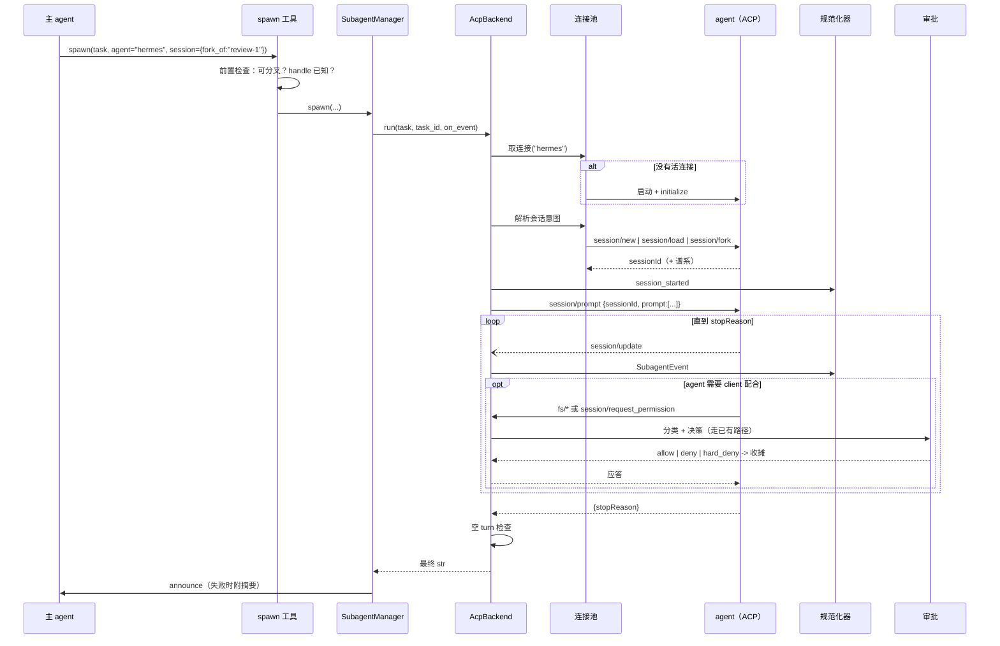
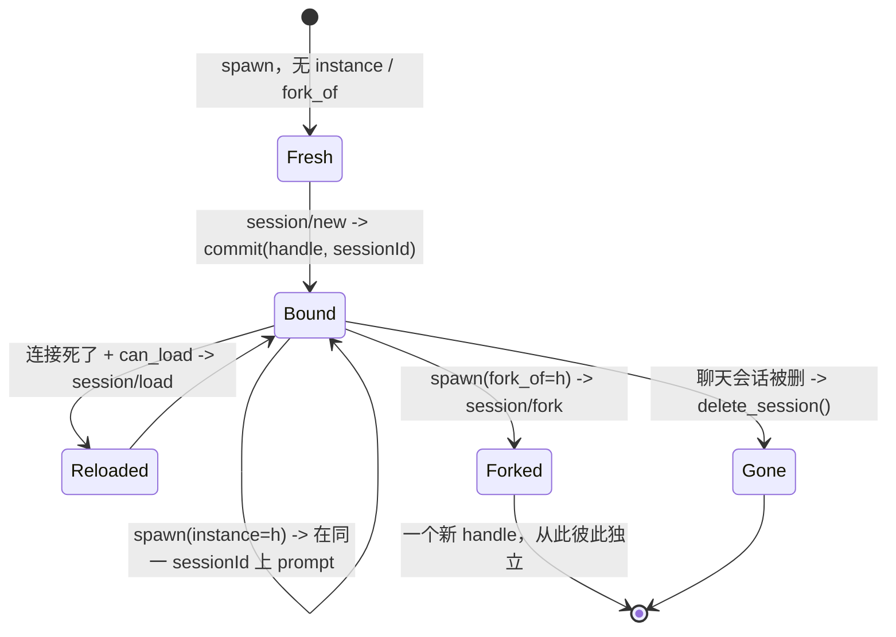
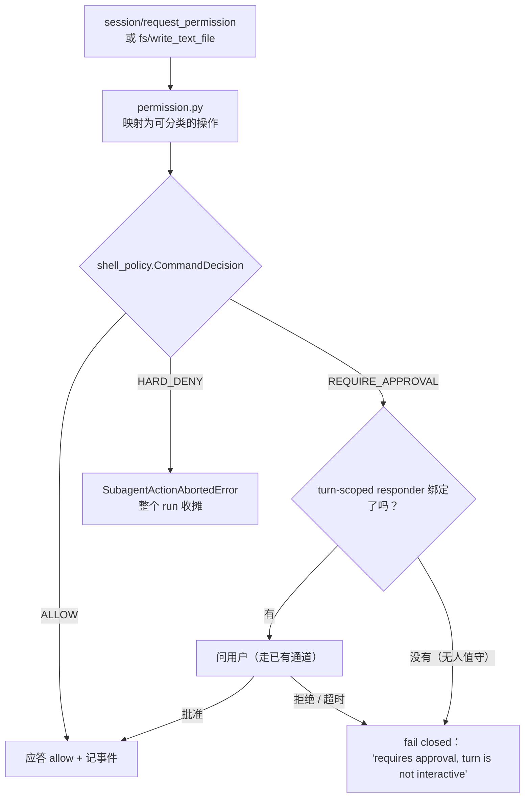
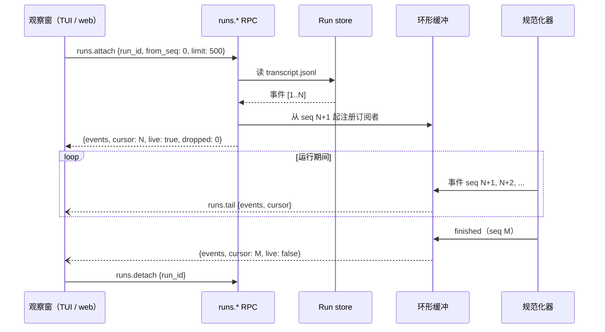

# 基于 ACP 的本地 agent 互联设计：注册、发现、调度、会话与实时观察窗

日期：2026-08-11
状态：传输层与注册接入已实现，本稿其余部分（调度、观察窗）仍是设计
取代：一份未进仓库的 CLI 流式改造草稿；该方向降级为本稿第 12 节的「冻结通道」

## 1. 为什么要走 ACP

### 1.1 今天的契约是什么

raven 已经能把任务派给本地 agent，契约是「一段字符串出去，一段字符串回来」：注册是一条配置，发现是被改写的工具 schema，调用是一个子进程。

```
config.json                       spawn 工具                      子进程
subagents.thirdParty[] --------> description + agent enum -----> argv 模板
  name, command, resumeCommand     （prompt-time 注入）             {prompt}
  idSource, transcriptFormat                                       {agent_id}
  stateful, readsLocalFiles                                           |
                                                  最终 str <-- parse(stdout)
```

模型读到的每一项能力都是**人手填的声明**。schema 能抓出自相矛盾（`stateful: true` 却没有 `resumeCommand`），但抓不出谎话。

### 1.2 这套契约结构性拿不到的四样东西

| 缺口 | 为什么是结构性的 |
|---|---|
| **过程数据** | `SubagentBackend.run(...) -> str`（`backends/base.py:46`）；`proc.communicate()` 等进程退出才返回（`cli_agent.py:165`）；四个 transcript parser 只留 `(session_id, reply)`，其余事件读过就扔。数据在管道里，被丢掉了。 |
| **会话分叉** | 一个 handle 一对一映射到上游 session id（`instances.py`）。只有「继续」和「全新开始」两个操作，「从某个点分叉」根本无法表达。 |
| **审批** | 子进程以用户身份在宿主上跑，6 个 preset 里 5 个带绕审批 flag（`--permission-mode auto`、`-a never`、`--yolo`、`--auto`）。没有回调通道，raven 没有任何位置可以站在子 agent 和磁盘之间。 |
| **能力可信** | 见 1.1。声明无法被验证。 |

### 1.3 实测结论

本机实测（darwin 25.3.0，登录 shell 为 zsh），2026-08-11。

**已安装：** `claude`（`/opt/homebrew/bin/claude`）、`openclaw` 2026.6.1、`hermes`（ACP adapter 0.17.0）。`codex` 和 `opencode` 本机没装。

**Claude Code stream-json** —— 真跑一次，吐出三行：`system/init`、`assistant`、`result`。注意 `subtype` 报 `"success"` 而 `is_error` 是 `true`（该次因余额不足失败）。因为失败了，**带真实 `tool_use` 块的转录没能捕获**：包络确认了，逐工具的 payload 没有。

**OpenClaw CLI** —— 真跑一次，exit 1，**stdout 0 字节，stderr 35,223 字节**。`openclaw agent --help` 只有 `--json` 一个开关：结束时吐一个 JSON 文档。**不存在可读的增量流。**

**Hermes CLI** —— preset 用 `chat -Q`，正是因为它「只把最终答案打到 stdout」。过程数据的缺失就是这个 flag 的目的。

**ACP 握手（对 `hermes acp`，真实）：**

```json
{"result":{
  "protocolVersion":1,
  "agentInfo":{"name":"hermes-agent","version":"0.17.0"},
  "agentCapabilities":{
    "loadSession":true,
    "promptCapabilities":{"image":true},
    "sessionCapabilities":{"fork":{},"list":{},"resume":{}}},
  "authMethods":[{"id":"openrouter",...},{"id":"hermes-setup","type":"terminal",...}]}}
```

**ACP `session/new` + `session/prompt`（真实）：**

- `session/new` 返回 `sessionId`，外带谱系：`sessionProvenance: {acpSessionId, rootHermesSessionId, parentHermesSessionId: null, sessionKind: "root", compressionDepth: 0}`，以及 `models.availableModels`。
- 一条真实的 turn 内通知：
  `{"method":"session/update","params":{"sessionId":"...","update":{"sessionUpdate":"usage_update","size":1000000,"used":13781}}}`
- `session/prompt` 返回 `{"stopReason":"end_turn"}`。

**这次实测有两个结论直接影响设计：**

1. 该 turn 没产出内容（provider 返回 `HTTP 401: User not found`），所以 `agent_message_chunk`、`tool_call`、`tool_call_update` **未在本机观察到**。按协议应当存在，但必须在 P2 收口前验证。
2. **ACP 在一个失败的 turn 上照样返回 `stopReason: "end_turn"`**，401 只出现在 stderr。和 Claude 的 `subtype: "success"` + `is_error: true` 是同一种失败形态。**上了协议不等于有了可靠的错误语义。**

**`openclaw acp`** 在 20 秒内没有响应 `initialize`，只能杀掉。它的 help 自述是「an ACP bridge backed by the Gateway」，需要 Gateway 接线（`--url` / `--token`）：这是每个 agent 的启动前置条件，不是阻塞项。

**`claude` 没有 `acp` 子命令。** 走 ACP 需要第三方 adapter —— 这本身是一个依赖与信任面决策。

**每家 agent 都自己落盘，而且是四套互不兼容的布局：**

| agent | 磁盘布局 | 能按 session id 定位吗 |
|---|---|---|
| claude | `~/.claude/projects/<cwd-slug>/<sessionId>.jsonl` | 能，但要先把 cwd 算成 slug |
| codex | `~/.codex/sessions/YYYY/MM/DD/...` + `session_index.jsonl` | 不能，按日期分区 |
| hermes | `~/.hermes/sessions/request_dump_<ts>_<hash>_<ts>.json` | 不能，文件名是时间戳 |
| openclaw | `~/.openclaw/agents/<agent>/sessions/` | 待确认 |

`~/.claude/projects/-Users-admin--raven-workspace/` 下面已经躺着 raven 自己派发留下的转录。而那里的事件类型（`queue-operation`、`attachment`、`last-prompt`、`user`、`assistant`）**和 stream-json 线格式是两套 schema** —— 那是内部存储实现，没有任何兼容承诺。这是 10.3 节「只存指针、拒绝解析」的直接依据。

### 1.4 决策

ACP 成为**主通道**：它是拿到会话分叉和审批回调的唯一路径，也是停止「每家一个 transcript parser」的唯一办法。它**不替换** CLI 通道 —— claude 和 codex 留在那边直到 adapter 被验证过，而且该通道**冻结**：只维护，不扩展。

更深的转变在注册表：**一条配置从「能力清单」变成「启动器」**，能力从声明变成协商。

## 2. 已定决策

以下均在本稿之前的讨论中敲定。

| # | 分叉 | 决策 |
|---|---|---|
| D1 | 主传输 | **ACP。** CLI 通道冻结，保留给没有 ACP server 的 agent。 |
| D2 | 一条配置声明什么 | **只声明怎么启动。** `resumeCommand`、`idSource`、`sessionIdPattern`、`outputPattern`、`transcriptFormat`、`stateful`、`readsLocalFiles` 全部删除 —— 握手会回答它们。 |
| D3 | roster 依赖实时探测吗 | **不依赖。** roster = 启用的条目 x **缓存的**能力快照。保住 `enabled_third_party` 已确立的规矩：roster 中途缩水会让模型围着正在消失的选项做计划。 |
| D4 | 事件流进模型上下文吗 | **不进。** 事件只进磁盘和 UI。**唯一例外**：失败时 announce 附带一份结构化摘要 —— 最后 N 个工具调用的**名字**加错误，绝不带 payload。 |
| D5 | 审批策略 | **复用 raven 自己的那套。** ACP 权限请求进同一个 `shell_policy.CommandDecision` 分类器、同一个 turn-scoped responder、同一条 fail-closed 规则、同一个 `SubagentActionAbortedError` 收摊路径。不设 per-agent 策略字段。无人值守不是新问题，不给新答案。 |
| D6 | 转录归谁 | **raven 的 `transcript.jsonl` 是权威。** agent 自己的存储记成 `external_ref` 指针，**永不解析** —— 四套互不兼容的布局、未文档化的内部 schema、外人管理的保留策略。 |
| D7 | 实时观察 | **必须有。** 操作者能在 TUI 和 web 里打开一个正在运行的本地 agent 的上下文窗口，看它流式输出。见第 11 节。 |

## 3. 目标与非目标

**目标**

1. 注册一个本地 agent 只需声明怎么启动它。
2. 通过握手发现真实能力，并把真相展示给操作者。
3. 模型可选的三种会话意图：全新、继续、**分叉**。
4. 每次运行落一份完整的规范化转录。
5. 把这份转录实时流给人看，attach 那一刻不能有缝。
6. 用 raven 已有的机制把审批权收回来。
7. 不回退 CLI 通道、它的 resume handle、它的进程组 kill 语义。

**非目标**

- raven 作为 ACP **server**（别的 agent 调 raven）。本稿的事件模型和审批路径刻意做成可复用，但那需要独立设计稿。
- 把过程数据喂给派发模型（D4）。
- 远程 agent。只做 stdio 上的本地进程。
- 改动 `run_subagent_dag` 节点间的文件传递契约。

## 4. 架构



四条性质是刻意的：

- **注册表分两层**，roster 只读缓存（D3）。
- **规范化器共用。** 两条通道都产出同一个 `SubagentEvent`，所以没有任何界面需要学某家方言。CLI 通道的退化流在 roster 里**是可见的**（一个 `no-progress` 标签），而不是被藏起来。
- **连接池按 agent 建，不按调用建。** ACP 的 session 活在连接里面，一个进程复用多个 session。
- **观察窗历史读磁盘、实时读环形缓冲**，两者用同一套 `seq` 排序。这是无缝 attach 能成立的前提。

### 4.1 模块布局

```
raven/agent/acp/
    protocol.py      带类型的帧、协议版本协商
    client.py        AcpClient：单连接，请求/通知的关联
    pool.py          进程生命周期、健康检查、空闲回收、重连
    sessions.py      会话意图（new / load / fork）落到账本
    events.py        session/update -> SubagentEvent
    handlers.py      client 侧：fs/read_text_file、fs/write_text_file、
                     session/request_permission -> 审批桥
    permission.py    ACP 权限请求 -> shell_policy.CommandDecision
    capabilities.py  握手结果 -> CapabilitySnapshot

raven/agent/subagent/
    backends/acp_agent.py   AcpBackend（SubagentBackend）
    registry.py             声明 x 事实 -> roster
    events.py               SubagentEvent（两条通道共用）
    runstore.py             transcript.jsonl、external_ref、环形缓冲、attach

raven/rpc/methods/runs.py     runs.list / attach / tail / detach
raven/web_rpc/methods_runs.py     web 侧同一套接口
ui-tui/src/components/agentWindow.tsx     TUI 上下文窗口
ui-webui/frontend/src/pages/runs/         web 上下文窗口
```

`instances.py` 复用而非重写：它的 `_load` 已经会给旧记录回填 `rec["kind"] = "cli"`，`lookup` 对其他 kind 直接返回 `None`，所以加 `kind: "acp"` 记录天然向前兼容。

## 5. 注册

### 5.1 一条配置变成启动器

```jsonc
{
  "name": "hermes",            // 模型在 spawn(agent=...) 里用的名字
  "kind": "acp",               // 第三种，与 "cli" / "openai" 并列
  "preset": "hermes",
  "enabled": true,
  "launch": {
    "command": "hermes acp",   // argv 模板；没有 {prompt}，没有 {agent_id}
    "cwd": null,
    "env": {},
    "readyTimeoutMs": 30000    // 握手预算；openclaw 实测超过 20s
  },
  "description": "",           // 可选的人工覆盖；留空则用 agentInfo
  "maxOutputChars": 30000
}
```

相比 `kind: "cli"` **少了 7 个字段**（D2）。也**没有新增** `approval` 字段 —— 审批是 raven 已有的策略，不是 per-agent 设置（D5）。

### 5.2 握手与能力快照



```python
@dataclass(frozen=True)
class CapabilitySnapshot:
    agent: str
    protocol_version: int
    agent_name: str            # agentInfo.name，例如 "hermes-agent"
    agent_version: str
    can_resume: bool
    can_fork: bool
    can_load: bool             # agentCapabilities.loadSession
    prompt_modalities: tuple[str, ...]
    available_models: tuple[str, ...]
    auth_methods: tuple[str, ...]
    status: Literal["ready", "needs_auth", "unreachable", "unknown"]
    detail: str
    fingerprint: str           # hash(launch.command + cwd + env)
    measured_at_ms: int
```

- 快照**落盘缓存**，按 `fingerprint` 失效 —— 沿用 `test_state.py` 给 test 结论用的同一套模式。
- 快照缺失退化为 `unknown`，**仍然向模型广告这个 agent**（D3）。
- `needs_auth` 与 `unreachable` 分开，因为 `authMethods` 能告诉我们是哪一种，而两者需要的操作者动作不同。实测的 hermes 401 正是这种：握手正常，但跑不动一个 turn。

### 5.3 「注册就是扫一下」到这里才成立

在 CLI 通道下它不成立：6 个 preset 是硬编码模板，`shutil.which` 探测只是给个绿点。在 ACP 下，安装 = 逐个试启动 → 留下能完成握手的 → 存下它自报的能力。**注册表从此不再存放主张，而是存放测量结果。**

## 6. 发现

机制不变（动态工具 schema），内容升级。

```
hermes [stateful, forkable, live-progress] (Hermes Agent，带工具调用的通用助手)
claude_code [stateful, no-progress] (Claude Code CLI - 强通用编码/agent 任务)
```

- `forkable` 是新的：模型在请求分叉前必须读到它。
- `live-progress` / `no-progress` 是新的，而且诚实 —— 没有它，一个空的观察窗看起来就像卡死。
- 正反两面都打标签，理由已写在 `format_agent_listing` 里：「没有标签」和「roster 没说」无法区分。

`spawn` 增加一个参数：

```jsonc
"session": {
  "type": "object",
  "properties": {
    "instance": {"type": "string", "description": "复用这个 handle 以继续那次对话。"},
    "fork_of":  {"type": "string", "description": "从这个 handle 的状态分叉出一次全新且独立的对话。仅适用于打了 [forkable] 标签的 agent。"}
  }
}
```

两者互斥。`_reject_useless_instance` 扩展：对快照里 `can_fork: false` 的 agent 传 `fork_of`，**在任何东西开跑之前就拒绝**，并返回一段写给模型读的说明 —— 否则替代结果是一个静默独立的会话，表现出来像失忆。

## 7. 调度



`SubagentBackend.run` 仍然返回 `str`，只多一个 keyword-only 的 `on_event: EventSink | None = None`，所以 `manager._run_subagent_inner`、`runner._run_node`（`runner.py:361`）、`probe.run_test` 都不用改。`SubagentBackend` 是 `runtime_checkable`，只检查方法存在而不检查签名，所以没有 `isinstance` 检查会被破坏。

### 7.1 空 turn 启发式

实测：provider 401 导致 `stopReason: "end_turn"`，错误只在 stderr。**`stopReason` 单独不可信。**

规则：一个 turn 结束时**零内容事件**且 `stopReason` 非错误 → 判为失败，详情取该连接的 stderr 尾部。每条连接的 stderr 持续被 drain 进一个**有界**环形缓冲 —— 有界，因为一次失败的 openclaw 运行往那里灌了 35 KB。

## 8. 会话



| 层 | 归谁 | 生命周期 |
|---|---|---|
| `instance` handle（`"review-1"`） | 模型自己取；语义化、自由格式 | 聊天会话 |
| ACP `sessionId` | agent 生成 | agent 自己的存储 |
| 谱系（root / parent / kind） | agent 上报（实测：`sessionProvenance`） | agent 自己的存储 |

映射记录仍存在现有的 `subagent_instances.json`，`kind: "acp"`，带 `sessionId`、`rootId`、`parentId` 和启动器 `fingerprint` —— 快照变了就让 resume 失效，因为那个 session 属于一个以不同方式启动的进程。

CLI 通道的 resume 失败分诊在精神上保留：连接硬失败或 `session/load` 被拒 → 忘掉 handle 并重试一次全新创建；超时或 agent 自报错误 → **不忘**，因为两者都不能证明上游 session 被清了。

## 9. 审批

按 D5，这里**不增加任何新策略**。ACP 只是接进 raven 已有路径的一个**新入口**：



两块现成的东西干了活：

- `shell.py:211-240` 已经把规则写死了：*「A missing responder therefore means 'cannot approve', not 'approval unnecessary'.」* 无人值守 fail closed，而这也是 raven 对自己工具的答案。
- `backends/base.py` 的 `SubagentActionAbortedError` 正是为这个形状写的：把拒绝交回给模型会让它*「把被拒的操作翻译成另一条命令或另一个解释器」*，所以硬拒绝要让 run 收摊，而不是返回。

**唯一真正新增的工作**是 `permission.py`：ACP 请求不总是 shell 字符串。能还原成命令的交给现有分类器；文件写入按路径对照 raven 已定义的 workspace 边界判定；认不出来的**一律 fail-closed 归到 `REQUIRE_APPROVAL`**，绝不猜。这是分类问题，不是策略问题。

每次决策都产出一个 `SubagentEvent`，所以转录里记着什么被允许、为什么 —— 这正是 `--yolo` 那套永远给不出的审计轨迹。

## 10. 过程数据

### 10.1 一个事件类型，两条通道共用

```python
EventKind = Literal[
    "session_started", "message", "text_delta", "thought",
    "tool_call", "tool_result", "plan", "usage",
    "permission",            # 第 9 节的一次决策
    "error", "finished",
]

@dataclass(frozen=True)
class SubagentEvent:
    run_id: str              # 一次调度；观察窗的单位
    task_id: str
    agent: str
    kind: EventKind
    at_ms: int
    seq: int                 # 每个 run_id 内单调；所有地方的排序键
    session_id: str | None
    payload: dict[str, Any]  # 按 kind 而定，必须可 JSON 序列化
    raw: dict[str, Any] | None   # 源帧；仅磁盘 sink 保留
```

`seq` 是整个观察面（第 11 节）的脊梁：磁盘和实时流用同一套序号，所以观察窗能把两者拼起来而不重不漏。`raw` 永不跨 RPC 边界；它的存在是为了让没建模的方言仍可追回，也让规范化器可以事后对着真实数据修正。

ACP 映射（`usage_update` 已实测；其余按协议预期，**待验证**）：

| ACP `sessionUpdate` | SubagentEvent |
|---|---|
| `agent_message_chunk` | `text_delta` |
| `agent_thought_chunk` | `thought` |
| `tool_call` | `tool_call` |
| `tool_call_update` | `tool_result` |
| `plan` | `plan` |
| `usage_update` | `usage`（实测：`{size, used}`） |
| （来自 `session/new`） | `session_started` |
| （来自 `stopReason` + 7.1） | `finished` 或 `error` |

### 10.2 Run store

一次调度一个目录，沿用仓库里 `DagRunStore` 已有的模式：

```
<runs-root>/<session-key>/<run_id>/
    meta.json           agent、instance/fork 谱系、启动器 fingerprint、
                        起止时间、最终状态
    transcript.jsonl    每一个 SubagentEvent，含 raw。只追加。
    external_ref.json   指向 agent 自己存储的指针（10.3）
    final.md            被 announce 出去的那份答案
```

`transcript.jsonl` 是权威（D6），且**不受 `maxOutputChars` 限制** —— 那个上限是保护模型上下文的，而这里的东西不进模型上下文。

### 10.3 external_ref：存指针，不解析

```jsonc
{
  "agent": "claude_code",
  "sessionId": "7778c23e-b923-40bb-b3cb-0611cd306269",
  "reportedCwd": "/Users/admin/.raven-workspace",
  "guessedPath": "~/.claude/projects/-Users-admin--raven-workspace/7778c23e-....jsonl",
  "guessConfidence": "derived-from-known-layout",
  "note": "raven 不读它。仅作人工排查时的线索。"
}
```

依据全部来自实测（1.3）：

1. **磁盘 schema 不是线上 schema。** claude 存的事件是 `queue-operation` / `attachment` / `last-prompt`；它 stdout 吐的是 `system` / `assistant` / `result`。存储形态是内部实现，没有兼容承诺。
2. **布局不可寻址。** 四家四套；codex 按日期分区、hermes 按时间戳命名文件，两家都无法从 session id 定位，只能扫加猜。`request_dump_` 这个命名本身也更像 debug 产物而非契约。
3. **保留策略不由我们控。** 别人会轮转和清理。raven 的 trace 指向一个已经不存在的文件，是最糟的失败模式：只在排查时才发现。
4. **读磁盘会重新引入 ACP 已经解决掉的同步问题** —— 「它写完了吗？」（轮询？inotify？等进程退出？）。实时流没有这个问题。

所以：**指针存，但不解析。** raven 的转录是唯一真相，外部文件是线索。

### 10.4 模型能看到什么

按 D4，模型不读这个流。只有一个例外，仅在失败路径上，追加在现有 announce 模板之后：

```
[Subagent 'review-1' failed]

Task: ...

Result:
<wrap_untrusted(错误文本)>

Trace: read_file, grep, edit_file, bash -> failed at bash
```

只有工具**名字**和失败步骤 —— 绝不带参数或输出。这样一份完整摘要会带来的四项代价全部不发生（不需要压缩层、不需要第二份上下文预算、不需要新的 DAG 占位符、不扩大注入面），同时又足够让模型判断该重试还是换 agent。工具名仍然渲染在 untrusted 围栏内，因为子 agent 可以编造工具名。

## 11. 观察面

D7：操作者能打开一个正在运行的本地 agent 的上下文窗口，看它流式输出。这是完整事件流的唯一消费者。

### 11.1 attach 不能有缝

难点是把历史和实时拼起来。先订阅再读盘会重、先读盘再订阅会漏，取决于时序。`seq` 解决它：



- **先读磁盘，再从 `cursor+1` 订阅。** 环形缓冲在内存里保留最近 K 个事件，所以在「读盘完成」和「订阅生效」之间产生的事件仍在环里，会被补发。如果缺口超过环容量（极慢的读者遇上极快的运行），响应里带 `dropped: n`，观察窗回去重读磁盘 —— **缺口可见，绝不静默**。
- 已结束的 run 就是纯磁盘回放，`live: false`。观察窗里不需要特例分支。
- 一个 run 可以有多个观察者，也可以观察属于另一个聊天会话的 run：键是 `run_id`，不是 conversation。

### 11.2 合并策略

`text_delta` 是 token 量级的。策略：

| kind | 处理 |
|---|---|
| `text_delta` | 每 session 约 100 ms 窗口内合并、拼接 |
| `tool_call`、`tool_result`、`permission`、`plan`、`error`、`finished` | **永不合并** —— 这些正是操作者打开窗口要看的东西 |
| `usage` | 窗口内后者覆盖前者 |
| `thought` | 同 `text_delta` |

合并**只发生在去观察窗的路上**。磁盘 sink 永远拿到未合并的全量，因为它是审计记录。

### 11.3 渲染前必须消毒

这条不能省，而且很容易做错：内容是攻击者可影响的，而其中一个渲染面是终端。

- 在 TUI 渲染前剥掉 ANSI 转义和 C0/C1 控制符。实测动机：openclaw 往 stderr 写了 35 KB 带 ANSI 颜色的诊断，preset 注释本身也写了纯文本输出会「interleave ANSI-coloured plugin and transport diagnostics」。
- 限制单事件渲染宽度和总渲染字节数；一个失控的事件不能把 UI 卡死。
- 永不把观察窗内容当作给 raven 的指令。它是给人看的，不回流进模型（D4）。

### 11.4 RPC 接口

四个方法，声明在 `ui-tui/rpc-schema/openrpc.json` 里并代码生成到客户端 —— 和 MR !18 对 `subagents.*` 的做法完全一致：

| 方法 | 参数 | 返回 |
|---|---|---|
| `runs.list` | `{session_key?, agent?, active_only?}` | run 摘要：`run_id`、agent、instance、状态、起止、计数 |
| `runs.attach` | `{run_id, from_seq, limit}` | `{events, cursor, live, dropped}` |
| `runs.tail` | （订阅期间服务端推送） | `{events, cursor, live, dropped}` |
| `runs.detach` | `{run_id}` | `{ok}` |

web UI 通过 `web_rpc` 拿同一套接口。DAG 现有的、按 conversation 键的 `ProgressSink`（gateway 已经把它接到 web channel 的 emitter）就是要沿用的传输模式，不重新发明。

### 11.5 TUI 界面

`/subagents`（MR !18）已经列出 roster。它新增一个 **Runs** 视图，进入某个 run 就是上下文窗口：

```
+- hermes  run 8f2a1c  running  00:41 -------------------- [esc] 返回 -+
| instance: review-1（fork of audit-3）      tokens: 13.8k / 1.0M      |
|                                                                      |
|   > read_file  src/auth/session.py                            0.2s   |
|   > grep       "def validate"  (12 matches)                   0.1s   |
|   * thinking   the token check happens before the nonce ...          |
|   > edit_file  src/auth/session.py  (+4 -1)                   0.3s   |
|   ! permission bash "rm -rf build/"        -> asked, approved        |
|   > bash       npm test                                    running   |
|                                                                      |
|   Regenerating the fixture now, then I will re-run the suite         |
|   and report...                                                      |
+- [f] 跟随  [t] 仅工具  [w] 换行  [s] 存转录 ------------------------+
```

渲染惯例沿用最近那次 TUI 改造确立的形态（可折叠 episode、一次工具调用一行、按需展开），这样它读起来和转录的其余部分是同一套视觉语言，而不是第二套。跟随模式自动滚动；向上滚动即脱离跟随，与主转录一致。

### 11.6 Web 界面

同样的数据，两栏布局：左边 run 列表（带实时状态点），右边上下文窗口。复用 DAG 图已有的事件传输，并且**一个 DAG 节点可以直接跳到它自己的 run 窗口** —— 这一刻这个面就回本了：今天一个 DAG 节点就是个状态方块，里面发生了什么完全看不见。

## 12. 两条通道

| | ACP 通道 | CLI 通道（冻结） |
|---|---|---|
| agent | hermes、openclaw | claude_code、codex、opencode |
| 注册 | 启动器 + 握手 | argv 模板 + 声明 |
| 能力 | 协商得到 | 人手声明 |
| 会话 | new / load / **fork** | create / resume |
| 过程数据 | 完整事件流 | 一个终态事件（`no-progress` 标签） |
| 审批 | raven 的策略，经回调 | 取决于 `command` 里写了什么 flag |
| 进程模型 | 长连接，多 session | 每次调度一个进程 |
| 观察窗 | 实时 | 只有最终答案 |
| 投入 | 全部新工作 | 只维护 |

晋级规则：一个 agent 换通道的条件是它自带的 ACP server 能在目标宿主上**既完成握手、又跑通一个真实 turn**。`claude` 需要第三方 adapter —— 那是独立的信任决策，本稿不假设。

冻结通道那些来之不易的部分一律不动：`start_new_session=True`、spawn 时捕获的 `pgid`、`_kill_process_group`、resume 分诊。本稿没有任何理由去重开那段代码。

## 13. 分期

| 期 | 内容 | 单独价值 |
|---|---|---|
| **P1** | `acp/{protocol,client,pool,capabilities}`、`kind: "acp"` schema、hermes preset、握手 + 快照。不做调度。 | 注册表持有测量结果；`/subagents` 显示真相。 |
| **P2** | `AcpBackend`、`session/new` + `prompt`、规范化器、run store（`transcript.jsonl`、`external_ref`）、空 turn 启发式。 | 走 ACP 调度，磁盘上有完整转录。 |
| **P3** | 环形缓冲 + `runs.*` RPC + TUI 上下文窗口。 | **实时观察窗。** 第一个用户看得见的阶段。 |
| **P4** | 会话账本：`load` / **`fork`**、spawn 的 `fork_of`、roster 标签。 | 独立上下文与分叉上下文。 |
| **P5** | `handlers.py` + `permission.py`；审批事件；硬拒绝收摊。 | 审批权回到 raven。 |
| **P6** | web 上下文窗口；DAG 节点 -> run 窗口跳转；trace sink。 | 各端对齐。 |
| **P7** | openclaw 启动器（Gateway 前置）；claude 的 adapter 评估。 | 通道覆盖。 |

P1 单独就值得落：能力从声明变成测量，运行时零风险。P3 刻意提前 —— 观察窗是让后面每一期都可调试的东西。

## 14. 风险

| 风险 | 应对 |
|---|---|
| **连接生命周期是全新的复杂度。** 今天一次调度就是一个进程跑完退出；ACP 是持有会话状态的长连接（连接池、健康检查、重连、僵尸回收、崩溃泄漏）。 | 连接池独占这块职责。每条 session 记录都带启动器 fingerprint，所以重启后的进程绝不会被误认成拥有该 session 的那个。进程纪律复用 `start_new_session` + `killpg`，不另发明一套。 |
| **连接死时正在飞的 prompt** 可能已经产生副作用。 | 该次调度以带类型的错误失败。绝不静默重发 prompt。 |
| **`stopReason` 会说谎**（实测）。 | 空 turn 启发式 + 每连接有界 stderr 环。 |
| **`openclaw acp` 需要 Gateway**（实测：20s 内无握手）。 | 作为 `verify` 时检查的启动前置条件，报成带 Gateway 提示的 `unreachable`，不是一个莫名的超时。 |
| **claude 没有 ACP server。** | 留在冻结通道；任何 adapter 在 P7 作为依赖评估。 |
| **ACP 是编辑器视角的协议**，预设 client 有能向人弹窗的 UI。 | 第 9 节：无人值守的答案就是 raven 已有的 fail-closed，不新增一套。 |
| **事件量。** `text_delta` 是 token 量级，DAG 扇出会乘上去。 | 只在观察窗路径合并；磁盘只追加 JSONL；环形缓冲有界并显式给出 `dropped` 计数，而不是静默丢弃。 |
| **经观察窗的终端注入。** | 11.3 节：剥 ANSI/控制符，限宽限字节。 |
| **未验证的 payload**：`agent_message_chunk` / `tool_call` / `tool_call_update` 本机未观察到（provider 401）。 | 每个规范化器只对着一个真实捕获的帧写。一次余额正常的 hermes 或 openclaw 运行是 P2 的门禁。 |
| **磁盘增长。** 每次调度一份转录。 | 保留策略是开放问题（16.2）；run store 的设计让删除就是 `rm -rf <run_id>`。 |
| **向后兼容。** | 纯增量：第三个 `kind`、一棵新模块树、一个可选 keyword 参数、每次运行的新文件。无迁移；回滚后 CLI 通道原样不动。 |

## 15. 测试计划

- **桩 ACP server**（仓内，asyncio），覆盖：握手、`session/new`、每一种 `sessionUpdate`、fork、load、权限请求、turn 中途死亡、`stopReason` 但无内容。
- **黄金帧**：把真实捕获的 JSON-RPC 帧作为 fixture，断言规范化成期望的 `SubagentEvent` 序列。本次实测的 hermes 握手帧和 `usage_update` 帧是最初两个。
- **空 turn**：桩返回 `end_turn` 且无内容，断言调度失败且 stderr 尾部传到调用方。
- **无缝 attach**：在观察窗 attach 过程中持续发事件，断言拼接后的序列既不重复也不缺 `seq`；再强制环溢出，断言报 `dropped > 0` 而不是静默丢失。
- **合并**：一个窗口内 N 个 `text_delta` 到观察窗合成 1 个，而 N 个 `tool_call` 仍是 N 个。
- **消毒**：带 ANSI 和 C1 字节的事件渲染后无害。
- **会话账本**：`fork_of` 产出不同的 `sessionId` 且 `parentId` 已设，之后对父会话 prompt 看不到分支的那些 turn。
- **fingerprint 失效**：改 `launch.command` 使快照与所有绑定其上的 session 记录同时失效。
- **审批**：无人值守（无 responder）以现有文案 fail closed；`HARD_DENY` 抛 `SubagentActionAbortedError` 且 run 收摊；认不出的操作落到 `REQUIRE_APPROVAL`。
- **连接池**：对同一 agent 的并发调度共用一个进程；被杀的进程能被发现并重启；`cancel_all` 后无孤儿进程。
- **集成测试**（`tests/integration/`，按 AGENTS.md 5.2）：对 `hermes acp` 的真实握手，以及 provider key 可用后的一次真实 turn。
- 现有 CLI 通道测试套件是冻结通道的回归门禁，不得改动。

## 16. 开放问题

1. **环形缓冲容量 K**，以及它是每 run 一个还是全局一个。决定观察窗慢到什么程度才会看到 `dropped`。
2. **转录保留策略** —— 按时间、条数还是字节，以及配在哪里。
3. **`fork` 要不要也给 `run_subagent_dag`？** 共享 `instance` 的节点已经会串行化；分叉能让一次扇出共用一段前缀。真实需求，但 P4 不需要。
4. **观察窗要不要允许输入？** 从上下文窗口直接往一个正在跑的子 agent 会话里发后续指令，是很自然的下一个需求，也是大得多的改动（它把人变成第二个派发者）。本稿明确划在范围外，但 RPC 接口的形状留了余地，加它不需要重新设计。
5. **raven 作为 ACP server**（别的 agent 调 raven）。事件模型、run store、审批路径都可复用；值得在 P5 之前把形状定下来，免得返工。

## 17. 分支

尚未开始。按 AGENTS.md 2.2，切分支前需确认基线；默认 `origin/main`（`687da67`），它已含 MR !18，本稿在其上构建。建议命名：`feat/acp_local_agent_mesh`。
