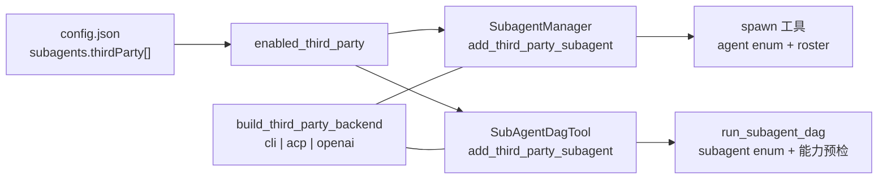
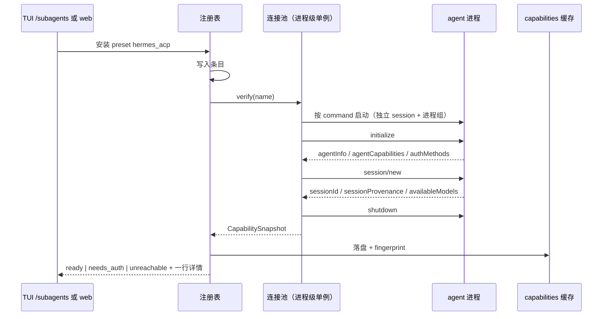

# 外部 agent 注册表：一张表、两种接入方式、独立落盘

> **已被扩展（2026-08-19）**：本稿的 R1/R2（第三方 agent 的登记与 spawn 派发）已收进
> [2026-08-19-unified-agent-registry-design.md](2026-08-19-unified-agent-registry-design.md)：
> 配置键从 `subagents.thirdParty` 改为 `subagents.agents`，表上多了 `builtin` 一档（raven
> 自己的进程内 agent 也上表、也能被 `spawn` 与 dag 节点指名），物化收成一份
> `AgentRegistry`。本稿描述的三方接入方式（cli / acp / openai 的字段与 backend）不变。

日期：2026-08-11
状态：已实现（P1+P2+P3），未评审
背景稿：`2026-08-11-acp-local-agent-mesh-design.md`（为什么选 ACP、以及全部实测依据在那里，本稿不重复）
范围：只做注册。会话分叉、审批回收、实时观察窗都不在本期。

## 1. 本期要满足的五条

| # | 需求 | 决策 |
|---|---|---|
| R1 | 外部 agent 注册在一张表上，可通过 acp 或 cli 两种方式接入 | **合并进现有 `subagents.thirdParty[]`，加第三个 `kind: "acp"`。不新开表。** |
| R2 | spawn 和 dag 都能用表上的外部 agent | 机制上已经成立（同一数组喂两个 setter）。真正的工作量是**修三处会让 acp 条目在两边失效的推导**，见第 6 节。 |
| R3 | 外部 agent 的数据按 raven 的可观测设计单独落盘 | **走 `raven.tracing`**：后端内部开 `subagent.external` span，过程事件挂 `span.event`，完整转录挂 `span.artifact`。不另造目录结构。 |
| R4 | 不动现有 spawn 和 dag 本身的设计，包括调度逻辑 | **落盘出口放在后端内部，不上抬到调度层。`SubagentBackend.run()` 签名不变。** 代价明说在第 5.3 节。 |
| R5 | 与现有外部 agent 注册的兼容 | **合并，不替代。** cli 通道长期保留而非过渡期。preset 层新增 `*_acp` 变体，已安装条目**不自动迁移**。 |

## 2. 一张表

### 2.1 为什么合并而不是新开一张

现有 schema 本来就是为扩展写的：

```python
ThirdPartySubagentConfig = Annotated[
    ThirdPartyCliSubagentConfig | ThirdPartyOpenAISubagentConfig,
    Field(discriminator="kind"),
]
```

加一个成员即可。反过来，新开一张 `subagents.acp[]` 要付的代价全是纯损失：两个来源要在两个 setter 里合并、跨表名字冲突要处理、roster 要拼两段、`enabled_third_party` 要改造 —— 每一项都是新的失败面，而没有任何一项换来能力。

顺带澄清一个措辞：表上实际是**三种 kind**。`openai`（mirothinker）不是本地 agent，是 HTTP 端点，它已经在表上且本期不动。所谓「两种方式」指的是两种**本地** agent 接入方式：`cli` 和 `acp`。

### 2.2 acp 条目的形状

刻意与 cli 条目共用字段名，让「一张表」在结构上也成立：

```jsonc
{
  "name": "hermes",            // 模型在 spawn(agent=...) / 节点 subagent 里用的名字
  "kind": "acp",
  "preset": "hermes_acp",
  "enabled": true,
  "command": "hermes acp",     // 启动 ACP server 的 argv 模板
  "cwd": null,
  "env": {},
  "readyTimeoutMs": 30000,     // 握手预算，openclaw 实测超过 20s
  "timeout": null,
  "description": "",           // 留空则用握手拿到的 agentInfo
  "maxOutputChars": 30000
}
```

两条约束，**都是加载期告警 + 写入期硬拒**：

1. **`command` 里不得出现 `{prompt}` / `{prompt_file}` / `{agent_id}`。** acp 的 command 是「怎么启动一个 server」，不是「怎么下发一次任务」。占位符留在里面会以字面量传给进程，失败得莫名。
2. **`resumeCommand` / `idSource` / `transcriptFormat` / `sessionIdPattern` / `outputPattern` / `stateful` / `readsLocalFiles` 一律不允许出现在 acp 条目上。** 这七个字段是 cli 通道的**声明**机制；acp 通道的同类事实来自握手**协商**。两者同时存在就是双源，而双源一定会出现「声明说 A、协商说 B」而代码不知道该信谁。宁可写不进去。

**实现时改了这一条。** 初稿写的是「acp 是全新 kind，没有存量条目，所以可以硬拒」——不成立：一个用户手抄一份 cli 条目改成 acp 就会触发，而加载期硬拒的后果是 `Config` 整体校验失败、raven 起不来、而能修它的 UI 在起不来的 config 后面。这正是 `_drop_declared_local_file_access` 那次的教训。

所以最终实现是 `readsLocalFiles` 那条已经证明过的分工：

- **加载期**：告警并丢弃（`Base` 本来就忽略未知键，所以无需真的 coerce），raven 照常启动。`{prompt}` 占位符同理只告警——它没有正确的替换值，留着就是启动失败、握手报错、状态显示 `unreachable`，一个能自我解释的降级状态，好过不启动。
- **写入期**：`update_subagents.reject_unsupported_acp_fields` 硬拒，因为调用方手上握着这个值，能对错误做出反应。

### 2.3 一张表，两个消费者



接线点不变，仍是 `loop/main.py:1380-1383` 把同一个 `configs` 列表交给两个 setter。本期唯一改动是让 `build_third_party_backend` 认识 `kind == "acp"`，返回 `AcpBackend`。

### 2.4 一个 agent 一条路，路在仓库里定死

**这一条是评审时改的，改掉的是一个错误设计。** 初版打算做「传输阶梯」：安装时先试 acp，不行退到 cli。两个问题：

1. **cli 那一 rung 的 verify 就是真派一个任务，会花用户的额度。** 点一下「连接」就悄悄烧 token，不能接受。
2. 更根本的：**传输是工具的静态属性，不是每台机器要重新发现的东西。** hermes 原生支持 ACP 是关于 hermes 的事实，测一次就定了，不该让每个用户的机器再试一遍。

所以：**每个 agent 一个 preset，preset 里已经写好它走哪条路。** 连接 = 验证那一条；失败就明确报为什么（adapter 没装 / gateway 没起 / 没登录），**不回退**。静默回退会把一个能力不同的 agent 交给用户，而用户不知道。

2026-08-11 实测结果，这就是各条路的依据：

| agent | 传输 | 命令 | 会话能力 |
|---|---|---|---|
| hermes | ACP 原生 | `hermes acp` | resume + fork + load |
| claude_code | ACP，走 ACP 项目的 adapter | `npx -y @agentclientprotocol/claude-agent-acp@0.66.0` | resume + fork + load |
| codex | ACP，走 ACP 项目的 adapter | `npx -y @agentclientprotocol/codex-acp@1.1.14` | resume + load，**无 fork** |
| opencode | ACP 原生 | `npx -y opencode-ai@1.18.16 acp` | resume + fork + load |
| openclaw | ACP 原生 | `openclaw acp` | 待 gateway 验证 |
| mirothinker | 不是本地 agent | HTTP 端点 | 无 |

**claude 那条是被一个硬约束逼出来的实测**：raven 把这些当外部 agent，所以一个要求自己单独登录的 adapter 不合格。实测证明它读的是本机 Claude Code 凭据——真派一个任务失败在 `Credit balance is too low`，和本机 `claude -p` 完全相同的错误，而环境里 `ANTHROPIC_API_KEY` / `ANTHROPIC_AUTH_TOKEN` / `CLAUDE_CODE_OAUTH_TOKEN` 一个都没设，`~/.claude/.credentials.json` 和 keychain 都在。

**codex 报 `fork=False` 而其他三家 true**，这是「能力只许协商不许声明」最好的证据：同一个协议下逐 agent 不同，任何人手填的字段都会在某一家上是错的。

adapter 版本**钉死**。`npx -y` 会去拉不存在的包，不钉就意味着用户跑的 adapter 构建会悄悄漂移；代价是这些版本号得手动升。

cli 传输**不再由任何 preset 提供，但没有消失**：已经那样配好的条目原样继续跑，命令模板的旗标知识作为注释保留在 `presets.py`（cli 后端还在，手写或排查时需要）。

## 3. 两条接入通道

| | cli 通道 | acp 通道 |
|---|---|---|
| 状态 | **冻结**：维护，不再作为 preset 提供 | 新增，五个 agent 全走这条 |
| 覆盖 | 只有存量条目 | claude_code、codex、opencode、hermes、openclaw |
| 注册 | argv 模板 + 七个声明字段 | 启动命令 + 握手协商 |
| 每次调用 | 起一个进程，跑完退出 | 复用长连接上的一个 session |
| 过程数据 | 只有最终 stdout / stderr / 退出码 | 完整事件流 |

**这一段也被实测推翻了。** 初稿写的是「claude 没有 `acp` 子命令，所以 cli 通道是它的长期归宿」。核实后：claude 和 codex 都有 ACP 项目自己维护的 adapter，opencode 原生支持——**五个 agent 全部能走 ACP**（四个已实测 ready，openclaw 卡在 gateway）。

所以 cli 通道降级成「存量条目的运行时」，不再是任何 agent 的目标状态。它的代码保留（有人还在用），但不再收新条目。

## 4. acp 通道：握手与能力快照



```python
@dataclass(frozen=True)
class CapabilitySnapshot:
    agent: str
    protocol_version: int
    agent_name: str            # agentInfo.name
    agent_version: str
    can_resume: bool           # sessionCapabilities.resume
    can_fork: bool             # sessionCapabilities.fork -- 本期只记录，不使用
    can_load: bool             # agentCapabilities.loadSession
    available_models: tuple[str, ...]
    auth_methods: tuple[str, ...]
    status: Literal["ready", "needs_auth", "unreachable", "unknown"]
    detail: str
    fingerprint: str
    measured_at_ms: int
```

三条规则：

- 缓存落盘，按 `fingerprint` 失效 —— 沿用 `test_state.py` 已有的模式（它连「为什么按 digest 而不是挂写路径」都论证过：digest 能覆盖手改 `config.json`，UI 钩子覆盖不到）。
- **roster 读缓存，不读实时握手。** 这是 `enabled_third_party` 已经确立的规矩：roster 中途缩水会让模型围着正在消失的选项做计划，比一次报错清楚的调度失败更糟。
- **状态沿用 `probe.ProbeStatus` 的四个词**（`ready` / `attention` / `missing` / `unknown`），不另造 `needs_auth` / `unreachable`。`/subagents` 已经会画这四种，多一个词等于教每个界面一个它已经能表达的状态。实测的 hermes 落在 `attention`：握手正常、拿不到 session（provider 401）。
- 实现时多分出一种情况：**握手被对方拒绝 ≠ 没装**。`AcpRemoteError` 报 `unknown` 而不是 `missing`——这条是被实测逼出来的，见 4.2 末尾。
- **`can_fork` 本期只记录不使用。** 记下来是为了避免将来做 fork 时要重新握手一遍全部 agent；不使用是因为 fork 涉及 `AgentMeta` 加位和 spawn schema 变化，超出本期范围。

**实测踩到的一个协议坑（已写进代码注释）：** `initialize` 一开始多发了一个 `clientInfo: {name, title}`，真实 `hermes acp` 直接回 `-32602 Invalid params`，整个握手失败。修法是**不发**，而不是猜它的形状——一个看着可选、实际会让握手硬失败的字段，是最糟的协议猜测。所以 `initialize_params()` 只发实测通过的两个参数。

这个坑还反过来定了一条状态规则：当时的实现把它报成 `missing`，而 agent 明明在那儿并且回了话。所以 `AcpRemoteError` 现在报 `unknown`（"连上了但拒绝了握手"），只有连不上/超时才是 `missing`——否则操作者会去找一个已经装好的东西。

### 4.1 连接池必须是进程级单例

`manager` 和 `SubAgentDagTool` 各自 `build_third_party_backend`，所以同一个 agent 在两条路上是**两个后端实例**。如果连接池挂在实例上，同一个 agent 会起两个进程池，spawn 一个、dag 一个，互不知情。

所以：**连接池是进程级单例，按 agent 名索引；后端实例只是它的客户端。** 后端实例可以随热更新反复重建，池不受影响。

## 5. 落盘

### 5.1 走 raven 已有的可观测设计

raven 的 tracing 已经具备本期需要的全部东西：`audit.span.v1` 的 span + event JSONL、以及 **SHA1 去重的 artifact 存储**（专门用于大 payload）。所以不另造 `transcript.jsonl` 目录结构，直接落成：

```
subagent.run  （spawn 路径已有，manager.py:231 的 @trace.instrument）
  └─ subagent.external        <- 本期新增，由后端自己开
       ├─ span.event("tool_call") / ("tool_result") / ("usage") ...
       ├─ span.artifact("external.transcript", <全部原始帧>, kind="jsonl")
       └─ span.artifact("external.stderr", <有界尾部>, kind="text")

tool.call   （dag 路径，registry.py:69 的 @trace.instrument）
  └─ subagent.external        <- 同一个 span，父节点不同
```

「单独落盘」体现在两处：**独立的 span 名**（可在 viewer 里单独筛）和**独立的 artifact key**（转录不混进 span attributes，也不受 `maxOutputChars` 约束 —— 那个上限是保护模型上下文的，而 artifact 不进上下文）。

### 5.2 为什么放在后端内部开 span

这是让 R3 和 R4 同时成立的关键。`trace` 的父子关系走 contextvar，所以后端在 `run()` 里开 span 时：

- spawn 路径下，父自动是 `subagent.run`
- dag 路径下，父自动是 `tool.call`

**两条调度路径一行都不用改。** 而且附带解决一个既有空白：`subagent_dag/runner.py` 的 `_run_node` 今天**没有任何 `@trace.instrument`**，DAG 节点在 trace 里是不可见的。后端自己开 span 意味着 DAG 里的外部 agent 一并被观测到，而不用碰 runner。

### 5.3 取舍：本期没有实时推送

不给 `SubagentBackend.run()` 加 `on_event` 参数，是为了满足 R4 的字面要求（不动调度层）。代价明说：

- **本期落盘是事后可查，不是实时可看。** 观察窗只能读 artifact。
- 将来要实时，加一个**进程级事件总线**：后端 publish、UI subscribe。这条路同样不需要改 spawn/dag —— 与连接池同一个思路（单例挂在模块上，不挂在调用链上）。所以本期的取舍不会把将来堵死。

### 5.4 cli 通道也落，同一个 span 形状

两条通道都走 `backends/observability.py`，不是各写一套属性。理由是这份记录的价值在于**可比**：一个 `subagent.external` span 无论由 ACP 还是由 shell 产生，含义都应该一样，看的人不需要先知道是哪条通道。

cli 落的是它有的东西：**完整的 stdout / stderr / 退出码，按「一次调度内的第 N 次调用」分组**。分组不是多余的——stateful 的 cli agent 会先试 resume、失败再新建，两次调用都记下来，读起来就是「它试了续接、失败了、然后重开」这个完整故事。

而且**记录发生在退出码检查之前**，所以失败的那次调用也被保住——那恰恰是输出最值得留的一次，以前它只以 2000 字符的尾巴出现在异常消息里，然后就没了。

cli 侧**没有**逐步事件，而且刻意不报一个全零的 `update_counts`：这条通道压根没有运行中的可见性，报 0 会读成「一次都没发生」。这个不对称在 roster 上明确可见——`AgentMeta` 新增一位 `live_progress`，渲染成 `live-progress` / `no-progress`：

```
hermes [stateless, local-files, live-progress] (Hermes Agent over ACP ...)
old_claude [stateful, local-files, no-progress]
```

这一位是纯展示位，不参与 DAG 的能力预检。它按 `kind == "acp"` 推导——是关于**传输**的事实，不是关于 agent 的，所以既不读配置声明也不读快照。

## 6. 必须修的三处推导（R2 的真正工作量）

这三处都是「acp 条目走进为 cli 写的代码」，**每一处都会静默出错而不是报错**，所以必须一起修。

### 6.1 `third_party_agent_meta` 会把每个 acp agent 算成 stateless

```python
bool(getattr(cfg, "resume_command", None))   # acp 条目没有这个字段 -> False
```

后果两处，都是硬伤：

- **`spawn` 根本不会给模型 `instance` 参数** —— `spawn.py` 只在 `stateful_names` 非空时才把它加进 schema。如果 roster 里只有 acp agent，模型连传 handle 的字段都没有。
- **DAG 的 `_check_instance_reuse` 会拒掉任何让多个 acp 节点共享 instance 的图**，理由是「这个 agent 不是 stateful」。

修法：按 kind 分流。`cli` 继续从 `resume_command` 推；`acp` 从能力快照的 `can_resume` 读。`_capabilities.AgentCapabilities` 是从 `AgentMeta` 来的，所以只改一处即可两边生效。

`reads_local_files`：acp agent 是本地进程，默认 `True`，与 cli 一致，无需特殊处理。

### 6.2 `test_state.fingerprint` 会让所有 acp agent 共用一个摘要

```python
fields = _OPENAI_FIELDS if getattr(cfg, "kind", None) == "openai" else _CLI_FIELDS
payload = {name: getattr(cfg, name, None) for name in fields}
```

acp 条目落到 `else` 分支，`_CLI_FIELDS` 里的 `resume_command` / `id_source` / `transcript_format` 等全部取到 `None`。于是**两个不同的 acp agent 只要 `command` / `cwd` / `env` / `timeout` 相同就得到同一个摘要** —— A 的测试结论会被当成 B 的当前结论。

修法：加 `_ACP_FIELDS = ("command", "cwd", "env", "timeout", "ready_timeout_ms")` 并把分派改成显式三分支，`else` 留给未知 kind 时抛错而不是猜。

### 6.3 `probe_one` 会把 acp agent 永久报成 unknown

```python
if getattr(cfg, "kind", None) == "openai":
    ...  # HTTP 探测
# 否则走 cli 探测，读 cfg.command 的第一个 token
```

acp 条目有 `command`，所以这条路**不会崩**，只会拿 `hermes` 这个可执行名做 `shutil.which` —— 恰好能查到，于是报 `ready`。而这是个**假绿灯**：它证明的是可执行文件存在，不是 ACP server 能握手。

修法：acp 的免费探测 = `shutil.which` 通过 **且**缓存里有一份快照；没有快照就报 `attention`（"已安装，但还没记录过它的 ACP 能力——跑一次 test"），有快照就直接用快照自己的状态。真正的判定归第 4 节的握手。

顺带定了 acp 的 test 语义：**`run_test` 就是 `verify_agent`**。这里 acp 比 cli 既便宜又更强——cli 的 test 必须真派一个任务（花 agent 自己的额度），因为除此之外没有东西能验证它的 auth；acp 在握手里就回答了同一个问题，所以零 token，而且产出可复用：它记下的快照正是 roster 后面读 stateful 的那一份。（只有 `source == "config"` 才落盘；preset 是模板，给它记快照会键到一个没有条目认领的名字上。）

## 7. 不碰清单（R4 的显式承诺）

| 文件 | 本期改动 |
|---|---|
| `raven/agent/tools/spawn.py` | **不改。** `instance` 参数的白名单会因为 6.1 的修复自动包含 acp agent —— 那是数据变化，不是代码变化。 |
| `raven/agent/subagent/manager.py` | **不改。** |
| `raven/agent/subagent_dag/runner.py` | **不改。** |
| `raven/agent/subagent_dag/tool.py` | **不改。** |
| `SubagentBackend.run()` 签名 | **不变。** |
| `raven/agent/subagent/instances.py` | 只加 `kind: "acp"` 记录。`_load` 已经会给旧记录回填 `kind="cli"`，`lookup` 对其他 kind 返回 `None`，所以是它当初就留好的扩展点。 |

改动集中在：新增 `raven/agent/acp/`、新增 `backends/acp_agent.py`、`backends/__init__.py` 加一个 kind 分支、`config/schema.py` 加一个 union 成员、`presets.py` 加两条 preset、以及第 6 节那三处推导。

## 8. 兼容策略（R5）

### 8.1 三层，都是合并

| 层 | 策略 |
|---|---|
| 配置 | 同一数组 + 新 kind。存量 `cli` / `openai` 条目**零迁移**，原样工作。 |
| 通道 | cli 通道长期保留（第 3 节）。不是过渡期。 |
| preset | 新增 `hermes_acp` / `openclaw_acp`，与现有 `hermes` / `openclaw` 并存。 |

### 8.2 preset 就地换 kind，不改名（评审时反过来了）

初稿的做法是新增 `hermes_acp` / `openclaw_acp` 与旧的并存，理由是「`preset` 记的是出处，原地换 kind 会让存量条目指向一个形状不同的模板」。

2.4 定下「一个 agent 一条路」之后这条不成立了，而且是反的：**两条同名 agent 的 preset 同时出现在列表里，本身就是要消掉的那个丑陋**。用户要的是「连接 hermes」，不是「选 hermes 还是 hermes_acp」。

所以最终是就地换：`hermes` 这个 preset 自己变成 acp，`hermes_acp` 删除。存量条目指向一个形状不同的模板**正是想要的效果**——那个不一致就是 8.3 的升级信号。

### 8.3 已安装条目不自动迁移，改成「可升级」提示

**这是本期最需要小心的兼容点。** 一个用户今天装的 `hermes`（cli）如果被自动改成 acp：

- 命令变了（`hermes --yolo chat -Q -q {prompt}` -> `hermes acp`）
- **`instances.json` 里绑在它上面的所有 handle 立刻失效** —— 那些是 CLI 的 session id，在 ACP 通道里没有意义

做法：roster 行上多一个 `upgrade_to` 字段（`_upgrade_transport`），值是这条目的 preset 现在指向的传输——也就是「你在 cli 上，这个 agent 现在走 acp」。用户点了才换；换的时候明确告知旧会话句柄会失效。`fingerprint` 机制正好让相关缓存和记录自动作废，不需要额外的迁移代码。

判断依据就是 `entry.kind != preset.kind`，不需要新增状态。这也是为什么 preset 归属要**按名字**回填而不按 kind：一个 kind 门控会把存量 cli 条目读成「手写的」，升级提示消失，Presets 组还会把这个 agent 当未配置再提供一次，诱导用户装出第二份。

### 8.4 名字冲突：核实后发现不需要做

初稿写的是「今天同名条目静默覆盖，本期要加写入期校验」。核实后**这一条不成立**：`add_third_party_subagent` 已经拒了——

```python
dupes = {n for n in names if names.count(n) > 1}
if dupes:
    raise ValueError(f"duplicate third-party sub-agent name(s): {sorted(dupes)}")
```

所有写入路径（web `_set`、`add_`/`remove_`、TUI 的三个 RPC）都经过它，所以产品内没有办法写出同名条目。仅剩的暴露面是**手改 `config.json`**，那时加载期取最后一条（`built[name] = ...`）。没有为它加校验：加载期硬拒会让 raven 起不来，而这条路径要求用户已经绕过了产品的写入路径。

另外新增了一处**跨 kind 的 preset 归属校验**，这才是真实存在的混淆：`_resolve_preset_provenance` 原本只按名字回填，所以一个叫 `hermes` 的 acp 条目会被盖上 cli preset 的provenance，Presets 组就会把一个已装的工具显示成未配置。现在回填按 `kind` 门控。

### 8.5 实际改了什么

| 文件 | 改动 |
|---|---|
| `raven/agent/acp/{__init__,protocol,client,capabilities,pool}.py` | 新增：framing、连接、握手快照、进程级连接池 |
| `raven/acp_client/acp_agent.py` | 新增：`AcpAgentBackend`，含 span/artifact 落盘 |
| `raven/config/schema.py` | 新增 `ThirdPartyAcpSubagentConfig` + union 成员；`_resolve_preset_provenance` 按 kind 门控 |
| `raven/config/update_subagents.py` | 新增 `reject_unsupported_acp_fields` |
| `raven/web_rpc/methods_config.py` | `_set` 调用上面这个 rejector |
| `raven/agent/subagent/presets.py` | 新增 `hermes_acp` / `openclaw_acp` |
| `raven/agent/subagent/backends/__init__.py` | `build_third_party_backend` 加 acp 分支；`third_party_agent_meta` 按 kind 取 stateful；新增 `acp_snapshot_for` |
| `raven/agent/subagent/test_state.py` | `_ACP_FIELDS` + 显式三分支（cli/openai 摘要保持不变） |
| `raven/agent/subagent/probe.py` | `_probe_acp` + `_test_acp` |
| `raven/agent/subagent/instances.py` | `lookup`/`commit` 加 `kind` 参数；`upsert_spawn` 不再硬写 `"cli"` |
| `tests/acp_stub_server.py`、`tests/test_subagent_acp.py` | 新增：桩 ACP server（真子进程）+ 34 个测试 |

`spawn.py`、`manager.py`、`subagent_dag/runner.py`、`subagent_dag/tool.py`、`SubagentBackend.run()` 签名：**一行未动**。

## 9. 分期

| 期 | 内容 | 单独价值 |
|---|---|---|
| **P1** | `raven/agent/acp/{protocol,client,pool,capabilities}`、`kind: "acp"` schema + 两条 validator、`hermes_acp` preset、握手与快照缓存、第 6 节三处推导修复、第 8.4 节同名校验。**不做调度。** | 表上能注册 acp agent，`/subagents` 显示的是握手测出来的事实。存量条目零影响。 |
| **P2** | `AcpBackend`：`session/new` + `session/prompt`、连接池单例、空 turn 判定。spawn 和 dag 自动可用。 | 两条路都能真正调度 acp agent。 |
| **P3** | `backends/observability.py`：两条通道共用的 `subagent.external` span + event + artifact；cli 侧的完整 stdout/stderr 归档；`live-progress` / `no-progress` 标签位。 | 外部 agent 的过程数据按 raven 可观测设计落盘，DAG 节点顺带获得可观测性，cli 的转录不再读完就扔。 |

P1 单独就值得落：它把「人手填的声明」换成「握手测出来的事实」，且运行时零改动。P3 之所以排在最后而不是跟 P2 绑在一起，是因为它需要真实的事件帧做 golden fixture，而那要等 P2 能跑通一个真 turn。

## 10. 风险

| 风险 | 应对 |
|---|---|
| **连接生命周期是全新的复杂度**：长连接、健康检查、重连、僵尸回收、崩溃泄漏。 | 池独占这块职责，进程级单例。进程纪律复用 cli 通道验证过的 `start_new_session` + `killpg`，不另发明。 |
| **连接死时正在飞的 prompt** 可能已产生副作用。 | 该次调度以带类型的错误失败，绝不静默重发。 |
| **`stopReason` 会说谎**（实测：provider 401 仍返回 `end_turn`，错误只在 stderr）。 | 零内容事件 + 非错误 stopReason = 判失败，详情取 stderr 尾部；stderr 用有界环形缓冲（实测 openclaw 一次失败写了 35 KB）。 |
| ~~**同一连接上能否并发 prompt 多个 session。**~~ **已解决，且比预期严重。** | 实现时被测试逼出来了：ACP 的 `session/update` 只带 session id，**不带任何标识说明它属于哪个请求**，所以同一 session 上两个 turn 同时在飞，会产生一条无法再拆开的交错流——一个任务会收走另一个的事件，然后被判成空 turn。而这是**可达的**：stateful agent 把同一个 `instance` handle 解析到同一个 session id，而 `spawn` 对此不加任何排序（DAG 已经把同 instance 的节点串行化了，spawn 没有）。修法是 `_Connection.session_lock`：同一 session id 上的 turn 串行，锁跨整个 turn 持有。顺序执行本来就是"一次对话"的语义，所以等待是正确行为而不是限制。另外 `router.detach` 改成**按身份**移除（`is` 比较），否则先结束的任务会拆掉后来者的路由——和 MR !18 里 `subagents_test` 的 `_RUNNING` 清理是同一类身份 bug。跨 session 并发不受影响，已有测试钉住。 |
| **`openclaw acp` 需要 Gateway**（实测 20s 内无握手）。 | 作为启动前置条件在 verify 时检查，报成带 Gateway 提示的 `unreachable`，不是莫名超时。 |
| **未验证的事件 payload**：`agent_message_chunk` / `tool_call` / `tool_call_update` 本机未观察到（provider 401）。 | 每个规范化器只对着一个真实捕获的帧写。一次余额正常的真 turn 是 P3 的门禁。 |
| **artifact 体积**：完整转录可能很大。 | 走已有的 SHA1 去重 artifact 存储与 `logs/archive` 轮转，不新建保留机制。 |
| **向后兼容** | 纯增量：一个新 kind、一棵新模块树、两条 preset。无迁移。回滚后 cli 通道原样不动。 |

### 10.5 已验证到什么程度

- `tests/test_subagent_acp.py`：34 passed。全部跑在真子进程（`tests/acp_stub_server.py`）上，不是 mock，所以启动、读循环、请求关联、拆除都被覆盖。
- 相关既有套件：480 passed（含 dag core/runner、manager、probe、test_state、web/tui RPC、config）。只改了两处钉住 preset 名单的断言。
- `ruff check` + `ruff format --check`：clean。
- **对真实 `hermes acp` 的端到端**：`verify` 报 `ready`，`can_resume/can_fork/can_load` 全 true，34 个模型；随后真派一个任务，落在 `AcpEmptyTurnError`，详情里带出 `code: 401 - User not found` —— 即协议报了 `stopReason: end_turn`、真实原因只在 stderr。**空 turn 启发式在真 agent 上按设计触发了。**
- 未验证：`openclaw acp`（需要 Gateway 在跑）；余额正常时的 `agent_message_chunk` / `tool_call` 真实 payload 形状——桩里按协议实现，代码里对未知形状是防御式处理而不是猜测。

## 11. 测试计划

- **桩 ACP server**（仓内，asyncio）：握手、`session/new`、`session/prompt`、各类 `session/update`、turn 中途死亡、`stopReason` 但无内容。
- **黄金帧**：真实捕获的 JSON-RPC 帧做 fixture。已有两个：hermes 的 `initialize` 响应和一条 `usage_update` 通知。
- **推导修复的回归**（第 6 节，三条各一个）：
  - acp 条目经 `third_party_agent_meta` 得到 `stateful=True`（当快照 `can_resume=True`），且 spawn 的 schema 里出现 `instance`、DAG 不再拒绝共享 instance 的图；
  - 两个只有 `name` 不同的 acp 条目得到**不同**的 fingerprint；
  - 没有快照的 acp 条目 probe 报 `attention` 而不是假绿灯 `ready`。
- **schema validator**：acp 条目带 `{prompt}` 被拒；带 `resumeCommand` / `transcriptFormat` 等七个字段中任一个被拒。
- **同名冲突**：写入期拒绝，加载期取第一条并 warn（不抛）。
- **连接池单例**：manager 和 DAG tool 各自建的后端实例共用同一个进程。
- **span 层级**：spawn 路径下 `subagent.external` 的父是 `subagent.run`；DAG 路径下父是 `tool.call`；artifact key 独立且不受 `maxOutputChars` 影响。
- **集成测试**（`tests/integration/`，按 AGENTS.md 5.2）：对 `hermes acp` 的真实握手；provider key 可用后的一次真实 turn。
- 现有 cli 通道测试套件是冻结通道的回归门禁，**不得改动**。

## 12. 开放问题

1. **raven 内置子 agent 要不要也进这张表？** 今天它是表外的默认值：`spawn` 省略 `agent` 时用它，DAG **根本用不了**（`subagent` 必填且只能取表上的名字）。让它进表能让 DAG 图里放 raven 自己的节点，代价是 roster 多一个不可删不可禁的特殊条目，且它的能力标签要单独定义。本期不做，但值得先定方向。
2. **`spawn` 未知 agent 名静默退回 raven 子 agent**（`_resolve_backend` 的兜底），而 DAG 是拒整张图。要不要统一成拒绝？热更新后消失的 agent 会走到这条路。
3. **`manager._run_subagent` 无条件 `build_executor`**，而 cli / acp / openai 后端全都忽略这个 executor（docstring 自己写了 "third-party backends ignore it"）。`backend="none"` 时是廉价的 `DirectExecutor`，配了 boxlite 就是白起一个 VM。属于既有问题，本期不在范围内，但连接池落地后这笔浪费会更显眼。

## 13. 分支

尚未开始。按 AGENTS.md 2.2，切分支前需确认基线；默认 `origin/main`（`687da67`，含 MR !18）。建议命名：`feat/external_agent_registry`。
