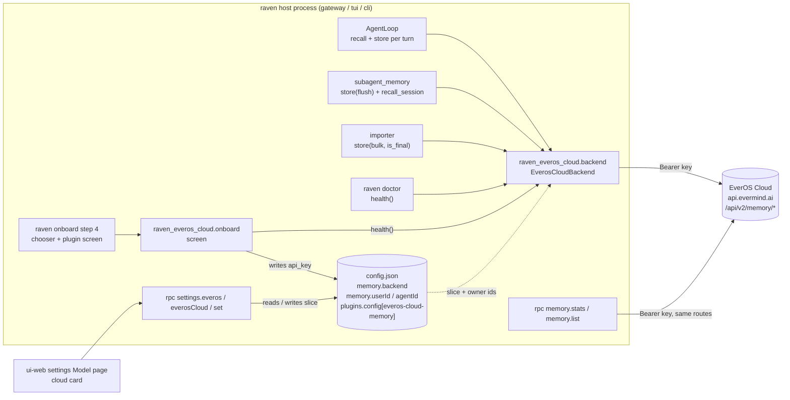
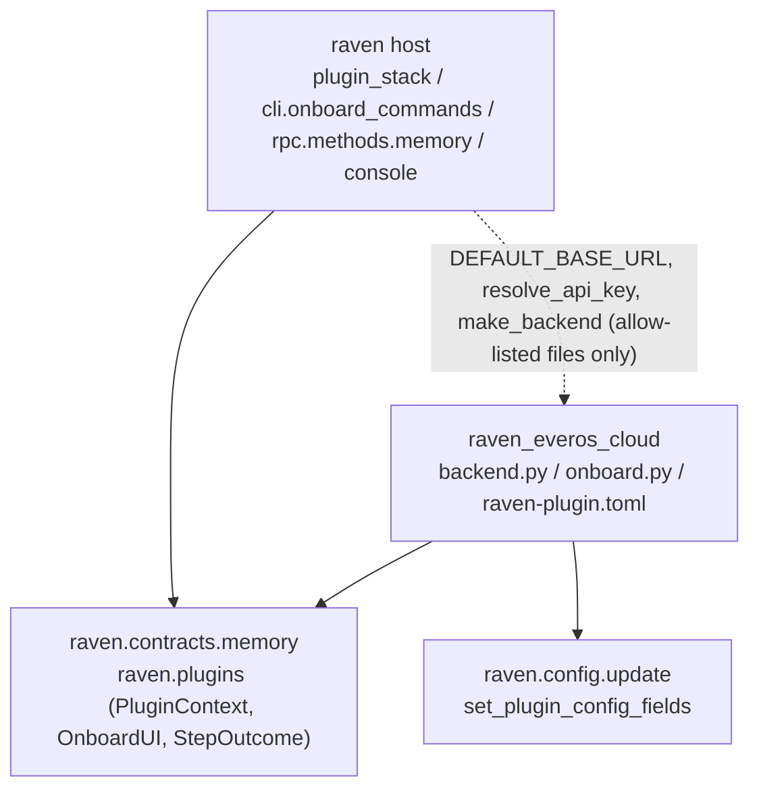

# EverOS Cloud as a memory backend plugin

Status: design; G1 passed 2026-10-08
Date: 2026-10-08
Base: `main` @ `3632e6040` (v0.2.4)

## Terms used throughout

New names this change introduces, to be added to `CONTEXT.md` in the same batch
(AGENTS.md section 6). Existing names are used as `CONTEXT.md` defines them:
**EverOS** (the local plugin), **EverOS role**, **role pin**, **Plugin**,
**Plugin Registry**, **Admission**, **Config-with-cargo**, **Memory record**.

| Term | Means |
|---|---|
| **EverOS Cloud** | The hosted EverOS at `https://api.evermind.ai`, authenticated with a Bearer key from `https://everos.evermind.ai`. Speaks the same `/api/v2/memory/{add,flush,get,search}` as the local server, plus Cloud-only routes this change does not use (`edit`, `delete`, `object/sign`). |
| **everos-cloud-memory** | The distribution this change adds (`plugins-dist/everos-cloud-memory`, Python package `raven_everos_cloud`). Contributes the memory backend named `everos-cloud` and one onboard screen of the same name. Depends on `raven` and `httpx` only -- never on the `everos` package. |
| **cloud slice** | `plugins.config["everos-cloud-memory"]` in `config.json`: `api_key` and an optional `base_url`. Holds no identity (see **owner id**). |
| **owner id** | `memory.userId` / `memory.agentId` from the host's `memory` block, handed to every backend through `ServiceLocator`. On the wire it is the `user_id` or `agent_id` of a search and the `sender_id` of a stored user message. The same two values on two machines sharing one key name one memory. |
| **memory backend chooser** | The `raven onboard` question asked only when more than one memory plugin is installed: which backend's screen to run. Ported from the hosted-memory branch (PR #434), where it was `_choose_memory_screen`. |
| **explicit end** | A `store` call whose caller says the conversation is over: `metadata["flush"]` (a convention of the `MemoryBackend` contract, set by the sub-agent **Memory record** handoff) or `metadata["is_final"]` (the importer's own key, set on a conversation's last batch). The only two store-time reasons this backend calls `/flush`. |

## Goal

Raven's long-term memory today is one plugin, `everos-memory`, which spawns and
manages a local EverOS server. EverMind runs the same engine as a service; a
Raven that keeps its memory there needs no local engine, no model roles to
configure, and no data root -- and a key is all it takes to point two machines
at one memory.

This change adds a second memory backend plugin, `everos-cloud-memory`, and
wires the host so that a person who selects it gets the whole of what the local
plugin gives: user- and agent-track recall and storage in every turn, the
sub-agent memory handoff, the importer, `raven doctor`, the memory browser, the
settings page and the `raven onboard` wizard. The plugin follows the shape of
the hosted-memory plugins on PR #434 -- a thin distribution over REST, one key,
one onboard screen -- without carrying that branch's host base class, because
EverOS is not the flat single-track service that base was written for.

Shapes rejected during exploration:

- **A remote mode inside `everos-memory`.** `server.py`, `config.py` and
  `onboard.py` (about 4,200 lines between them) assume a local process, a data
  root and four model roles at nearly every entry; a mode flag would grow a
  branch at each. A cloud user would also keep installing `everos[multimodal]`,
  which this plugin exists to avoid.
- **Port `HttpMemoryBackend` / `ApiKeyOnboardStep` from PR #434 into the host
  first.** That base answers an `agent_id` call empty by design ("a flat service
  has no agent track") and knows one memory kind; EverOS Cloud has two tracks,
  four kinds and a filter DSL. Widening the base to fit one subclass is more
  code than the subclass saves.
- **No host changes at all.** Install both plugins and `raven onboard` runs the
  local screen and then the cloud screen; the memory browser tells a cloud user
  "this page reads EverOS's store only. Nothing here is what recall uses" (which
  is false for them); the settings page shows four model-role slots that edit
  nothing the cloud reads; a provider credential saved on the models page
  restarts a local EverOS nobody uses. Rejected by the owner: the feature is
  parity with the local plugin, not a backend that only recall can see.
- **A host-side "memory backend panel" contribution point**, so a plugin
  supplies its own settings card and memory-browser data source and the host
  stops naming any backend. The right shape once a third backend exists; today
  it is a new contract and a generalised memory page (whose four tabs are
  EverOS's four kinds) paid for by one plugin. The host edits below are the
  material for that abstraction when it is wanted.

## Non-goals

- **Not shipping in the default install.** The release builds the wheel so it
  can be downloaded and `uv tool install --with` it, but `raven-plugins.txt`,
  `install.sh`, `install.ps1` and `publish_beta.py` keep listing three
  distributions -- which also means a local-clone install (`sh install.sh` from
  a checkout) does not carry it; `tests/test_release_plugin_list.py` pins the
  three names in both installers and stays green untouched. Every default
  install would otherwise gain a wizard question ("Which memory backend?") on
  the strength of a plugin not yet run against the real service. Flipping it
  later is one line in each of those files plus that test.
- **Not implementing `delete`.** Cloud `/memory/delete` soft-deletes by scope
  (`user_id` / `agent_id` / `session_id`), not by memory id; the contract's
  `delete(memory_id, kind)` has no caller since PR #602 removed the browser's
  button. The backend answers `False`, which is what the contract test expects
  of a backend that cannot delete.
- **Not contributing `understand_media`.** Cloud multimodal ingestion needs a
  presigned upload (`POST /api/v2/object/sign`, then S3, then a `uri`), a
  different pipeline from the local parser the tool wraps. A cloud-only install
  has no `understand_media` tool.
- **Not exposing `app_id` / `project_id`.** Cloud defaults both to `"default"`;
  nothing in the host sets them today.
- **Not storing multimodal message parts.** Non-text parts of a message are
  dropped and the text parts joined, exactly as `raven_everos.convert_messages`
  does.
- **Not adding a session-end hook.** Raven has no event meaning "this
  conversation is over": `session.close` flushes unsaved messages to disk and
  only the TUI calls it, `session.archive` toggles a list flag, there is no idle
  timer. The flush policy below uses the two signals callers already send plus
  process stop. See Open questions for the hook's shape if wanted later.
- **Not migrating memories** from a local store to the cloud, or back. Switching
  backends switches which store recall reads; the other store stays where it is.
- **Not migrating configuration** from the `everos-memory` slice (its `base_url`,
  root, role pins) into the cloud slice. The two slices describe different
  services; the cloud one starts empty.
- **Not stopping a local EverOS server** left running from before a switch. Its
  lifecycle belongs to `everos-memory`. Nothing in this change starts one
  either: H15 closes the one host path that would (a provider credential save
  restarting EverOS without asking which backend is active).
- **Not touching the agent's self-configuration surface.**
  `raven/config/self_surface.py` declares `memory.models.llm` / `rerank` /
  `multimodal` with `writer="everos"` and `stored_at="plugins.config.everos-memory.*"`;
  an agent on the cloud backend still sees those settings listed. Changing that
  surface is a separate change.
- **Not changing `~/.raven/env`.** Web tool keys are mirrored there for cli/acp
  sub-agents; the cloud key is read only inside the host process, so it is not.
- **Not making the base URL editable in the GUI.** It is read-only on the card;
  a private deployment edits `base_url` in the cloud slice by hand.

## Overview



Participants and external systems (V1):

| Participant | Person or system | Wants | Crosses the boundary via |
|---|---|---|---|
| Person installing Raven, memory never configured | person | a working long-term memory with the least setup | `raven onboard` step 4: chooser (if two plugins), key screen |
| Person already on local EverOS | person | move to the cloud, or keep local untouched | `raven onboard` re-run; settings page |
| Person chatting | person | recall that reflects what was said before | nothing visible; AgentLoop recall/store |
| Person on the memory page | person | see what the active backend holds; a first-time user sees zeros, not an error | `memory.stats` / `memory.list` |
| Person on the settings page | person | know whether memory is connected; change the key; change a provider key or the main model without side effects on memory | `settings.everosCloud`, `settings.set`, `model.*` |
| Person running `raven doctor` | person | one sentence per fault | `health()` |
| Person with two machines and one key | person | shared memory, or to know how to separate it | the wizard's one-line hint; `memory.userId` |
| Sub-agent handoff (`subagent_memory`) | system | its transcript extracted now and read back | `store(metadata={"flush": True, "user_id": ..., "agent_id": ...})` (camelCase spellings also arrive -- see Wire interactions), `recall_session` |
| Importer | system | historical conversations stored in batches, extracted when a conversation ends | `store(metadata={"bulk": True, "is_final": true/false})` |
| StorePipeline | system | a `False` for a write that did not land, so it can retry | `store` return value |
| Plugin Registry | system | a manifest, factories that build without I/O | `raven-plugin.toml` |
| EverOS Cloud | external system | authenticated JSON over HTTPS | the four calls in the wire table |
| `everos-memory` (coexisting) | system | nothing from this plugin; must keep working unchanged when it is the backend | shared host surfaces: onboard, memory page, settings, the restart-on-config path |

How many of each (V7 counts):

| Thing | How many | Decided by |
|---|---|---|
| `EverosCloudBackend` | one per host process that has `memory.backend == "everos-cloud"` | built by `maybe_build_memory_backend` at loop assembly; `raven doctor`, the onboard screen and `settings.everosCloud` build short-lived ones |
| `httpx.AsyncClient` | one per backend | owned by the backend, closed in `stop()`; tests inject one |
| cloud slice | one per `config.json` | written by the onboard screen and `settings.set` |
| in-process unflushed-session set | one per backend | grows with sessions written; shrinks when a flush returns; swept at `stop()` |
| memory owner on the cloud | one per distinct (`userId`, `agentId`) pair under one key | the host's `memory` block -- the same on every machine unless edited |

## Constraints

Every constraint has a number and a check; the plan and `deviations.md` refer to
them by number.

| # | Kind | Constraint | How it is checked |
|---|---|---|---|
| C1 | architecture | The plugin imports the host only through `raven.contracts.memory`, `raven.plugins` and `raven.config.update` (to write its own slice); never `raven.cli`, `raven.config.loader`, `raven.config.raven`. | `tests/test_plugin_boundary.py::test_plugin_does_not_import_host_private_modules`, with `PLUGIN_DIR` widened to every `plugins-dist/*/raven_*` package. |
| C2 | architecture | The host imports `raven_everos_cloud` from `raven/rpc/methods/memory.py` and `raven/rpc/methods/console.py` only -- the two files already allow-listed as EverOS wire-protocol surfaces. | `test_plugin_boundary.py::test_host_does_not_import_plugin_internals`, regex widened to `raven_everos(_cloud)?\b`; `HOST_WIRE_PROTOCOL_SURFACES` unchanged. |
| C3 | architecture | The plugin's dependency table is `raven` and `httpx`; it never imports `everos` or `raven_everos`. | `plugins-dist/everos-cloud-memory/pyproject.toml`; a test imports every module of the package with `everos` and `raven_everos` blocked in `sys.modules`. |
| C4 | design | Owner ids come from `ServiceLocator` only. The cloud slice declares no `user_id` / `agent_id`; a stale one is warned about and ignored. | manifest `config_schema` has no identity key; unit test with a slice carrying `user_id` asserts the wire uses the locator's. |
| C5 | design | Every `/memory/add` carries `mode: "agent"`. | fake-transport test asserts the body of every add. |
| C6 | design | `/memory/flush` is sent only on an explicit end and in `stop()`. Twenty ordinary turns produce zero flushes. | fake-transport test counts flush calls across N plain `store` calls (0), one `flush` metadata store (1), one `is_final` store (1), one `stop()` after unflushed writes (1 per session). |
| C7 | design | Key resolution is config first, `EVEROS_CLOUD_API_KEY` second; a key that came from the environment is never written to `config.json`. | unit tests on the resolver; onboard test asserts the slice after an env-sourced run has no `api_key`. |
| C8 | design | No contract method raises. `recall` answers within 4.0 s on both tracks (the per-turn user-track caller abandons at 5.0 s, `raven/context_engine/segments/memory.py:27`; the skill router has no budget of its own, `raven/memory_engine/skill_forge/backend_source.py:95`, so this bound is the only one it gets). `recall_session` answers within 10.0 s (its caller allows 30.0 s, `raven/agent/subagent_memory.py:42`, and a read-back right after extraction is the slow case). `store` returns `False` on any failure. `health` answers within 5.0 s. | `tests/test_everos_cloud_backend_contract.py` inherits `MemoryBackendContractTests` and `LifecycleContractTests`; fault-injection tests per failure row with a hanging fake and a clock. |
| C9 | design | With `memory.backend` equal to `"everos"` or `None`, every host surface behaves exactly as before. A backend name that is neither (`"everos-cloud"` today, any future plugin, a stale name) is the one case the host edits change: role slots hidden, settings role writes refused, no EverOS restart. | existing suites unchanged and green: `test_cli_onboard_commands.py`, `test_rpc_settings.py`, `test_rpc_memory.py`, `test_everos_*`; one explicit regression test per surface for the `everos` and `None` branches. |
| C10 | design | Request bodies respect Cloud limits: at most 500 messages and under 300 KB per add. | unit test: a 600-message `store` issues two adds; a 400 KB slice splits by message. |
| C11 | design | Source language is English, including the plugin, tests and the `i18n/messages.json` `en` column; `zh` entries only where the catalogue already carries them. | `make check-source-language`. |
| C12 | design | GUI text goes through `t(key)` with entries in `i18n/messages.json`; no CJK literal enters a `.tsx`. | `ui-web/scripts/gates/first-frame-literals.test.mjs`; `npm run gen:check` in `ui-web` and `lint:rpc` in `ui-tui` for the regenerated RPC types. |
| C13 | design | The release plugin list stays at three distributions. | `tests/test_release_plugin_list.py` unchanged and green; `release.yml` keeps `-eq 3`. |
| C14 | assumption | Cloud `/api/v2/memory/{add,flush,get,search}` accept the request bodies the local plugin sends (`SearchRequest`, `MemorizeAddRequest`, get-by-type), differing only in `mode` being per request. | Read from docs.evermind.ai (`llms-full.txt`) on 2026-10-08. **Unverified against the live service**: `tests/integration/test_everos_cloud_real_cloud.py::test_add_flush_search_roundtrip` and `::test_get_by_session` run only with `EVEROS_CLOUD_API_KEY` set and are the first thing to run when a key exists. |
| C15 | assumption | `/memory/flush` exists on Cloud and answers `no_extraction` harmlessly when nothing is pending. | docs.evermind.ai 2026-10-08; EverOS's own `everos demo --live` client calls it against `api.evermind.ai`. Live: `test_everos_cloud_real_cloud.py::test_flush_with_nothing_pending_is_no_extraction`. |
| C16 | assumption | HTTP 401 means "invalid or missing token"; 403 means "account not authorized for v2". | docs.evermind.ai error table, 2026-10-08. Live: `test_everos_cloud_real_cloud.py::test_wrong_key_is_401` (a deliberately wrong key). The 403 half cannot be exercised without an un-entitled account; it stays documentation-backed and the spec words it as a hint, not a certainty ("may mean ..."). |
| C17 | assumption | Cloud extracts on its own after `add` ("you rarely need flush"), so a session that never sees an explicit end is still extracted eventually. | docs.evermind.ai 2026-10-08. Live: `test_everos_cloud_real_cloud.py::test_add_without_flush_is_searchable_within_two_minutes` (polls `/search`; skipped by default, run by hand -- it costs two minutes). The `stop()` sweep is the hedge. |
| C18 | assumption | `POST /memory/get` with `page_size: 1` is accepted with a key and refused without one, so it can stand as the health probe. | Live: `test_everos_cloud_real_cloud.py::test_get_page_one_with_and_without_key`. |

## Scenarios

Each use case has a main path and its extensions; every failure point lands on
a row of a state table below. `A` numbers are the acceptance items these rows
produce. Rows marked "regression baseline" change no path and are held by C9's
existing suites.

| # | Actor and goal | Main path | Extensions | A |
|---|---|---|---|---|
| S1 | Fresh install with both memory plugins installed configures the cloud | 1 `raven onboard` reaches step 4 -> 2 chooser lists `everos`, `everos-cloud`, Off, default = current `memory.backend` -> 3 picks `everos-cloud` -> 4 cloud screen: no key on file, no env -> prompts -> 5 probe `health()` -> ready -> 6 slice gets `api_key`, `memory.backend = "everos-cloud"` -> 7 recap row `Memory: everos-cloud` | 2a picks Off -> `memory.backend = null`, nothing else written. 2b cancels the chooser (Esc / Ctrl-C) -> the wizard exits with code 1 and writes nothing. 4a `EVEROS_CLOUD_API_KEY` set -> "Using the key from EVEROS_CLOUD_API_KEY", no prompt, key not written. 4b slice already holds a key -> "Using the key on file", no prompt. 5a 401 -> "key rejected" -> Re-enter / Skip. 5b 403 -> "not authorized for v2" -> Re-enter / Skip. 5c unreachable -> names the URL -> Re-enter / Skip. 5d `--skip-test` -> no probe, record. 3a Back on the key prompt -> previous wizard step. | A1 A2 A3 A4 A5 A6 A7 A38 |
| S2 | Install with only the cloud plugin | step 4 runs the cloud screen directly, no chooser | as S1 4a-5d | A8 |
| S3 | Install with only the local plugin | step 4 runs the local screen directly, no chooser | regression baseline | A9 |
| S4 | Chat turn stores and recalls on the user track | recall: `POST /search {query, user_id, top_k, include_profile: true}` -> episodes + profile -> `Memory` list sorted by score, profile capped at 1,200 chars. store: `POST /add {session_id, mode: "agent", messages[]}` -> 202 -> `True`; no flush | recall timeout / 5xx / 429 -> `[]`, warning logged. store 4xx/5xx/timeout -> `False` (StorePipeline retries). | A10 A11 A12 |
| S5 | Skill router recalls on the agent track | `POST /search {query, agent_id, top_k}` -> agent_skills + agent_cases -> `Memory` list with `type` skill / case | both ids or neither -> warning, `[]` without a request | A13 |
| S6 | Sub-agent handoff | `store(metadata={"flush": True, "user_id": X, "agent_id": Y})` (or `userId` / `agentId`) -> add with sender ids for X/Y, then `POST /flush {session_id}` -> `True`; `recall_session(session_id, user_id=X)` -> `POST /get {user_id, memory_type: "episode", filters: {session_id}}` rows | flush times out at 360 s -> `False`, session stays in the unflushed set. | A14 A15 A34 |
| S7 | Import of a historical conversation | batches arrive with `bulk: True`; non-final -> add only; final -> add + flush | a batch over the add limits -> split (C10). | A16 A17 |
| S8 | Process stop | `stop()` flushes each session in the unflushed set, one request each, within the shutdown budget; then closes the client | budget exceeded -> warning naming the sessions left; `stop()` still returns. | A18 |
| S9 | Memory page with the cloud backend | `memory.stats` -> four counts via `/get page_size=1` with Bearer, `ok: true`; `memory.list` -> `/get` or `/search` with Bearer, no `/health` probe, `include_profile` on the profile tab | first use -> `ok: true`, four zeros, no note (empty state). key rejected -> `memory.stats` answers `ok: false` with zeros (it never raises) and `memory.list` raises `InternalError` carrying the server's `error.message`. `memory.backend == "everos"` -> regression baseline. | A19 A20 A21 A37 |
| S10 | Settings page with the cloud backend | `settings.everos` -> `available: false` + note -> role slots hidden; `settings.everosCloud` -> card: status chip, key set/unset + source, endpoint | key missing -> chip "needs key". change key -> `settings.set plugins.config.everos-cloud-memory.api_key` -> re-probe -> chip updates. | A22 A23 A24 A25 |
| S11 | Settings page with the local backend or memory off | four role slots, no cloud card | regression baseline | A26 |
| S12 | `raven doctor` | `health()` -> ready, or one `missing` line naming the fault in the backend's words | 401 / 403 / 429 / unreachable / no key / any other status, each its own sentence | A27 |
| S13 | Two machines, one key, default ids | both read and write the same owner | hint on the wizard screen says so and names `memory.userId` | A28 |
| S14 | `raven onboard --non-interactive` with two plugins | existing early return: "Long-term memory stays off" unless already configured; chooser never shown | already configured (`_memory_enabled()` true) -> nothing written, the same sentence still printed (today's behaviour) | A29 |
| S15 | Person on the cloud backend saves a provider credential or changes the main model | `model.*` write succeeds; `everos_follows_provider` / `everos_follows_main_model` return without restarting anything; no `memory.health` frame | a direct `settings.everosSet` call (the slots are hidden, but the RPC exists) is refused with a `ConfigValidationError` naming the active backend | A35 |
| S16 | `memory.backend = "everos-cloud"` but the wheel is not installed | memory page note names `everos-cloud-memory`; `raven doctor` reports the backend did not build and exits 2 | doctor's sentence is the generic "did not build; check the log" (it names the distribution only for the shipped default) | A36 |

## Structure



| Rule | How it is checked |
|---|---|
| `raven_everos_cloud` -> host: only the three modules above (C1) | `test_plugin_boundary.py` |
| host -> `raven_everos_cloud`: `rpc/methods/memory.py`, `rpc/methods/console.py` only (C2) | `test_plugin_boundary.py` |
| `raven_everos_cloud` never imports `everos` / `raven_everos` (C3) | blocked-import test |
| `raven_everos_cloud.__init__` stays import-cheap (no httpx, no backend import) -- discovery resolves the manifest through it | manifest discovery test imports the package and asserts `httpx` not in `sys.modules` |

Package layout:

```
plugins-dist/everos-cloud-memory/
  pyproject.toml                    deps: raven (workspace), httpx; entry point raven.plugins = raven_everos_cloud
  raven_everos_cloud/
    __init__.py                     docstring, __version__; imports nothing heavy
    raven-plugin.toml               id everos-cloud-memory; memory_backends everos-cloud; onboard everos-cloud; config_schema api_key, base_url
    backend.py                      DEFAULT_BASE_URL, resolve_api_key, EverosCloudBackend, make_backend
    onboard.py                      CloudKeyScreen, make_onboard_step
```

## Data

The cloud slice (persisted, `config.json`):

| Field | Type | Who produces it | When |
|---|---|---|---|
| `api_key` | string | onboard screen (typed key only); `settings.set` from the card; a person by hand | first configuration; key change |
| `base_url` | string, optional | a person by hand | private deployment or test; absent means `https://api.evermind.ai` |

Three questions for it: it outlives every process (it is the file); its writers
are the onboard screen, the `settings.set` route and a hand edit -- the first
two go through `set_plugin_config_fields`, a merge, so neither drops the other's
key; its readers are the backend constructor, the memory page RPC, the settings
RPC and `raven doctor`, all of which read it fresh from `load_raven_config()` --
a hand edit is seen by the next construction, which for the running gateway's
backend means the next start.

Host-owned fields this change reads but never defines:

| Field | Owner | Read here as |
|---|---|---|
| `memory.backend` | host; written by `set_memory_backend` from the wizard's outcome | which plugin's slice the memory page and settings RPC read; `"everos-cloud"` selects this plugin; H6 and H15 read it to leave the local plugin's surfaces alone |
| `memory.userId`, `memory.agentId` | host (`MemoryConfig`); default `"default"`, written by nobody | `ServiceLocator.user_id` / `agent_id` |
| `EVEROS_CLOUD_API_KEY` | the shell | fallback key when the slice has none |

In-process state (lives with one backend):

| Field | Type | Meaning |
|---|---|---|
| `_unflushed` | `set[str]` | session ids this backend added to since the last flush that returned; added before the request goes out, discarded only when a flush returns |
| `_client` | `httpx.AsyncClient` | one connection pool; injected by tests |

Lifecycle by entity:

| Entity | Created by | Updated by | Read by | Deleted by |
|---|---|---|---|---|
| cloud slice | onboard screen or card | onboard screen, card, hand | backend ctor, memory RPC, settings RPC, doctor | hand only |
| `memory.backend = "everos-cloud"` | wizard (`set_memory_backend`) | wizard | every host surface | wizard (Off / unconfigured -> `null`) |
| unflushed set | first `store` of a session | every `store` (add) / a flush that returns (remove) | `stop()` | process exit |
| memories on the cloud | `/add` | the service's own extraction | `/search`, `/get` | nobody from Raven (non-goal) |

Lifecycle by event:

| Event | Started by | What else happens |
|---|---|---|
| wizard records the cloud backend | person | slice written (typed key only); `memory.backend` written; recap shows it; next gateway start builds this backend |
| key changed on the card | person | slice merged; `settings.everosCloud` re-probes; running gateway's backend keeps the old key until restart (card says so) |
| ordinary turn | AgentLoop | one `/search` (user track), one `/add`; session joins the unflushed set |
| sub-agent finishes | `subagent_memory` | `/add` + `/flush`; session leaves the set when the flush returns; `/get` reads back |
| import finishes a conversation | importer | `/add` + `/flush` on the last batch |
| provider key or main model changed | person on the models page | nothing on the memory side (H15); the local plugin's restart path is not taken |
| process stops | host | one `/flush` per session still in the set, within budget; client closed |

## States

Memory backend chooser (step 4, only when two or more memory plugins are
installed):

| State | Entered when | Shows | Actions | Leaves when |
|---|---|---|---|---|
| not shown | fewer than two memory plugins installed, or `--non-interactive` / `--skip` | nothing; the single screen runs as today | -- | -- (terminal for this run) |
| asking | two or more plugins and an interactive run | "Which memory backend?" with one entry per contribution name and Off; the current `memory.backend` preselected | pick a plugin; pick Off; cancel | any action |
| plugin chosen | a name picked | that plugin's screen | the screen's own | the screen returns an outcome -> `memory.backend` written from it |
| Off chosen | Off picked | "Long-term memory stays off" | -- | `memory.backend = null` written; step ends |
| cancelled | Esc / Ctrl-C on the question | nothing further | -- | the wizard exits with code 1; nothing written (terminal) |

Onboard screen (`everos-cloud` step; the first row is the state before anyone
has done anything):

| State | Entered when | Shows | Actions | Leaves when |
|---|---|---|---|---|
| no key anywhere | slice has no `api_key`, env unset | key URL, prompt for a key, the sharing hint | type key; Back | key typed -> probing; Back -> `StepOutcome.BACK` |
| key from env | env set | "Using the key from EVEROS_CLOUD_API_KEY", the sharing hint | -- (nothing to type; shown so the person knows which key is in force) | -> probing |
| key on file | slice has `api_key` | "Using the key on file", the sharing hint | -- (same reason) | -> probing |
| probing | a key is in hand and `skip_test` is false | nothing new | -- (an answer is seconds away) | `health()` answers |
| verified | health ready | "EverOS Cloud connected." | -- | -> recorded |
| failed | health not ready or raised | the check's hint (401 / 403 / unreachable wording) | Re-enter (not offered when the key came from env); Skip | Re-enter -> no key anywhere; Skip -> `StepOutcome.DISABLED` |
| recorded | verified, or `skip_test` | -- | -- | `StepOutcome.CONFIGURED`; slice gets `api_key` only if it was typed here (terminal) |

Backend health (`health()` -> `BackendHealth`); the probe is `POST /memory/get
{memory_type: "episode", user_id: <owner>, page_size: 1}`. One row per answer
the probe can give; a backend holds no health state between probes, so "leaves
when" is the next probe for every row:

| Answer | Entered when | `ready` | check line | What a person does |
|---|---|---|---|---|
| no key | neither slice nor env has one | false | `missing` -- "no API key; set EVEROS_CLOUD_API_KEY or run raven onboard" | set a key |
| ok | 2xx | true | `ok` -- base URL | nothing |
| key rejected | 401 | false | `missing` -- "API key rejected (401); check the key in plugins.config.everos-cloud-memory or EVEROS_CLOUD_API_KEY" | re-enter the key |
| not authorized | 403 | false | `missing` -- "refused (403); this may mean the account is not authorized for the v2 memory API; see everos.evermind.ai" | account action |
| rate limited | 429 | true | `degraded` -- "rate limited by <base URL>" | wait |
| unreachable | transport error or timeout | false | `missing` -- "cannot reach <base URL>: <detail>" | check network / URL |
| other status | any other non-2xx | false | `missing` -- "<base URL> answered <status>" | read the status |

Settings card (`ui-web` Model page):

| State | Entered when | Shows | Actions | Leaves when |
|---|---|---|---|---|
| absent | plugin not installed, or `memory.backend` is not `everos-cloud` | nothing; role slots behave as today | -- | backend becomes `everos-cloud` |
| needs key | selected, `api_key_set` false | chip "needs key", KeyRow unset, endpoint | set key | key saved -> probing |
| probing | card mounted or key saved | chip spinner | -- (shown so the card does not flash empty; the answer is one RPC away) | `settings.everosCloud` answers |
| connected | `status == "ok"` | chip "connected", KeyRow set (source: file or env), endpoint | change key | key saved -> probing |
| degraded | `status == "degraded"` | chip "rate limited", KeyRow set | change key | key saved -> probing; next mount re-probes |
| faulted | `status == "missing"` with a key | chip with the health hint | change key | key saved -> probing |

Role slots on the same page: today `available: false` means the plugin is not
installed, and every EverOS role row stays drawn with a dim "The EverOS memory
plugin isn't installed" pill (`Roles.tsx:265-272`). This change adds
`reason: "other_backend"` to the RPC's answer when `memory.backend` names a
backend other than `everos` or `None`, with only the `embedding` section left
in it, and `Roles` skips the memllm / rerank / multimodal rows on that flag
(H13); the embedding row stays, because knowledge bases embed with that pin
whatever the memory backend is; the not-installed rendering is untouched.

Memory page, the `memory.stats` call (never raises):

| State | Entered when | Shows | Actions | Leaves when |
|---|---|---|---|---|
| unavailable | configured backend's plugin not installed; or `memory.backend` is neither `everos` nor `everos-cloud`; or memory off | `ok: false`, the note, zeros | -- (nothing to browse; the note says why) | config changes |
| empty | backend answers, all four counts zero | `ok: true`, four zeros, the kind hints | open a tab (lists are empty) | memories arrive |
| populated | counts > 0 | `ok: true`, counts | open a tab, search | -- |
| refused or unreachable | any `/get` fails | `ok: false`, zeros for the failed kinds, no note | reload | the next call succeeds |

Memory page, the `memory.list` call:

| State | Entered when | Shows | Actions | Leaves when |
|---|---|---|---|---|
| unavailable | as above | empty page carrying the note | -- | config changes |
| empty | `/get` answers no rows | "0 total" | switch tab, search | rows arrive |
| populated | rows | the rows, pagination | page, search, switch tab | -- |
| refused | cloud answers 4xx | `InternalError` "everos refused the request: <server message>" | retry | the next call succeeds |
| unreachable | transport error / timeout | `InternalError` "everos unreachable: ..." / "did not answer within 15s" | retry | the next call succeeds |

Session flush tracking (per session id, inside one backend):

| State | Entered when | Leaves when |
|---|---|---|
| untouched | never stored in this process | first `store` -> unflushed |
| unflushed | an add went out | an explicit-end flush returns -> untouched; the `stop()` sweep's flush returns -> untouched |

## Wire interactions

Every call carries `Authorization: Bearer <key>` and `Content-Type: application/json`;
every success is `{"request_id", "data"}`. Four calls are used; the last row
lists the routes deliberately not used.

| Call | Request | Error semantics | Timeout | Repeat / duplicate | Compatibility |
|---|---|---|---|---|---|
| `POST /api/v2/memory/search` | `{query, user_id XOR agent_id, top_k, include_profile (user only)}`; `method` left to the server default (hybrid) | any non-2xx or transport error -> `[]` and a warning; never raised | 4.0 s on both tracks (C8) | idempotent | `/api/v2` only; `enable_llm_rerank` not sent (cloud has a cross-encoder) |
| `POST /api/v2/memory/add` | `{session_id, mode: "agent", messages: [{sender_id, role, timestamp (ms), content, tool_calls?, tool_call_id?}]}`; `async_mode` left default (true -> 202 queued) | non-2xx / transport -> `store` returns `False`; StorePipeline retries | 30 s | a retry after an ambiguous failure may store the slice twice; the cloud's extraction dedups at its own discretion (same exposure as the local plugin) | body <= 500 messages, < 300 KB (C10) |
| `POST /api/v2/memory/flush` | `{session_id}` | non-2xx -> `store` returns `False`, session stays unflushed | 360 s (extraction runs inside the call) | harmless when nothing is pending (`no_extraction`) | Cloud and OSS (C15) |
| `POST /api/v2/memory/get` | `{user_id XOR agent_id, memory_type, filters: {session_id}, page_size: 100}` for `recall_session`; `{..., page_size: 1}` as the health probe and the memory page's counts | `recall_session`: `[]` on error; `health`: classified by status | `recall_session` 10.0 s; health 5.0 s (C8) | idempotent | `memory_type` must match the owner's track (user: episode; agent: agent_case) |
| not used: per-turn `/flush`, `/health`, `/delete`, `/edit`, `/object/sign` | -- | -- | -- | -- | see Non-goals |

Owner and sender mapping on `add` is `raven_everos.convert_messages`, copied:
`assistant` / `tool` messages get `sender_id = agent_id`; `user` messages keep
their own `sender_id` or get `user_id`; `system` messages are dropped;
timestamps become unix milliseconds (ISO strings and second-epochs converted);
multimodal parts collapse to their text. The per-call owner override is
`raven_everos._owner_override`, also copied: it reads `user_id` **and**
`userId` (`agent_id` and `agentId`), because the sub-agent handoff passes the
agent's `memory` block as written in `config.json`, which spells its keys in
camelCase (`raven/agent/subagent_memory.py:55-76`); reading one spelling made
the override silently never fire.

## Deployment

| Thing | Is | Lives where | Talks to |
|---|---|---|---|
| raven host (gateway, tui, one-shot cli, importer) | the process that builds the backend | the user's machine | EverOS Cloud over HTTPS; `config.json` on disk |
| `EverosCloudBackend` | an object inside the host | same process | `api.evermind.ai` |
| EverOS Cloud | EverMind's service | remote | -- |
| a local EverOS server | a process `everos-memory` spawned earlier, if any | the user's machine | nobody, once the backend is `everos-cloud`; H15 keeps the host from spawning another |
| ui-web settings page | a browser tab | the user's machine | the gateway's `/rpc` WebSocket |

Concurrency: the host serialises writes per session (`StorePipeline`); two
hosts on two machines sharing one key and the default ids write the same owner,
and the cloud is the single truth. The settings card and a hand edit can both
write the slice; `set_plugin_config_fields` is an atomic merge, last writer
wins per field, and the running backend reads the slice only at construction.

## Failure modes

| Part | Failure | Effect | Detected by | Recovery | Severity |
|---|---|---|---|---|---|
| EverOS Cloud | unreachable (DNS, refused, TLS) | recall `[]`; store `False` -> StorePipeline retries, then counts the turn lost; health `missing` | warning per call; doctor; card chip | the turn is lost after retries, as with a local server down; next turn tries again | medium |
| EverOS Cloud | 401 | same as unreachable, with "key rejected" wording | health; card; doctor | re-enter key on the card or wizard | medium |
| EverOS Cloud | 403 | same, "may mean not authorized for v2" | health; card; doctor | account action at everos.evermind.ai | medium |
| EverOS Cloud | 429 | recall `[]` for that call; store `False` -> retry with backoff; health `degraded`, `ready` true | warning; card chip "rate limited" | wait; StorePipeline's backoff | low |
| EverOS Cloud | 5xx | as unreachable | warning | retry | medium |
| EverOS Cloud | slow extraction, flush exceeds 360 s | store `False`; session stays unflushed; swept at stop | warning naming the budget | stop sweep or the cloud's own extraction (C17) | low |
| EverOS Cloud | changes a field name or rejects a body (C14 wrong) | 422 on every add or search | real-cloud test red; memory page shows the server's message | fix the request shape; nothing silent | high until C14 is verified |
| host process | dies with sessions unflushed | tail of those sessions waits on the cloud's own boundary (C17) | not detected; accepted | none in Raven; relies on C17 | low |
| host process | `stop()` sweep exceeds its 5 s budget | some sessions left unflushed | warning listing them | the cloud's own extraction (C17); see Open questions on the budget | low |
| host | provider credential or main model saved while the backend is `everos-cloud` | before H15: a local EverOS is restarted or started and a `memory.health` banner pushed; after H15: nothing | regression test per S15 | H15 | medium (closed by this change) |
| config.json | slice edited by another writer (hand edit vs card) | running backend keeps the key it was built with | card says "takes effect at next start" | restart | low |
| config.json | `memory.backend == "everos-cloud"` but the wheel is not installed | `maybe_build_memory_backend` -> no backend; doctor says "did not build"; memory page note names the distribution | doctor exit 2; memory page note | install the wheel | medium |
| config.json | both plugins installed, `memory.backend` holds a stale name | roles hidden with a note naming that name (H6 -- this change's doing, applied to any non-`everos` name); `_memory_enabled` keeps treating an unknown name as configured (unchanged) | the settings note; `raven doctor` "did not build" | re-run `raven onboard` | low |
| identity | two machines, default ids | memories merge | the wizard hint | edit `memory.userId` | by design |
| request body | one turn over 500 messages or 300 KB | split into several adds (C10); a single message over 250 KB fails its own add -> that add returns `False` and the log names the session and message index; the rest of the turn still goes out | warning | none automatic: that one message is not stored (a deliberate ceiling; truncating it would store a sentence the user never said) | low |
| onboard chooser | two plugins contribute the same contribution name | registry activation already fails the second plugin whole; the chooser sees one | `activation_failures()` notifier | fix the plugin id | low |
| settings route | `settings.set` asked for a key the manifest does not declare, or declares without `settable = true` (`base_url`) | `ConfigValidationError` naming the key | RPC error | use a settable key; change an endpoint in the config file | low |
| boundary gate | a third host file imports the plugin | `test_plugin_boundary.py` red | CI | move the import into one of the two allow-listed files, or reach the plugin through the registry | -- |

## Change plan

Sizing uses two axes: how much code, how deep the blast radius if wrong.
Estimates, not measurements. Line numbers are at `3632e6040`.

### New: the plugin (large, shallow)

`plugins-dist/everos-cloud-memory/` -- about 650 lines including docstrings,
no host file touched. Shallow: nothing reads it until `memory.backend` names it.
Translation code is copied from `raven_everos.backend` (`convert_messages`,
`as_ms_epoch`, `_owner_override`, `_search_data_to_memories`,
`_flatten_profile` and its cap) and stripped of the service state machine.

### Host edits (small each; the deep ones are marked)

| # | Where | Now | After | Size | Depth |
|---|---|---|---|---|---|
| H1 | `raven/cli/onboard_commands.py:2010-2026` (`_step4_memory`, from `ui = _onboard_ui()` to the trailing `return None`) | runs every memory screen in registry order; the first `CONFIGURED` wins | `chosen = _choose_memory_screen(steps) if len(steps) > 1 else steps[0][0]`; `None` -> `set_memory_backend(None)`; otherwise run that one screen. `_choose_memory_screen` ported from PR #434: questionary select over the contribution names plus Off, default = `_selected_backend()`; a cancelled select raises `typer.Exit(1)` (nothing written); Off returns `None` | ~35 lines | **deep**: step 4 of every install; one plugin installed must take the same path as today (C9, A9) |
| H2 | `raven/rpc/methods/memory.py:39` (`_EVEROS_BACKEND`), `:55-69` (`_cfg`); call sites `:217`, `:257` unchanged | one backend name; base URL from the `everos-memory` slice | `_WIRE_BACKENDS = {"everos": "everos-memory", "everos-cloud": "everos-cloud-memory"}`; `_cfg` keeps its `(base_url, user_id, agent_id)` shape and picks the slice by `memory.backend` (the cloud arm imports `DEFAULT_BASE_URL` from `raven_everos_cloud.backend`); a new `_auth_headers()` returns `{"Authorization": "Bearer <key>"}` for the cloud backend (key through `resolve_api_key`) and `{}` otherwise. The shape is kept so `tests/test_rpc_memory.py`, which monkeypatches `_cfg` and `_post` with 3-argument fakes, stays untouched (A21) | ~30 lines | **deep**: the browser of every memory user; the `everos` arm must not change (A21) |
| H3 | `raven/rpc/methods/memory.py:72-78` (`_post`); call sites `:227`, `:262`, `:270` unchanged | no headers | same signature; the body passes `headers=_auth_headers()` to `httpx` | 2 lines | shallow |
| H4 | `raven/rpc/methods/memory.py:81-102` (`_search_tuning`); call site `:265` | always probes `/health` through `raven_everos.health` | takes the backend name; for `everos-cloud` returns `{}` plus `include_profile` for the profile tab without probing | ~8 lines | shallow |
| H5 | `raven/rpc/methods/memory.py:171-195` (`_unavailable_note`) | "installed" means `raven_everos`; anything but `everos` gets "this page reads EverOS's store only" | installed check per configured backend's package (`find_spec`, the way `everos_plugin_installed` does); when the configured backend's package is absent the note names its distribution (`everos-cloud-memory`); both names are "here"; other names keep today's sentence | ~15 lines | shallow |
| H6 | `raven/rpc/methods/console.py:1243-1264` (`settings_everos`) | answers whenever `everos-memory` is installed | first: `backend = load_raven_config().memory.backend`; if `backend not in (None, "everos")` and the local plugin is installed -> `describe_roles()` reduced to `{"reason": "other_backend", "note": "Long-term memory runs on <backend>; the EverOS model roles are not in use.", "sections": {"embedding": ...}, "required": <the roles report, kept only if it names embedding>, ...}`. The `embedding` section stays because its pin is raven's top-level `embedding` block, which knowledge bases embed with whatever the memory backend is (`CONTEXT.md`, role pin); `llm`, `rerank` and `multimodal` are EverOS's alone and drop out. `reason` is new: a bare `available: False` already means "plugin not installed" and the page renders that sentence on every role row (`Roles.tsx:265-272`); a cloud user must not read it. With the local plugin absent the answer is today's | ~14 lines | **deep**: the Model page of every user; the `None` and `everos` arms unchanged (A26); any other name now hides the slots, by design (C9) |
| H7 | `raven/rpc/methods/console.py:630-725` (`settings_set`, new arm before the final `raise` at `:725`) | whitelist of dotted keys | `plugins.config.<plugin_id>.<field>` -> the plugin must be activated and `<field>` declared in its manifest `config_schema` **with `settable = true`** (type-checked as admission does): this door is reachable from any RPC client with no confirmation step, so a field that decides where a stored credential is sent (`base_url`) is declared but not settable, the same rule that keeps `tools.web.proxy` off the whitelist; the cloud manifest marks only `api_key`; write via `set_plugin_config_fields(plugin_id, {field: value})`; returns `{"applied": True, "previous": None}` like the other raw arms | ~25 lines | shallow (a new arm; existing keys untouched) |
| H8 | `raven/rpc/methods/console.py` (new function) + register beside `:2438` | -- | `settings_everos_cloud(params)` -> `{"available", "selected", "api_key_set", "key_source": "file" \| "env" \| null, "base_url", "status": "ok" \| "degraded" \| "missing" \| null, "hint"}`; builds a backend from the slice through `raven_everos_cloud.backend.make_backend` and awaits `health()` the way doctor does; registered as `settings.everosCloud` | ~45 lines | shallow |
| H9 | `tests/test_plugin_boundary.py:20-22` (`PLUGIN_DIR`, `_PLUGIN_IMPORT`), `:50` (`PLUGIN_DIR.rglob`) | one plugin dir; regex `raven_everos\b` | every `plugins-dist/*/raven_*` dir; regex `raven_everos(_cloud)?\b` | ~10 lines | shallow |
| H10 | `scripts/coverage_gate.py:26`; CI coverage flags | one plugin glob | add `plugins-dist/everos-cloud-memory/**/*.py` and `--cov=raven_everos_cloud` where `--cov=raven_everos` is passed | ~3 lines | shallow |
| H11 | `pyproject.toml:151-153` (dev deps), `:222-224` (`[tool.uv.sources]`), `:385` (ruff `src`) | three workspace members | add `everos-cloud-memory` to each; `uv lock` | ~4 lines + lock | shallow |
| H12 | `.github/workflows/release.yml:85-90` | builds three wheels | add `uv build --wheel plugins-dist/everos-cloud-memory -o dist`; the plugin-list loop at `:181` and `-eq 3` at `:187` unchanged (C13) | 1 line | shallow |
| H13 | `ui-web/src/features/settings/providers/Roles.tsx:514-526` (`Roles` maps every `ROLES` entry; add `.filter(r => !(r.everos && r.everos !== 'embedding' && snap.everos?.reason === 'other_backend'))` so the memllm / rerank / multimodal rows are not drawn for another backend -- the embedding row stays, because knowledge bases use that pin -- while `:265-272` keeps drawing the `everos_missing` pill for the plugin-not-installed case unchanged) and a new card beside `RoleRows` (`:502`); `ui-web/src/features/settings/source.ts:45-83` (load `settings.everosCloud` next to `settings.everos`); `ui-web/src/features/settings/types.ts:143` (snapshot field); `ui-web/src/features/settings/store.ts:146-149` (`emptySnap` seed `everosCloud: null`); `KeyRow` imported from `ui-web/src/features/settings/pages/Tools.tsx:53`; `i18n/messages.json`; `ui-web/src/rpc/generated.ts` + `ui-tui/src/rpc/generated.ts` regenerated (`npm run gen` / `gen:rpc`) | no cloud card | `EverosCloudCard` using `Card`, `KeyRow` (key name `plugins.config.everos-cloud-memory.api_key`), `Chip`; rendered when `everosCloud.selected`; strings `gui.settings.cloud.*` | ~120 lines TS/TSX + catalogue entries | shallow |
| H14 | `docs/memory-plugin-architecture.md`; `docs-site/docs/repo-layout.md:11` + `.zh.md`; `CONTEXT.md` Memory section | three distributions | a section for the cloud plugin; the layout line names four; the Terms table above | docs | -- |
| H15 | `raven/rpc/methods/console.py:1362-1398` (`everos_follows_provider`) and `:1426-` (`settings_everos_set`); callers `raven/rpc/methods/model.py:578`, `raven/rpc/methods/config.py:665` unchanged | `everos_follows_provider` restarts EverOS whenever a saved provider serves a role pin, without reading `memory.backend` (its sibling `everos_follows_main_model` already checks `!= "everos"` at `:1413`); `settings_everos_set` writes a role and restarts for any backend | both read `load_raven_config().memory.backend` first: `everos_follows_provider` returns unless it is `"everos"`; `settings_everos_set` raises `ConfigValidationError("long-term memory runs on <backend>; EverOS roles are not in use")` for `llm`, `rerank` and `multimodal` when the backend is neither `"everos"` nor `None` -- the `embedding` section stays writable for every backend, because knowledge bases size themselves to that pin (the existing test `test_a_narrow_model_is_fine_where_everos_does_not_consume_the_pin[mem0]` pins exactly that); for `None` everything keeps today's behaviour, since clearing or setting `llm` is how memory is turned on | ~10 lines | **deep**: runs on every provider save; the `everos` and `None` arms must not change (A35, C9) |
| H16 | `tests/_everos_cloud_fake.py` (new test fixture; the `_` prefix marks a helper module, as `tests/_everos_presence.py` does) | -- | one module, two faces: `FakeCloud`, an `httpx.MockTransport` for the contract tests, and `python -m tests._everos_cloud_fake --port N --mode M --ledger F [--with-health]`, an HTTP server for the real-host acceptance runs. Speaks the four wire-table routes with the documented shapes; every field the backend sends is honoured or rejected with 400 naming it; a catch-all records every request (404s included) to the ledger; `POST /_fake/mode` switches the scripted answer at run time; `--with-health` adds the OSS `/health` for the local-plugin baseline cases | ~250 lines | shallow (tests only; outside the coverage gate's production globs) |

Dependencies between edits: H2 and H8 depend on the plugin exporting
`DEFAULT_BASE_URL`, `resolve_api_key` and `make_backend`; H13 depends on H7 and
H8. Everything else is independent.

### Smallest set

Stops the bleeding: the plugin, H1, H11, H15 -- a person can select and use the
cloud backend, the local path is untouched, and a provider save no longer wakes
a local server. Without H2-H5 the memory page tells a cloud user their memories
are elsewhere; without H6-H8, H13 the settings page shows dead role slots and no
way to change the key. The owner asked for parity, so the full set is the
deliverable; the smallest set is the order of work, not the scope.

## Code to copy

Function bodies in the plugin sketches are elided (`...`); the comments beside
them are the specification of what the body does. Host "before" blocks are
verbatim from `3632e6040`; "after" blocks are illustrative, and names in them
are placeholders until the plan fixes them.

### The plugin's manifest

```toml
[plugin]
id           = "everos-cloud-memory"
version      = "0.1.0"
display_name = "EverOS Cloud memory"
raven        = ">=0.1"
bundled      = false

[[plugin.contributes.memory_backends]]
name    = "everos-cloud"
factory = "raven_everos_cloud.backend:make_backend"

[[plugin.contributes.onboard]]
name    = "everos-cloud"
factory = "raven_everos_cloud.onboard:make_onboard_step"

# The backend reads plugins.config["everos-cloud-memory"]. api_key is read
# first; EVEROS_CLOUD_API_KEY in the environment is the fallback. Identity is
# not declared here: user_id / agent_id come from the host through
# ServiceLocator, never from a plugin's own slice.
[plugin.config_schema]
api_key  = { type = "string" }
base_url = { type = "string" }
```

### `backend.py` -- the shape

```python
DEFAULT_BASE_URL = "https://api.evermind.ai"
ENV_KEY = "EVEROS_CLOUD_API_KEY"
KEYS_URL = "https://everos.evermind.ai"

RECALL_TIMEOUT_S = 4.0            # C8: both tracks
SESSION_TIMEOUT_S = 10.0          # C8: recall_session; its caller allows 30 s
ADD_TIMEOUT_S = 30.0              # cloud queues the add and answers 202
FLUSH_TIMEOUT_S = float(os.environ.get("RAVEN_EVEROS_CLOUD_FLUSH_TIMEOUT_S", "360"))
                                  # extraction runs inside the call; the variable exists so an
                                  # acceptance run can make a hung flush give up in seconds
HEALTH_TIMEOUT_S = 5.0
SHUTDOWN_FLUSH_BUDGET_S = 5.0     # the local plugin's value, copied; see Open questions
ADD_MAX_MESSAGES = 500
ADD_MAX_BYTES = 250_000           # under the documented 300 KB with headroom


def resolve_api_key(config: Mapping[str, Any]) -> tuple[str, str | None]:
    """(key, source): the slice first, then the environment; ("", None) when neither."""
    key = str(config.get("api_key") or "")
    if key:
        return key, "file"
    key = os.environ.get(ENV_KEY, "")
    return (key, "env") if key else ("", None)


class EverosCloudBackend:
    def __init__(self, ctx: PluginContext, *, client: httpx.AsyncClient | None = None) -> None:
        self._config = dict(ctx.config or {})
        self._logger = ctx.logger
        self._user_id = ctx.services.user_id
        self._agent_id = ctx.services.agent_id
        self._warn_stale_identity_keys()                      # C4, copied from raven_everos
        self._api_key, self._key_source = resolve_api_key(self._config)
        self._base_url = str(self._config.get("base_url") or DEFAULT_BASE_URL).rstrip("/")
        self._client = client
        self._owns_client = client is None
        self._unflushed: set[str] = set()
        self._stopping = False

    async def start(self) -> None:
        ...  # opens the client when none was injected; no network I/O

    async def stop(self) -> None:
        ...  # flush every session in _unflushed, one request each, within SHUTDOWN_FLUSH_BUDGET_S;
             # log "flushed N session(s) at stop" at info, warn with the sessions left when the budget
             # ran out; then close an owned client

    async def recall(self, query, *, user_id=None, agent_id=None, top_k) -> list[Memory]:
        ...  # user_id XOR agent_id, else warn and [] (copied). No key -> [] without a request.
             # POST /search; include_profile on the user track; RECALL_TIMEOUT_S; any failure -> [];
             # a timeout warns "recall timed out after 4.0 s; returning empty" (the budget by value, so a
             # log reader can tell which bound fired), any other failure warns with the exception.
             # return _search_data_to_memories(data, owner_type)[:top_k]  (copied)

    async def store(self, session_id, messages, *, metadata=None) -> bool:
        ...  # owners: _owner_override(metadata, "user_id") or self._user_id, same for agent_id (copied).
             # payload = convert_messages(...) (copied); empty payload -> True (nothing to write).
             # No key -> False. Split into adds of <= ADD_MAX_MESSAGES / ADD_MAX_BYTES; a single
             # message over ADD_MAX_BYTES fails its own add (False, logged) and the rest go on.
             # Every add carries mode="agent"; add to _unflushed before the first request.
             # explicit_end = bool(metadata and (metadata.get("flush") or metadata.get("is_final")))
             # after the adds: if explicit_end -> POST /flush; on success discard from _unflushed.
             # Any failure -> False; never raises.

    async def recall_session(self, session_id, *, user_id=None, agent_id=None) -> list[Memory]:
        ...  # POST /get with filters.session_id and the track's memory_type (copied); SESSION_TIMEOUT_S;
             # [] on failure.

    async def delete(self, memory_id, *, kind=None) -> bool:
        return False                                          # Non-goals

    async def feedback(self, signals) -> None:
        return None                                           # logged once, as raven_everos does

    async def health(self) -> BackendHealth:
        ...  # no key -> missing. POST /get page_size=1 -> classify by status (the health table).


def make_backend(ctx: PluginContext) -> EverosCloudBackend:
    """Sync and read-only: raven doctor constructs without starting."""
    return EverosCloudBackend(ctx)
```

### `onboard.py` -- one screen

```python
class CloudKeyScreen:
    def __init__(self, ctx: PluginContext, *, client_factory=None) -> None:
        ...  # keeps ctx; client_factory lets tests hand the probe a transport

    def run(self, ui: OnboardUI, *, step_no, non_interactive, main_model, warnings, skip_test) -> StepOutcome:
        ui.step_header(step_no, ui.t("Long-term memory: EverOS Cloud"))
        key, source = resolve_api_key(self._ctx.config)
        while True:
            if source == "env":
                ui.console.print(ui.t("  [dim]Using the API key from {var}.[/dim]", var=ENV_KEY))
            elif source == "file":
                ui.console.print(ui.t("  [dim]Using the API key on file.[/dim]"))
            else:
                ui.console.print(ui.t("  [dim]Keys: {url}[/dim]", url=KEYS_URL))
                key = ui.prompt_api_key("EverOS Cloud", allow_back=True)
                if key is ui.back:
                    return StepOutcome.BACK
                source = "typed"
            ui.console.print(ui.t("  [dim]Memories are shared by every Raven that uses this key under user id {uid}; "
                                  "change memory.userId in config.json to keep devices apart.[/dim]", uid=self._ctx.services.user_id))
            if not skip_test:
                health = self._probe(key)                     # a backend built on this key; health() then stop()
                if health is None or not health.ready:
                    hint = health.checks[0].hint if health and health.checks else ""
                    ui.console.print(ui.t("  [yellow]x Couldn't verify EverOS Cloud: {detail}[/yellow]", detail=hint))
                    options = [(ui.t("Skip long-term memory"), "skip")]
                    if source != "env":
                        options.insert(0, (ui.t("Re-enter"), "rekey"))
                    if ui.failure_choice(options, non_interactive=non_interactive) == "rekey":
                        key, source = "", None
                        continue
                    return StepOutcome.DISABLED
                ui.console.print(ui.t("  [green]v EverOS Cloud connected.[/green]"))
            if source == "typed":
                set_plugin_config_fields("everos-cloud-memory", {"api_key": key})
            return StepOutcome.CONFIGURED

    def configured(self) -> bool:
        return bool(resolve_api_key(self._ctx.config)[0])
```

### Host: the chooser (H1), before and after

Before (`raven/cli/onboard_commands.py:2010-2026`, verbatim):

```python
    ui = _onboard_ui()
    for name, step in steps:
        outcome = step.run(
            ui,
            step_no=4,
            non_interactive=non_interactive,
            main_model=main_model,
            warnings=warnings,
            skip_test=skip_test,
        )
        if outcome is StepOutcome.BACK:
            return _BACK
        if outcome is StepOutcome.CONFIGURED:
            set_memory_backend(name)
            return None
    set_memory_backend(None)
    return None
```

After:

```python
    ui = _onboard_ui()
    chosen = _choose_memory_screen(steps) if len(steps) > 1 else steps[0][0]
    if chosen is None:
        set_memory_backend(None)
        return None
    step = dict(steps)[chosen]
    outcome = step.run(
        ui,
        step_no=4,
        non_interactive=non_interactive,
        main_model=main_model,
        warnings=warnings,
        skip_test=skip_test,
    )
    if outcome is StepOutcome.BACK:
        return _BACK
    set_memory_backend(chosen if outcome is StepOutcome.CONFIGURED else None)
    return None
```

With one plugin installed the new code runs the same single screen and writes
the same value: `steps[0][0]` is the name the old loop would have reached first,
and the three outcomes map to the same writes.

### Host: the memory page config (H2), before and after

Before (`raven/rpc/methods/memory.py:55-69`, verbatim):

```python
def _cfg() -> tuple[str, str, str]:
    """(base_url, user_id, agent_id) from raven's config.

    ``plugins`` / ``memory`` live on the composed :class:`RavenConfig`,
    not the base channels ``Config`` — hence ``load_raven_config``.
    """
    from raven.config.raven import load_raven_config
    from raven_everos.server import DEFAULT_EVEROS_BASE_URL

    cfg = load_raven_config()
    plug = (cfg.plugins.config or {}).get("everos-memory", {})
    base_url = str(plug.get("base_url") or DEFAULT_EVEROS_BASE_URL).rstrip("/")
    user_id = cfg.memory.user_id or "default"
    agent_id = cfg.memory.agent_id or "default"
    return base_url, user_id, agent_id
```

After:

```python
def _cfg() -> tuple[str, str, str]:
    """(base_url, user_id, agent_id) for the configured EverOS-shaped backend."""
    from raven.config.raven import load_raven_config

    cfg = load_raven_config()
    user_id = cfg.memory.user_id or "default"
    agent_id = cfg.memory.agent_id or "default"
    if cfg.memory.backend == _CLOUD_BACKEND:
        from raven_everos_cloud.backend import DEFAULT_BASE_URL

        plug = (cfg.plugins.config or {}).get("everos-cloud-memory", {})
        return str(plug.get("base_url") or DEFAULT_BASE_URL).rstrip("/"), user_id, agent_id
    from raven_everos.server import DEFAULT_EVEROS_BASE_URL

    plug = (cfg.plugins.config or {}).get("everos-memory", {})
    return str(plug.get("base_url") or DEFAULT_EVEROS_BASE_URL).rstrip("/"), user_id, agent_id


def _auth_headers() -> dict[str, str]:
    """The Bearer header for the cloud backend; nothing for the local one."""
    from raven.config.raven import load_raven_config

    cfg = load_raven_config()
    if cfg.memory.backend != _CLOUD_BACKEND:
        return {}
    from raven_everos_cloud.backend import resolve_api_key

    key, _source = resolve_api_key((cfg.plugins.config or {}).get("everos-cloud-memory", {}))
    return {"Authorization": f"Bearer {key}"} if key else {}
```

`_post` keeps its three parameters and adds `headers=_auth_headers()` to the
`httpx` call; the three call sites do not change.

### Host: the settings route (H7), the new arm

```python
    if key.startswith("plugins.config."):
        _, _, rest = key.partition("plugins.config.")
        plugin_id, _, field = rest.partition(".")
        declared = _plugin_config_declaration(plugin_id)      # manifest config_schema of an activated plugin, or None
        if declared is None or field not in declared:
            raise ConfigValidationError(f"key not writable via settings.set: {key}")
        if not isinstance(value, _TYPE_FOR[declared[field]["type"]]):
            raise ConfigValidationError(f"{key} must be {declared[field]['type']}")
        from raven.config.update import set_plugin_config_fields

        set_plugin_config_fields(plugin_id, {field: value})
        return {"applied": True, "previous": None}
```

### Host: the restart guard (H15)

```python
def everos_follows_provider(slug: str, agent_loop_factory: Any) -> None:
    try:
        from raven.config.raven import load_raven_config

        if load_raven_config().memory.backend != "everos":
            return
    except Exception:  # noqa: BLE001 - a save must not fail over this question
        return
    ...  # the existing body follows unchanged
```

### ui-web: the card

```tsx
/* One card for the cloud memory backend: whether it answers, which key it
   uses, where it points. Drawn only when settings.everosCloud says the
   backend is the selected one; the role slots are hidden by then. */
export function EverosCloudCard(): JSX.Element | null {
  const s = useSyncExternalStore(store.subscribe, store.get)
  const c = s.snap.everosCloud
  if (!c?.selected) return null
  return (
    <Card title={t('gui.settings.cloud.title')}>
      <Row label={t('gui.settings.cloud.status')}><CloudChip c={c} /></Row>
      <KeyRow label={t('gui.settings.cloud.key')} keyName="plugins.config.everos-cloud-memory.api_key"
              url="https://everos.evermind.ai" raw={s.snap.raw} />
      <Row label={t('gui.settings.cloud.endpoint')}><Rov>{c.base_url}</Rov></Row>
      <Row><Rov>{t('gui.settings.cloud.restart_hint')}</Rov></Row>
    </Card>
  )
}
```

## Acceptance checklist

Every item names the table row it comes from and the situation in which it does
not hold. Items marked ★ are candidates for the human walk-through
(`make-it-fail` 4.1 decides the final ★ table in the acceptance document).
Unless a row says otherwise, "real host" means `raven onboard`, `raven doctor`,
or the gateway with the web UI, against a fake cloud (an `httpx.MockTransport`
or a local HTTP stub speaking the wire table); the live service is C14-C18's
integration test.

| A | Source row | Holds when | Does not hold when |
|---|---|---|---|
| A1 ★ | S1 main; chooser "asking" | With both plugins installed, `raven onboard` step 4 asks "Which memory backend?" listing `everos`, `everos-cloud`, Off, with the current backend preselected | the wizard runs a plugin screen without asking, or lists a name that is not a contribution |
| A2 ★ | S1 steps 4-6 | Choosing `everos-cloud` and typing a key the fake accepts ends with `memory.backend == "everos-cloud"` and `plugins.config["everos-cloud-memory"].api_key` equal to what was typed | either field is missing or the key is written under another slice |
| A3 | S1 2a; chooser "Off chosen" | Choosing Off writes `memory.backend = null` and touches no slice | a slice gains a key or `memory.backend` keeps a name |
| A4 | S1 4a; C7 | With `EVEROS_CLOUD_API_KEY` set, the screen does not prompt and the slice has no `api_key` afterwards | a prompt appears or the env key lands in the file |
| A5 ★ | S1 5a/5b; health table | A fake answering 401 makes the screen say the key was rejected and offer Re-enter / Skip; a fake answering 403 says the account may not be authorized for v2 and offers the same. (Whether the live service answers those statuses in those situations is A32's question, not this one's.) | the two statuses get the same sentence, or 403 is reported as a bad key |
| A6 | S1 5c | A refused connection names the base URL and offers Re-enter / Skip | the failure is reported without the URL |
| A7 | S1 3a | Back on the key prompt returns to the previous wizard step | Back is ignored or exits |
| A8 | S2 | With only the cloud plugin installed, step 4 runs its screen with no chooser | a chooser appears with one option |
| A9 | S3; C9 | `tests/test_cli_onboard_commands.py` passes, its only edited tests being the two that pinned the retired run-every-screen behaviour with two fake plugins (`test_step4_memory_first_configured_wins`, `test_step4_memory_all_disabled_clears_backend`, `test_step4_memory_back_returns_sentinel_without_writing`); and with only `everos-memory` installed, the transcript of `raven onboard --skip-test` step 4 under this branch is byte-identical to the transcript of the same command under a checkout of `3632e6040` (same `RAVEN_HOME`, same answers) | any other existing test needed an edit, or the two transcripts differ |
| A10 | S4 recall | A fake returning two episodes and one profile yields three `Memory` items sorted by score, profile text capped at 1,200 characters with the truncation marker, every request carrying `Authorization: Bearer <key>` and `include_profile: true` | a header is missing, the profile is uncapped, or the order is not by score |
| A11 | S4 store; C5 | A plain `store` of a user/assistant turn issues one `POST /add` whose body has `mode: "agent"`, `sender_id` = `memory.userId` on the user message and = `memory.agentId` on the assistant message, millisecond timestamps, and **no** `/flush` | `mode` is absent or `"chat"`, a sender id comes from the slice, or a flush follows |
| A12 | S4 extensions; C8 | A fake that never answers makes `recall` return `[]` in 4.0 s (measured: between 4.0 and 4.5 s) and `recall_session` in 10.0 s; a fake answering 500 or 429 makes `recall` return `[]` and `store` return `False` at once; nothing raises | an exception escapes, or a bound is missed |
| A13 | S5 | `recall(agent_id=...)` sends `agent_id` and returns skills and cases as `Memory` with `type` `skill` / `case`; passing both or neither id returns `[]` with a warning and no request | the request carries both ids, or an agent-track call is answered empty while the fake has rows |
| A14 | S6; C6; Wire owner mapping | `store(metadata={"flush": True, "user_id": "u2", "agent_id": "a2"})` issues `/add` with sender ids `u2` / `a2` followed by exactly one `/flush`; the same call spelled `{"flush": True, "userId": "u2", "agentId": "a2"}` produces the same wire | no flush, two flushes, the host's ids on the wire, or the camelCase call falling back to the host's ids |
| A15 | S6 | `recall_session(sid, user_id="u2")` issues `/get` with `memory_type: "episode"` and `filters: {"session_id": sid}` and returns the rows as `Memory` | the filter is missing or the owner is wrong |
| A16 | S7; C6 | Importer-style stores (`bulk: True`) with `is_final: False` produce adds only; the one with `is_final: True` adds then flushes once | a non-final batch flushes, or the final one does not |
| A17 | S7; C10; failure "request body" | A 600-message slice produces two adds (500 + 100); a slice serialising over 250 KB splits by message boundary; a slice holding one 300 KB message sends the other messages and returns `False` with a warning naming the session and the message index; every add carries `mode: "agent"` | one oversized request goes out, or the oversize message takes the rest of the turn down with it |
| A18 | S8; C6 | After three plain stores on sessions s1, s2, s3 and an explicit end on s2, `stop()` issues exactly two flushes (s1, s3) and then closes the client; a fake that hangs makes `stop()` return within 5.5 s with a warning naming the sessions left | a flushed session is flushed again, a session is skipped, or `stop()` hangs |
| A19 ★ | S9 main | With `memory.backend = "everos-cloud"` and a fake cloud, the memory page shows four counts and lists episodes; every request to the fake carries the Bearer header and none hits `/health` | the page shows the "reads EverOS's store only" note, a request lacks the header, or `/health` is called |
| A20 | S9 empty; stats "empty" | A fake with no rows makes `memory.stats` answer `ok: true` with four zeros and no note, and the page renders zeros without an error or a note | `ok` is false, or a note or retry control appears |
| A21 | S9; C9 | With `memory.backend = "everos"`, `tests/test_rpc_memory.py` passes unchanged and requests carry no Authorization header | an existing test changes or a header appears |
| A22 ★ | S10 main | With `memory.backend = "everos-cloud"`, the Model page draws none of the memllm / rerank / multimodal rows (neither a pill nor the "plugin isn't installed" sentence), keeps the embedding row (knowledge bases embed with that pin), and shows the EverOS Cloud card with status, key and endpoint | one of the three rows is visible in any form, the embedding row is missing, or the card is absent |
| A23 | S10; H6 | `settings.everos` answers `reason: "other_backend"`, a note naming `everos-cloud` and sections holding only `embedding` when it is the backend; answers as today when the backend is `everos` or `None` | the role RPC still reports sections for a cloud user, or changes for a local one |
| A24 ★ | S10 key change | Changing the key on the card writes `plugins.config.everos-cloud-memory.api_key` and the status chip reflects the next probe (connected for an accepted key, the 401 wording for a rejected one) | the key lands elsewhere, or the chip does not change |
| A25 | S10; H7 | `settings.set` with `plugins.config.everos-cloud-memory.nope` or with a non-string value is refused with a `ConfigValidationError` that names the key; `plugins.config.not-a-plugin.api_key` is refused | an undeclared key is written |
| A26 | S11; C9 | With `memory.backend` `everos` or `None`, `tests/test_rpc_settings.py` and the ui-web settings tests pass unchanged and the card is absent | an existing test changes, or the card renders |
| A27 ★ | S12; health table | `raven doctor` prints the memory line the health table gives for each of its seven answers -- ok with the base URL; the 401, 403, 429, unreachable, no-key and other-status sentences -- and exits 2 for every `missing` and 0 for `ok` and `degraded` | two answers share a sentence, or the exit code treats 429 as a fault |
| A28 | S13 | The cloud screen prints the sharing hint naming `memory.userId` | the hint is absent |
| A29 | S14 | `raven onboard --non-interactive` with two plugins installed prints "Long-term memory stays off" and never shows the chooser; with no backend configured it writes `memory.backend = null`, with the cloud already configured it writes nothing | a prompt blocks a non-interactive run, or a configured backend is cleared |
| A30 | Structure; C1-C3 | `tests/test_plugin_boundary.py` scans both plugins and passes; the blocked-import test imports every `raven_everos_cloud` module with `everos` and `raven_everos` unavailable | a scan root is missing, or the plugin imports a blocked package |
| A31 | Non-goals; C13 | `tests/test_release_plugin_list.py` passes unchanged; `release.yml` builds the fourth wheel and keeps `-eq 3` | the plugin list grows or the wheel is not built |
| A32 | C14-C18 (live) | With `EVEROS_CLOUD_API_KEY` set, the six integration tests named in C14-C18 pass (round trip, get by session, flush with nothing pending, wrong key is 401, add without flush searchable, probe with and without key; the fifth is skipped by default and run by hand); without the key the other five are skipped with a reason naming the variable, and the fifth with its own reason | a test passes without a key, or hides a failure as a skip |
| A33 | Contract | `tests/test_everos_cloud_backend_contract.py` runs `MemoryBackendContractTests` and `LifecycleContractTests` against the backend over a fake transport and passes | any inherited test is skipped or overridden |
| A34 | S6 extension; failure "slow extraction" | A fake that accepts `/add` and hangs on `/flush` makes the explicit-end `store` return `False` when the budget runs out (360 s; shortened through `RAVEN_EVEROS_CLOUD_FLUSH_TIMEOUT_S` in a run) and leaves the session in the set `stop()` sweeps, which tries it again | `store` reports `True`, or the session is dropped from the sweep |
| A35 ★ | S15; H15 | With `memory.backend = "everos-cloud"` and both plugins installed, saving a provider key on the models page and changing the main model each complete without any EverOS process being spawned or restarted and without a `memory.health` frame; a direct `settings.everosSet` is refused with an error naming `everos-cloud`; with `memory.backend = "everos"` the existing restart tests in `tests/test_rpc_settings.py` pass unchanged | a local EverOS starts, a banner appears, the role write succeeds, or an existing test changes |
| A36 | S16; failure "wheel not installed" | With `memory.backend = "everos-cloud"` and the package absent, `memory.stats` answers `ok: false` with a note containing `everos-cloud-memory`, and `raven doctor` exits 2 with a memory line saying the backend did not build | the note does not name the distribution, or doctor exits 0 |
| A37 | S9 key rejected; stats "refused"; list "refused" | A fake answering 401 makes `memory.stats` answer `ok: false` with zeros and `memory.list` raise `InternalError` whose message contains the server's `error.message` | stats reports `ok: true`, or the list error says "unreachable" |
| A38 | S1 2b; chooser "cancelled" | Cancelling the chooser exits `raven onboard` with code 1 and leaves `memory.backend` and every slice as they were | `memory.backend` is cleared or a screen runs |
| A39 | failure "stale name"; H6 | With `memory.backend = "mem0"` (nothing installed under that name), `settings.everos` answers `reason: "other_backend"`, sections holding only `embedding` and a note naming `mem0`, and the Model page draws none of the memllm / rerank / multimodal rows | the slots show for a backend that is not EverOS |

Count, by the rule "one sentence in an Extensions cell is one extension;
references to another row are not counted": the scenario table has 16 rows with
25 extensions; the seven state tables hold 5 + 7 + 7 + 6 + 4 + 5 + 2 = 36 rows;
the failure table 18 rows. The 39 items above cover every scenario row (A30-A33
trace to the Structure rules, Non-goals and C14-C18 rather than to a scenario;
A39 to a failure row), every
state a person can observe (the health answers through A27 and A5, the chooser
and screen states through A1-A8 and A38, the card through A22-A24, the memory
page through A19-A21 and A36-A37; the flush-tracking states are internal and
reached by A14, A16, A18 and A34), and every failure row that is this change's
to handle (rows marked "by design", "accepted" and "unchanged" are documented,
not tested).

## Perspective checklist

| Perspective | Applies? | Where |
|---|---|---|
| V1 context | yes | Overview: participants table, including the person who never configured memory |
| V2 scenarios | yes | Scenarios: 16 use cases; two are regression baselines by declaration |
| V3 structure | yes | Structure: dependency diagram and the rules the boundary test enforces |
| V4 data | yes | Data: slice fields, host fields read, in-process state, both lifecycle tables |
| V5 states | yes | States: seven tables (chooser, screen, health answers, card, stats, list, flush tracking); every first row is the empty state; every row has actions or says why none, and an exit or is marked terminal |
| V6 interaction | yes | Wire interactions: four calls with format, error semantics, timeout, repeat and compatibility |
| V7 deployment | yes | Overview counts and Deployment: processes, where they live, who writes the slice |
| V8 failure | yes | Failure modes: 18 rows, each with detection and recovery or an explicit "accepted" |
| V9 decisions | yes | Decisions |
| V10 traceability | yes | Acceptance checklist: every A names its source row; the acceptance document adds the test column |

## Cost

| | |
|---|---|
| Who pays | one engineer: the plugin (~650 lines copied and trimmed), the host edits (~180 lines over seven files), one ui-web card (~120 lines), the fake cloud fixture (~250 lines), tests, docs. Reviewers: two commits (plugin; host + ui) in one PR. |
| Reversible | the plugin is a separate distribution; each host edit stands alone and reverts without the others. H7 (the settings route) is the only addition other plugins might come to rely on. |
| Can half be shipped | yes: plugin + H1 + H11 + H15 is usable; the rest is the parity the owner asked for and the reason the memory and settings pages are in scope. |
| What is not bought | live verification. Until a key exists every claim about the cloud's answers rests on its documentation (C14-C18). |

## Decisions

- **A separate distribution, not a mode of `everos-memory`.** The local
  plugin's three large modules assume a process and a data root; the cloud
  user must not install the `everos` package.
- **No host base class from PR #434.** Its flat single-track shape does not fit
  EverOS; the plugin carries its own ~650 lines, most copied from
  `raven_everos.backend`.
- **Every add is `mode: "agent"`.** The local server runs both pipelines on
  every add (`memorize.mode` defaults to `agent` server-side); the cloud makes
  it a per-request field defaulting to `chat`. Sending `chat` would silently
  stop agent-track memories on the cloud.
- **Key: file first, environment second; an env key is never written.** The
  same order the web tool vendor keys use (`tools.web.providers.*.apiKey`, env
  as fallback), chosen for consistency with the one credential pattern the
  settings page already edits. PR #434 had the reverse order; rejected here.
- **Flush only on an explicit end and at stop.** `flush` is a convention the
  `MemoryBackend` contract names (`raven/contracts/memory.py:214-221`);
  `is_final` is the importer's own key, listed by the contract among
  backend-specific fields (`:208-212`), and honoured here because the importer
  is a real caller that means "this conversation is over". The per-turn cadence
  was the local plugin's private policy, written for a server that extracts
  only on flush. The stop sweep is kept as data-loss insurance (C17 is
  unverified). Rejected: per-turn flush (one extra request per turn for a
  service that extracts on its own); no sweep (an unflushed tail depends on a
  boundary policy Raven cannot see).
- **The flush budget reads one environment variable,
  `RAVEN_EVEROS_CLOUD_FLUSH_TIMEOUT_S`.** Not a feature: a real-host acceptance
  case for a hung flush (A34) would otherwise wait 360 s per attempt, and the
  importer retries three times on top. Two lines, documented as a test hook.
- **Health probe is `/get page_size=1`.** The cheapest authenticated call;
  `/search` would spend an embedding; the OSS `/health` is not a cloud route.
- **Identity stays the host's.** No `userId` control in the wizard or card; one
  hint sentence. A second write point for the owner id is how store and recall
  drift apart (`ServiceLocator.user_id` docstring).
- **Memory page and settings page are in scope; `understand_media`, delete and
  the installer are not.** Owner's call: parity is what a person sees, and a
  memory page that says "your memories are elsewhere" is a visible defect; the
  tool and deletion are different pipelines with no caller.
- **`settings.set` gets a generic `plugins.config.<id>.<field>` arm** rather
  than a cloud-specific setter. `channels_configure`
  (`raven/rpc/methods/console.py:1647`) decided the opposite for channel
  credentials -- "not a widening of `settings.set`: field names are checked
  against the channel's own spec map here, so an arbitrary dotted path can
  never ride a credential write into the rest of the config" -- and this arm
  honours the same rule by a different door: the manifest's `config_schema` is
  the plugin's spec map, a field not declared there is refused, and the write
  goes through `set_plugin_config_fields`, which can only touch
  `plugins.config[<id>]`. ~25 lines, and the next plugin with a key reuses it.
- **Three role slots hide for any backend that is not `everos` or `None`,
  through a new `reason: "other_backend"` flag, not by reusing
  `available: false`; the embedding slot stays.** memllm, rerank and
  multimodal edit EverOS's extraction models, which no other backend reads, so
  a stale or future name hiding them is the correct answer rather than a side
  effect (C9, A39). Embedding is different: its pin is raven's top-level
  `embedding` block, and a knowledge base embeds with it whatever the memory
  backend is, so the slot and its write stay for every backend. `None` keeps today's behaviour because setting `llm` is how
  memory is turned on from that page. `available: false` alone was rejected:
  the page already gives it one meaning -- "plugin not installed" -- and
  renders that sentence on every role row, which is false for a cloud user.
- **The chooser is a host edit, shipped in the same PR as a separate commit.**
  Its only observable effect needs two memory plugins installed, which this
  change is the first to make possible; a separate PR would have nothing to
  show. Cancelling it exits the wizard, as PR #434's version did, rather than
  writing `null` -- a dismissed question must not turn memory off.
- **`everos_follows_provider` learns to check `memory.backend`, as its sibling
  already does.** A provider save is the most common edit on the models page; a
  cloud user making one must not start a local EverOS. `settings_everos_set`
  refuses role writes for the same backends.
- **Not in the default install.** A plugin unverified against its service does
  not get a question in every user's wizard.
- **The host imports the cloud plugin from the two allow-listed files, and the
  boundary regex is widened to see it.** Rejected: a second copy of
  `https://api.evermind.ai` in the host, which would drift.
- **Diagrams are Mermaid, not SVG.** AGENTS.md section 7 keeps SVG assets out
  of the repository outside the application trees; this spec is committed.

## Open questions

Assumptions the plan will confirm or record in `deviations.md`:

1. **C14-C18 are unverified live.** The first run of
   `tests/integration/test_everos_cloud_real_cloud.py` with a key decides
   whether the wire table is right. Until then the delivery states that no
   request has reached the real service. The 403 meaning (C16) cannot be
   exercised even then without an un-entitled account.
2. **A session-end hook.** If wanted later: `SessionObserver` gains
   `on_session_closed(session_key)`, fired from `session.close`,
   `session.archive` and `delete`; the cloud plugin contributes an observer that
   flushes. About 40 lines, no new subsystem -- and it covers only TUI
   switches, archives and deletes, because Raven has no other end event.
3. **Duplicate adds on retry.** A `store` that fails after the cloud accepted
   the body is retried by StorePipeline and stored twice. The local plugin has
   the same exposure; whether the cloud dedups is unknown.
4. **`SHUTDOWN_FLUSH_BUDGET_S = 5.0`** is the local plugin's value, sized for a
   server on localhost. A cloud `/flush` runs extraction inside the call
   (360 s budget on the explicit-end path), so a 5 s sweep at stop will often
   leave sessions behind with a warning. Whether to lengthen it, or to accept
   that the cloud's own extraction (C17) covers the tail, is decided by the live
   run.
5. **A local EverOS server left running after a switch.** Not stopped by this
   change; whether `raven` should offer to is a separate question for the
   local plugin.
