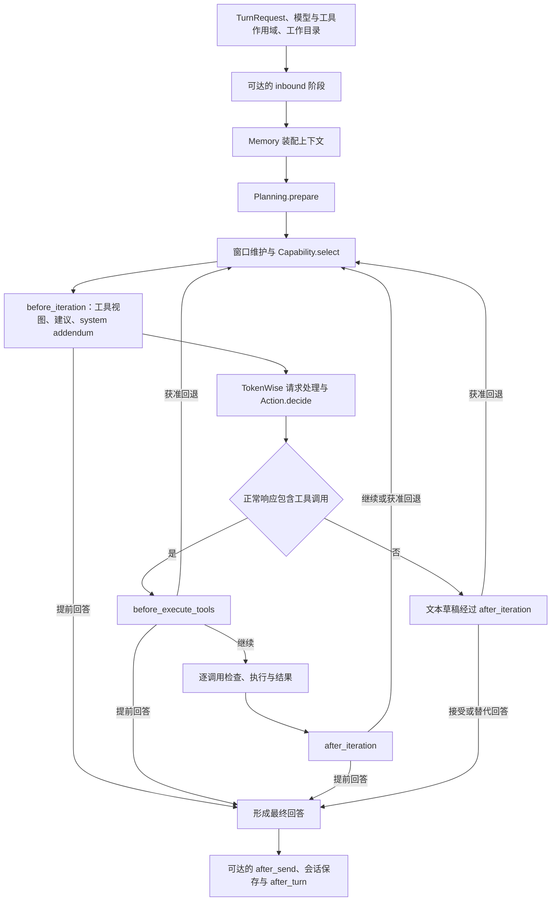

# Loop 执行：从任务输入到结果保存

本篇解释原生 `AgentLoop` 在当前实验接入路径中的执行顺序。适用范围、术语和材料边界见[阅读入口](index.md)。关注参与方法的精确输入输出时，继续读[参与行为与控制](participation-and-control.md)。

## 1. 谁负责推进执行

`AgentTurnRunner.run` 将 `TurnRequest` 交给 `AgentLoop.run_turn`。Loop 负责 turn 身份、会话与工作目录绑定、阶段推进、工具执行、恢复预算、事件和保存；Raven 原生四模块在其调用位置回答相应策略问题。

当前实验的 `Worker` 是调用方进程里的控制对象。RavenRuntime 位于子进程中，同一 Harness 版本的连续 turn 复用该进程。启动、检查、候选验证和换版由 `raven_adapter` 管理；它们的进程安排见[装配与状态](assembly-and-state.md)，不属于四策略的语义划分。

一条普通用户消息不自动触发 Curator。是否重新生成由调用方决定，任务级反馈调度由同级 `experimental/iteration/` 负责。worker 内部的模型/工具循环、Curator 的补查/修复循环和任务级反馈迭代需要分别理解。

## 2. 普通执行路径

下图展示主要调用关系和 Hook 产生的继续、回退与结束分支；provider 错误恢复、预算停止和 answerless 收尾见第 3 节。

### 2.1 进入第一次模型调用之前

| 次序 | 处理 | 对改造的含义 |
|---|---|---|
| 接收 turn 与作用域绑定 | `run_turn` 解析会话身份，绑定模型、session 工具、工具名称/对象快照、Charter 和原生四模块，再进入本轮处理 | 这些作用域在 inbound 之前建立；会话身份、工作目录与调用来源影响后续可达性 |
| inbound | 在来源允许时调用 `before_user_inbound`；可改写模型将看到的输入，也可直接回答 | 提前回答会跳过后续普通执行链；需要区分原始输入与改写输入 |
| 会话与具体工具上下文准备 | 获取会话并处理原生命令等前置路径；继续执行时，`_set_tool_context` 设置 channel/chat/message 信息及相关工具上下文 | 这是对具体工具的上下文设置，与此前建立 turn scope 不同；前置逻辑可能提前返回 |
| 模型与上下文准备 | 在已建立的绑定与本轮设置下处理 session 模型选择或路由，取得候选历史并通过 Memory 构造输入 | 不应把这里的路由处理误读为此时才首次建立模型绑定 |
| Planning | `prepare` 接收任务文本、`session_key` 字符串与已组装消息，返回进入迭代的消息 | 默认实现透传；不能从 Planning 名称推断会额外运行一个规划模型 |
| 进入迭代 | 使用初始消息建立本轮记录边界、计数和控制状态 | 后续重采样、历史保存均依赖这些边界 |

工具的注册名称与对象快照先于 inbound 建立，不表示随后所有工具视图都不再变化：进一步收窄、channel 条件和本轮展示选择仍按各自机制生效。新增或替换原生注册工具的生效边界见[工具视图说明](tools-and-extensions.md#2-模型可见集合与执行集合)。

来源会改变阶段可达性。当前原生 Loop 对 Sentinel 和 Subagent 来源跳过通用 inbound、after_send 路径；部分派发还会通过自己的 Charter 路径处理输入。实验声明根据实际 origin 排除不可达的生成目标，不能仅依据方法存在就认定可用。

### 2.2 一次迭代内部

1. Loop 检查继续条件，处理可接收的中途输入与原生状态。
2. Memory 执行主动窗口维护和常驻图片窗口处理，返回后续阶段实际使用的消息。
3. Capability 取得本轮要展示的工具定义；Loop 记录本次迭代的消息边界。
4. `before_iteration` 看到当前消息和工具。Participant 在这里依次参与工具视图选择、建议和 system addendum；Hook 可以提前结束当前 turn。
5. TokenWise 的请求处理可能继续调整消息、工具、模型或缓存标记。`Action.decide` 获得处理后的请求；Loop/provider 边界才适合检查实际提交的输入。
6. 模型返回后，Loop 处理用量和恢复条件，随后进入工具分支或文本分支。

因此，“组件产生了 Prompt 片段”与“该片段出现在实际模型请求中”是不同事实。窗口处理、段落降级、后续 Hook 和请求处理均可能改变结果。

### 2.3 工具分支

模型返回工具调用提案后，`before_execute_tools` 可以审查整个提案。被接受的提案随后进入每个工具自己的执行检查，详见[工具与扩展](tools-and-extensions.md)。

工具结果写回消息后，正常路径调用 `after_iteration`，下一次迭代可以读取结果。当前 `Continuation.ABORT_TURN` 分支和工具停滞退出分支位于这次 Hook 调用之前，会跳过它。单次调用失败、阻断同批调用与结束 turn 的区别见[工具结果语义](tools-and-extensions.md#3-一次工具调用经过哪些检查)。

`review` 在工具执行前和结果写入后处于不同阶段。要用测试输出判断任务是否完成，必须等待结果可见；要阻止某个动作的副作用，则需要在执行前施加约束。

### 2.4 文本分支

正常文本候选会在保存为本轮最终助手消息之前经过 `after_iteration`。此处可以接受、要求重采样或提供替代回答。该 Hook 位于错误和空响应恢复处理之后；那些分支如果重试或直接以错误结束，就不会经过这次 after_iteration。

是否向外逐步发送文本受流式设置和草稿门控制。声明可能回退迭代的 Hook 会影响文本草稿何时释放；“模型产生了 token”不能直接等同于“用户已看到最终回答”。原生的具体流式路径以 Loop 和 runner 的事件为准。

## 3. 恢复与结束不是单一分支

| 情况 | 原生机制 | 需要区分的事实 |
|---|---|---|
| Provider 内部可重试失败 | Provider 自己的重试或 fallback 路径 | 一次 `Action.decide` 不必对应一次网络请求 |
| 上下文溢出、图片格式或大小被拒绝 | Loop 向 Memory 请求对应的 shrink；有实际改变时撤回本次迭代计数，再进入受预算约束的重试 | 不消耗这次普通迭代名额；与 Participant 重采样使用不同的恢复计数和决策入口 |
| Hook 要求重采样 | Loop 检查上限，回退本次追加消息、应用允许的覆盖和注入后重试 | 请求可能被拒绝；已发生的工具副作用保留 |
| 可恢复的空响应或模型错误 | 原生恢复分类与预算决定是否再尝试 | 未经对应分支，不应把所有“无文本”都视为完成 |
| 迭代数、时限或重复工具停止条件触发 | Loop 可能进行一次禁用工具的总结，并使用回退回答 | 已有回复仍可能表示执行被中断，不能仅看文本判断完成 |
| 错误或没有可见最终回答 | 在没有已安排 rerun 时进入 `terminal_answerless` | `salvage` 不保证在每次预算耗尽时触发 |
| 宿主配置了 dead-end rerun | 当前 turn 内可能再运行一次 Loop attempt | attempt、iteration 和任务级 RSI 是不同层次 |

重采样、恢复及收尾的具体条件应连同返回值的消费者一起阅读。只看某方法的名称或输出格式，无法推断实际控制效果。

### 3.1 计数的作用域

一次 `_run_agent_loop` 是一个 attempt；当前实现的 iteration、窗口恢复状态和执行回退上限的局部计数在每次进入该函数时初始化。宿主可以在同一 turn 内再次调用它，而 turn 的墙钟预算由外层共享。默认 Memory 根据原生窗口策略常量检查缩减重试上限，并读写 Loop 交付的 WindowState；策略判断与状态归属需要分别理解。

参与者实例保存在共享的 turn 元数据中，正常 rerun 不会自动重建这些实例。重新开始 iteration 计数，也不代表参与者属性、任务文件或工具副作用已恢复。`StepView.rollbacks` 和 `loop.control` 读取的是原生元数据计数，存在多个 attempt 时不能直接当作整个 turn 的累加总数；还需结合具体 attempt 和调用记录判断。

## 4. 收尾与持久化

正常主路径形成最终内容后，在 origin 允许时执行 `after_send`，合成输出修改及观察记录，再保存本轮会话，并调用 Memory 的 `after_turn`。原生记忆后端随后有自己的存储、反馈和资源管理路径。

`after_send` 的名称不足以定义对外可见性：在这条执行路径中，它位于最终返回之前，但部分流式内容可能已经发出。它也不等于每个传输层完成发送后的确认回调。

当前 `_process_message` 用该阶段的 `modified_content` 更新最终返回文本，但随后 `_save_turn` 保存的是 Loop 返回的 `all_msgs`；这条路径没有自动把改写后的文本替换回对应助手消息。使用输出改写时，需要分别核对最终返回、已发送事件和持久消息，不能预设三者相同。

提前短路、取消和异常路径可能不经过完整收尾。需要跨 turn 保存的重要状态，必须考虑成功、提前结束和失败路径，而不是只在假设必达的回调中保存。

## 5. 对具体 worker 必须补齐的信息

- 实际执行后端是否为本篇描述的 `AgentLoop`。
- 当前 origin、resident 条件，以及对应阶段是否可达。
- 当前原生四模块、Hook 的真实实现与组合顺序。
- 实际模型绑定、工具视图、迭代和恢复相关配置。
- 是否存在原生短路、预算停止、rerun 或请求降级的证据。

## 6. 代码依据

- [AgentTurnRunner](../../../../raven/agent/spine_runner.py)：`run`。
- [AgentLoop](../../../../raven/agent/loop/main.py)：`run_turn`、原生控制上限与 wiring。
- [TurnPathMixin](../../../../raven/agent/loop/turn_path.py)：`_process_message`、`_run_agent_loop`、`_synthesize_final_on_exhaustion`、保存与恢复路径。
- [来源条件](../../../../raven/agent/loop/_shared.py)：`_SKIP_USER_INBOUND_ORIGINS`、`_SKIP_AFTER_SEND_ORIGINS`。
- [上下文连接](../../../../raven/agent/loop/organ_glue.py)：`_assemble_context_messages`。
- [原生 Action](../../../../raven/agent/harness/action.py)：`DefaultAction.decide`。
- [实验 worker](../worker.py)：进程中的 runner 调用与执行边界。
