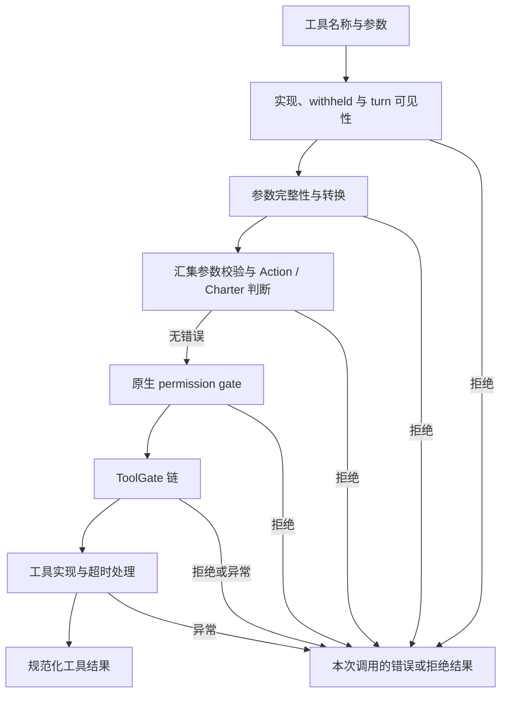

# 工具与扩展：定义、授权、执行与组件生命周期

本篇解释能力如何从声明进入真实执行。适用范围见[阅读入口](index.md)，模型与工具的往返时序见[Loop 执行](loop-execution.md)。

## 1. 工具的四个事实层次

| 层次 | 含义 | 常见误判 |
|---|---|---|
| 工具定义 | 模型看到名称、描述和参数 schema | 看到了定义就一定能执行 |
| 注册实现 | 注册表中存在对应可调用对象 | 注册成功就一定向当前 turn 开放 |
| 执行资格 | 当前范围与逐调用检查允许这次调用 | 之前允许过就永远允许 |
| 实际执行 | 实现被调用，并得到可关联的结果 | 返回了文字就一定完成了目标或产生了副作用 |

Capability.select 和 Participant.select_tools 主要影响第一层。工具工厂与原生装配建立第二层。ToolRegistry、权限机制和 ToolGate 共同参与第三层。执行记录和实际结果说明第四层。

## 2. 模型可见集合与执行集合

默认 Capability 从 ToolRegistry 取得工具定义。原生注册表还考虑 session overlay、withheld、当前 turn 可见性、工具自身配置和 schema-hidden 等因素。工具的 channels 条件影响展示与发现视图；有 Charter 的派发还会把它要求收窄的名称合入 withheld_names。channels 的展示条件不能直接当成逐调用权限检查，执行是否允许仍需沿 execute 的检查路径判断。

schema-hidden 支持按需发现：一个工具未出现在初始定义数组中，仍可能通过合法名称被调用。Participant 从展示数组移除一个定义，不会自动注销或禁止该工具。

反过来，Participant 添加一个定义也不会凭空产生实现或授权。若方案要求新增能力，需要同时确认工厂/服务可用、原生注册成功和执行检查可通过。

原生 turn_scope 固定进入 turn 时的注册名称与对象身份，并保留当时的 withheld 限制。新增工具、解除已有 withheld 限制或同名对象替换，不能据此为当前 turn 增加原生可见能力；移除和进一步收窄可以立即生效。同名替换时，旧对象从当前视图移除，新对象等待下一 turn。session overlay 有自己的范围，声明为动态 schema 的同一对象可以重新渲染定义，因此这里固定的不是每个 schema 字节。

## 3. 一次工具调用经过哪些检查

当前 `ToolRegistry.execute` 的主要路径如下。错误会成为该调用的结果，而不是自动等价于整个任务结束。

参数不完整等情况会先返回错误；完成转换后，当前实现汇集 schema 校验、工具自身校验和 Action 判断的错误，再决定是否继续。所以参数校验已经报告错误时，Action 判断仍可能被调用，不应假设其输入已通过所有校验。正常实现按原生接口执行，结果转换后进入后续 Loop 消息和事件。

工具返回经原生 Tool/ToolResult 路径规范化，以下含义需要分别表达：

| 表达 | 消费语义 |
|---|---|
| model_text / display_text | 提供给模型的内容与可选展示文本 |
| ok | 工具报告的成功状态；原生失败识别还考虑 Error 前缀 |
| retryable | 控制是否附加原生通用纠错提示，不是自动重试命令 |
| blocks_call | 指示该动作被阻断，Loop 据此限制同一响应中的其他调用 |
| continuation | 决定是否继续 turn，例如 ABORT_TURN；与单个调用失败分开 |

因此，错误结果、阻断同批调用和结束整个 turn 是不同后果。生成实现应复用原生协议，并观察 Loop 实际怎样消费。

### 3.1 原生权限判定与实验 worker

PermissionGate 位于 Action 判断之后、插件 ToolGate 之前。它先产生 Allow、Deny 或 NeedsApproval，再决定是否进行审批交互。主要次序如下，具体命令和工具规则以原生配置及分类实现为准：

1. 内建拒绝规则优先；用户配置中的拒绝随后检查。
2. 用户允许规则可放行；没有匹配的用户规则时，默认分级为允许的调用也可直接通过。
3. 对仍需处理的调用，FULL 模式可以放行；此前的拒绝不会被它覆盖。适用的会话授权也可使调用通过。
4. SMART 模式在有可用审阅 provider 时进行原生判断：明确允许则通过，否则转为需要审批。缺少审阅 provider 或 ASK 模式下，仍需审批的调用进入 NeedsApproval。
5. enforce 处理最终 NeedsApproval：gate 必须允许询问，当前权限上下文必须有 responder 和 conversation_id，才能发起审批；缺少这些条件就拒绝本次调用。

当前实验 Worker 没有绑定权限审批 responder 的入口，原生权限上下文因此按无人响应的情况处理。它也使用 `TurnPolicy(interactive=False)`，但 PermissionGate 的直接判据是上面的授权结果与权限上下文，不能仅根据这个 policy 字段推断所有调用均会拒绝。已由规则或 SMART 判断允许的调用可以继续；仍需人工审批的调用不能凭装配成功获得执行许可。

这会影响能力选择：新增工具可能已注册，默认验证也可能通过，但在真实调用时遇到审批要求。Curator 应从拒绝结果、当前权限配置和宿主交互能力定位缺口；本轮 Declaration 没有提供的权限修改能力，不能通过改写 Prompt 或新增 ToolGate 获得。

正常权限拒绝会携带 `blocks_call=True`，使 Loop 阻断同一模型响应中后续的兄弟调用；默认仍允许 turn 继续。人工选择“拒绝并停止”时才使用 ABORT_TURN。内建参数解析错误有自己的可纠正返回，未采用上述阻断语义。插件 ToolGate 按协议返回普通字符串拒绝时，只替代该次调用的结果，并不自动携带 blocks_call；这两种 gate 的后果需要分别读取。

## 4. review、judge 与 ToolGate

| 机制 | 检查位置 | 作用对象 | 失败与限制 |
|---|---|---|---|
| Participant.review | 整个模型提案执行前、正常迭代结果之后 | 一次模型步骤 | 可以要求回退或结束；受 phase、合成顺序和 Loop 回退上限影响 |
| Action.ask_judge / Charter 判断 | 注册表逐调用检查中 | 单个调用与此前调用信息 | 普通 Hook Participant 的 judge 未接入；该角色判断抛异常时，注册表按无意见继续后续检查 |
| ToolGate.adjudicate | 参数处理、原生权限检查之后，工具实现之前 | 单个调用 | 非 None 结果拒绝该调用；异常也拒绝该调用 |

插件 ToolGate 返回的普通字符串交回模型作为该调用的结果。其他调用继续由各自规则处理；原生 PermissionGate 通过 ToolResult 表达的批次阻断与 turn 控制见上节。

ToolRegistry 按 gate 对象的 `name` 与 `contributed_by` 排序，首个非 None 结果决定该调用。manifest 的贡献名称与对象名称可能不同，应检查实际对象及排序结果。gate 允许通过，只表示它没有拒绝，不能扩大原生权限。与原生 Hook 的异常通常按无意见处理相比，gate 的异常处理是另一种明确语义。

## 5. 工具与其他插件贡献如何装配

插件 manifest 描述贡献及工厂。工厂通过 `PluginContext` 接收自己的配置切片、宿主授予的 ServiceLocator 和 logger；部分组件声明原生 `bind_runtime`，在对象可用后接收 RuntimeHandles。

构造时有的服务，与后续才绑定的运行对象不是同一集合。生成代码应使用明确交付的能力，不能从工厂参数推断可以直接替换宿主内部对象。

下表覆盖当前 worker 装配相关的六类贡献。原生 manifest 另有 onboard，用于宿主引导流程；当前 worker 的 build_runtime 路径不执行这些引导步骤，Declaration 也没有单独的 onboard 生成目标。

| 贡献种类 | 装配后的消费路径 |
|---|---|
| Tool | 进入 ToolRegistry，由模型提案经检查后调用 |
| AgentHook | 进入原生 Hook 链，在实际可达阶段调用 |
| ToolGate | 进入注册表的逐调用检查链 |
| MemoryBackend | 工厂登记后由 memory 配置选择、构造和使用 |
| Service | resident 宿主启动、停止后台资源 |
| SessionObserver | resident 宿主附加到会话删除通知路径 |

注册贡献名称与运行时对象名称可以具有各自语义；应按原生工厂和注册规则核对绑定，不能凭字符串相同代替对象被实际接入的证据。

原生 bind_runtime 失败也要按组件区分：工具失败会被注销，ToolGate 失败则使整次原生装配失败。对于当前候选明确请求的工具，实验适配层还会核对实际绑定；被注销的请求工具不能通过该核验。因此，原生层“注销后继续构造”不等于实验候选会被接受。

## 6. MCP 是连接与发现过程

配置 MCP server 后，还要建立连接、发现工具并按原生规则注册。当前实验在正常启动时连接 MCP，记录状态，并检查候选显式请求启用的 server 是否已连接。

候选可以提供 server 相关支持文件；适配层将对应的 artifact 相对路径解析为物化路径。文件存在和命令可构造，仍不能证明协议握手、工具发现或调用成功。

验证进程的默认检查不启动完整资源；若需要验证 MCP 连接和调用，要通过适用的宿主 probe 或实际运行路径观察。连接后的工具仍经过原生执行机制，不因来自 MCP 而获得额外权限。

## 7. Service 与 SessionObserver

Service 属于 runtime generation 的后台资源。只有 resident 宿主启动它；`stop` 需要可重复调用，失败应有可观察结果。服务不负责偷偷重装宿主对象。

SessionObserver 是会话删除请求完成后的同步通知。`removed` 区分是否实际删除文件；观察者无法否决已经完成的删除。其他进程直接删除文件不在该进程的通知范围内。需要外部资源清理时，要考虑没有通知的情况和幂等处理。

当前实验在启动服务时核对请求贡献是否实际进入 started 集合，失败时尝试清理。成功构造服务对象不等于服务已正常启动。

## 8. 具体实例需要核实

- 工具定义、注册对象、当前 withheld/可见条件与实际执行结果。
- 所需权限、ToolGate 与 Hook 的实际组合顺序。
- 权限模式、实际规则结果与审批 responder 是否可用；拒绝是否阻断同批调用、是否结束 turn。
- 插件配置、构造输入和运行时授予的能力。
- MCP server 的连接、工具发现、调用和关闭情况。
- 服务是否启动、观察者是否附加，以及资源停止是否完成。

## 9. 代码依据

- [工具协议](../../../../raven/contracts/tool.py)与[ToolRegistry](../../../../raven/agent/tools/registry.py)：admission、定义、turn_scope、execute、adjudicate。
- [Capability](../../../../raven/agent/harness/capability.py)与[Action](../../../../raven/agent/harness/action.py)。
- [ToolGate 协议](../../../../raven/contracts/tool_gate.py)。
- [原生权限门](../../../../raven/permissions/gate.py)：`check`、`enforce`、`_refusal` 的决策顺序和拒绝结果。
- [权限上下文](../../../../raven/permissions/turn.py)：`current_turn`、`start_permission_turn`；[权限规则](../../../../raven/permissions/rules.py)：用户与默认分级。
- [插件 manifest](../../../../raven/plugins/manifest.py)、[PluginContext](../../../../raven/plugins/context.py)、[宿主能力](../../../../raven/contracts/plugin_surface.py)。
- [原生插件装配](../../../../raven/core/plugin_stack.py)与[运行时 wiring](../../../../raven/agent/loop/wiring.py)。
- [MCP 连接](../../../../raven/agent/loop/mcp_glue.py)。
- [Service](../../../../raven/contracts/services.py)与[SessionObserver](../../../../raven/contracts/session_events.py)。
- [实验装配与启动](../bind.py)：`construct_component`、`_verify_bindings`、`Bound.start`。
