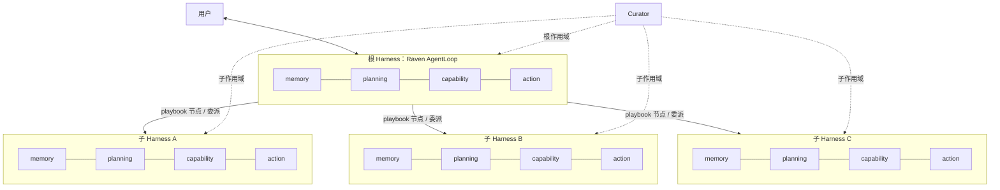
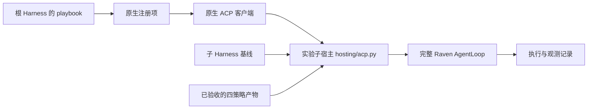
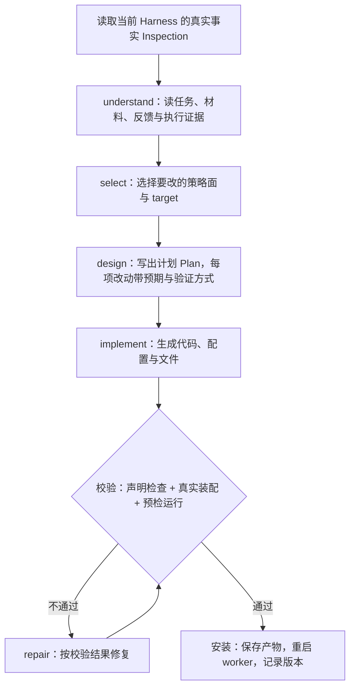
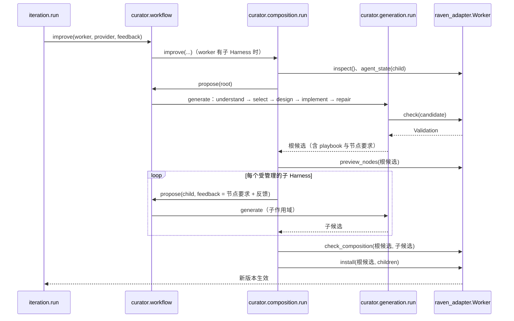
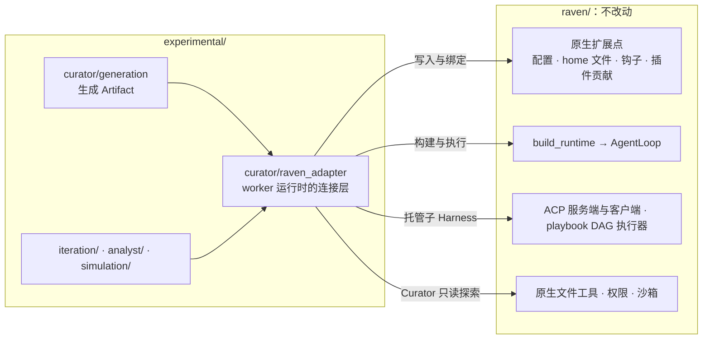
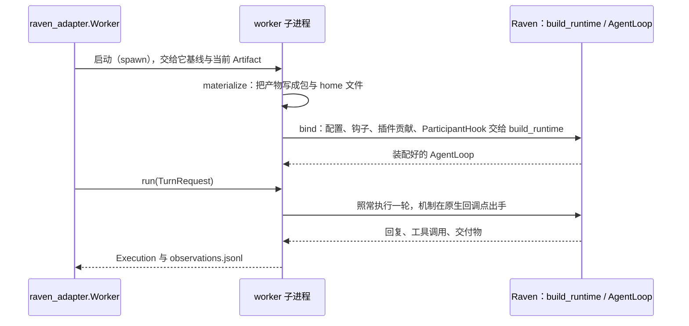

# Curator：生成与管理 Harness-of-harnesses

Curator 读取一个数字员工当前的 Harness，依据任务、交给它的材料和反馈，在四个策略面上生成代码与配置，校验后装到真实的 Raven 运行时里。数字员工由一个根 Harness 和它调用的若干子 Harness 组成，Curator 用同一套生成流程改造其中每一层。

本文说明结构与调用逻辑。反馈怎样驱动多轮改进见 [rsi-iteration.md](rsi-iteration.md)。

## 1. 结构：两层 Harness

数字员工只有两层。根 Harness 直接面对用户；它通过 playbook 或委派调用子 Harness，子 Harness 不再向下委派。每个 Harness 都是一个完整的 Raven agent，都有同样的四个策略面。



- **根作用域**决定改哪一层、playbook 怎样组织，并通过 playbook 节点的要求文件 `playbooks/<name>/nodes/<node>/requirements.json` 向子层提出行为要求。
- **子作用域**只看自己的真实 Harness、父层要求和相关材料，自己选择并实现满足要求的机制。
- playbook 是根 Harness home 里的文件，写明节点、每个节点交给哪个子 Harness、依赖顺序和节点提示词。Raven 的 DAG 执行器只照文件调度，所以改 playbook 就是改子 Harness 之间的协作结构。

受 Curator 管理的子 Harness 由实验宿主托管：读取基线与已验收的产物，装配四策略，创建完整的 Raven AgentLoop，再挂到原生 ACP 管线上。父层仍经原生注册表和 playbook 调用它。



## 2. 四个策略面

Curator 的产物落在 Raven 已有的扩展点上，每个扩展点在代码里是一个 target（`raven_adapter/targets/`）。一次修订只改需要的面，不要求四个面都重写。

| 策略面 | 管什么 | 主要 target | 常见产物 |
|---|---|---|---|
| memory | 员工每次工作都会读到的知识与上下文 | `memory.strategy`、`memory.prompt`、`memory.system_addendum`、`memory.context_engine`、`memory.backends` | 上岗手册、角色设定、上下文整理策略 |
| planning | 多步任务怎样编排 | `planning.strategy`、`planning.playbooks`、`planning.skills`、`planning.advise` | playbook（DAG）、技能包、每步的规划状态机 |
| capability | 能用哪些工具、怎样用 | `capability.strategy`、`capability.tools`、`capability.tool_config`、`capability.mcp`、`capability.plugins` | 新工具（如自检工具）、关掉不该用的工具 |
| action | 每一步执行前后的检查与干预 | `action.strategy`、`action.review`、`action.tool_gates`、`action.hooks` | 发出前的审核代码：不合格就打回重写，或拒绝一次工具调用 |

每个面都有一个 `<面>.strategy` target，对应一个公共策略协议（`harness/strategies/` 里的 `MemoryStrategy`、`PlanningStrategy`、`CapabilityStrategy`、`ActionStrategy`）：Curator 生成一个实现协议的 Python 类，由适配层绑定到 Raven 的原生回调上。例如 `action.strategy` 在模型回复发出前和工具执行前被调用，返回 accept、resample（带更正提示重写）或 end。其余 target 是 Raven 已有的配置、文件或钩子扩展点。

## 3. 一次 curation



- **事实优先。** Curator 看到的是当前实际装配出的 Harness（`raven_adapter/inspection/`），不是它上一轮的计划。上一轮的计划只作为预期，和执行证据对照。
- **探索是只读的。** 生成期间 Curator 可以按需查询材料、源码快照和执行观测（`raven_adapter/exploration.py`）；worker 的 `withheld` 指定的评测侧文件不进它的快照，场景由调用方声明。
- **校验是交付边界。** 候选先在副本上做声明检查和真实装配，必要时跑一次预检；不通过就进入 repair，通过才安装。预算（调用次数、查询次数、修复次数）在一次 curation 内累计，超出时暂停并可接续。

## 4. 两层组合的调用时序

有子 Harness 时，`workflow.improve` 走组合流程：先生成根候选，再按根候选里的节点要求逐个生成子候选，最后整体校验、一次生效。



- 根候选先在隔离环境校验，再交给子层读取；子层生成期间不把根候选装到活动员工上。
- 子层实现错误在子作用域修复；真实能力缺口或父子交接冲突带证据交回根层。
- 生效是整体的：全部候选就绪后一次安装；任何一个启动或检查失败，恢复前一整套版本。

## 5. 与 Raven 的连接

Curator 生成的是 Harness，运行 Harness 的始终是 Raven 本身。`experimental/` 对 Raven 源码零侵入：`raven/` 里没有为它改过一行，也不引用 `experimental/`；依赖只有 `experimental/ → raven/` 一个方向。被培养 worker 的 Raven 运行时只经 `raven_adapter/` 接触；其余部分只用 Raven 的公共部件：生成阶段用它的 provider、工具与权限契约调用 Curator 自己的模型，入口用它的配置加载与 provider 工厂。



### 5.1 生成物落在哪些原生扩展点

每个 target 声明自己绑到 Raven 的哪一种扩展点（`raven_adapter/targets/`）。Curator 写的不是 Raven 的补丁，而是 Raven 本来就允许用户提供的东西：

| 原生扩展点 | 对应的 target（举例） | 生效方式 |
|---|---|---|
| agent home 里的文件 | `memory.prompt`（引导文件）、`planning.skills`（技能包）、`planning.playbooks`（playbook 与节点要求） | 写进 home，Raven 照常加载 |
| Raven 配置 | `memory.context_config`、`planning.skill_config`、`capability.tool_config`、`capability.mcp`、`capability.plugins`、`action.config` | 合并进这个 worker 的配置 |
| 构建运行时时的钩子（`HostWiring.hooks`） | `memory.system_addendum`、`planning.advise`、`capability.select_tools`、`action.review` | `build_runtime` 时交给 AgentLoop |
| 插件贡献 | `capability.tools`、`action.tool_gates`、`action.hooks`、`memory.backends`、`action.services` | 以插件的工具、闸门、钩子、服务注册 |
| 四个 `*.strategy` | `memory.strategy`、`planning.strategy`、`capability.strategy`、`action.strategy` | 生成的协议类包进一个原生 `ParticipantHook`，在 Raven 已有的回调点上被调用 |

### 5.2 一次执行怎样跑在真实的 Raven 上



- worker 常驻在一个子进程里，跨轮保留原生状态；只有 Harness 变了才重建。安装新版本时先在副本上真实装配、校验，通过后替换，失败则保留原版本。
- 观测靠 `observe.py`：一个 `AgentHook` 子类在每个回调点记一行，模型调用经包装后的 provider 记录；Raven 自身的执行路径不变。

### 5.3 子 Harness 与 Curator 探索用的原生部件

- **子 Harness**：父层按 Raven 原生的第三方 ACP 子代理配置（`ThirdPartyAcpSubagentConfig`）登记，由原生 ACP 客户端和 playbook DAG 执行器调用。实验宿主 `hosting/acp.py` 用 Raven 的 ACP 服务端部件应答，内部起的仍是完整的 Raven AgentLoop。
- **Curator 探索**：`exploration.py` 直接用 Raven 的只读文件工具（`read_file`、`list_dir`、`grep`、`find`）、`PermissionGate` 和沙箱执行器，在源码快照上工作。
- **Curator 自己的模型调用**：`generation/run.py` 经 Raven 的 `LLMProvider` 契约和工具注册表调用模型，沿用 Raven 的提示词缓存、原始参数回传与不可信内容包装。

### 5.4 依赖的 Raven 内部成员

不改源码，但有几处读到了 Raven 没有公开接口的内部成员。Raven 重构这些地方时，要同步调整适配层；curator 的单元测试和集成测试会暴露这类断裂。

| 内部成员 | 用在哪里 | 用途 |
|---|---|---|
| `AgentLoop._playbooks` | `inspection/runtime.py` 的 `playbook_library` | 读已加载的 playbook 与节点，校验节点要求 |
| `AgentLoop._disabled_tools` | `capability/protected.py` | 确认必需工具没有被关掉 |
| `AgentLoop._connect_mcp`、`_started_services` | `bind.py` | 候选校验时连上 MCP、确认插件服务已启动 |
| `AgentLoop._mcp_tool_notices`、`_now_fn`、`_skill_hub_client`、`_provider_pool`、`_skill_blocklist_reader` | `memory/context.py` | 为 `memory.context_engine` 用与 AgentLoop 相同的输入构造上下文引擎 |
| `raven.acp.server._answer`、`_drain`，`raven.cli.acp_commands._open_stdin` | `hosting/transport.py`、`hosting/acp.py` | 子宿主复用 Raven ACP 服务端的请求应答与收尾 |

### 5.5 适配层模块

| 模块 | 职责 |
|---|---|
| `targets/` | 四个策略面在 Raven 上的扩展点声明 |
| `materialize.py`、`validate.py` | 把产物写成可校验的包，做声明与装配检查 |
| `bind.py`、`strategy.py` | 把生成的策略类与组件构造出来，绑定到原生扩展点 |
| `worker.py` | 被培养的 worker：装载 Harness、执行一次任务、安装新版本 |
| `deployment.py`、`hosting/` | 子 Harness 的部署清单与 ACP 托管 |
| `inspection/` | 从实际运行时读出当前 Harness 的统一视图 |
| `observe.py` | 执行期间每个机制做了什么，写进 `observations.jsonl` |
| `exploration.py` | 生成期间 Curator 的只读探索空间 |

每次执行，机制的每个决定（放行、打回、拒绝工具、规划状态变化）都记成观测行。下一轮 Analyst 和 Curator 都能看到"装上的机制实际做了什么"，据此判断修订是否起效。

## 6. 代码位置

```text
experimental/curator/
  workflow.py            # 入口 improve / propose：单层生成或组合流程
  composition/           # 两层组合：根候选 → 子候选 → 整体校验与生效
  generation/            # 分阶段生成：stages/、提示词 prompts/、材料组装 context/
  harness/               # 产物模型、target 声明、四个公共策略协议、参考材料
  raven_adapter/         # 与 Raven 运行时的连接：装配、校验、托管、检查、观测
```
